

  

<h1 align="center">debuga.ai</h1>

  <strong>Agente Autônomo de IA para Infraestrutura, Segurança e DevOps</strong>

  <a href="https://debuga.ai">Plataforma</a> · <a href="docs/WHITEPAPER_PTBR.md">Whitepaper</a> · <a href="docs/ARCHITECTURE_PTBR.md">Arquitetura</a> · <a href="docs/ROADMAP.md">Roadmap</a> · <a href="docs/USE_CASES.md">Casos de Uso</a>

---

## Visão Geral

A **debuga.ai** é uma plataforma de IA operacional projetada para equipes de infraestrutura, segurança e DevOps. Diferente de assistentes genéricos, o agente executa diagnósticos reais, analisa topologias, gera documentação técnica e automatiza tarefas operacionais — tudo através de uma interface conversacional com streaming em tempo real.

A plataforma é oferecida como **white label**, permitindo que MSPs, provedores de internet, consultorias de TI e equipes internas operem com marca própria, infraestrutura dedicada e controle total sobre dados e custos.

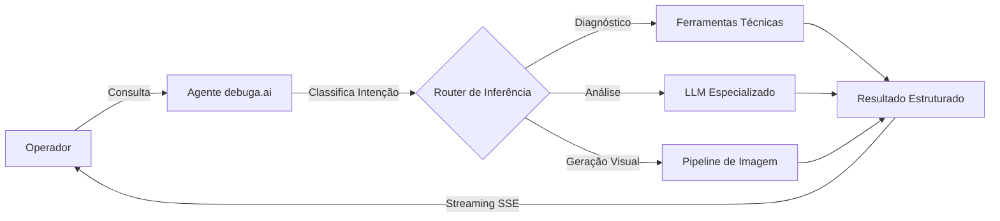

---

## Para Quem É

| Perfil | Caso de Uso |
|--------|-------------|
| MSPs e provedores de serviços gerenciados | Suporte técnico assistido por IA com marca própria |
| Provedores de internet (ISPs) | Diagnóstico de rede, automação de NOC |
| Equipes de segurança (SOC/NOC) | Análise de vulnerabilidades, hardening, auditoria |
| DevOps e SRE | Automação de infraestrutura, troubleshooting |
| Consultorias de TI | Ferramenta interna de produtividade técnica |
| Telecomunicações | Configuração de equipamentos, análise de topologia |
| Setor público e cartórios | Suporte técnico especializado com dados isolados |

---

## O Produto em 30 Segundos

<table>
  <tr>
    <td align="center" width="50%">
      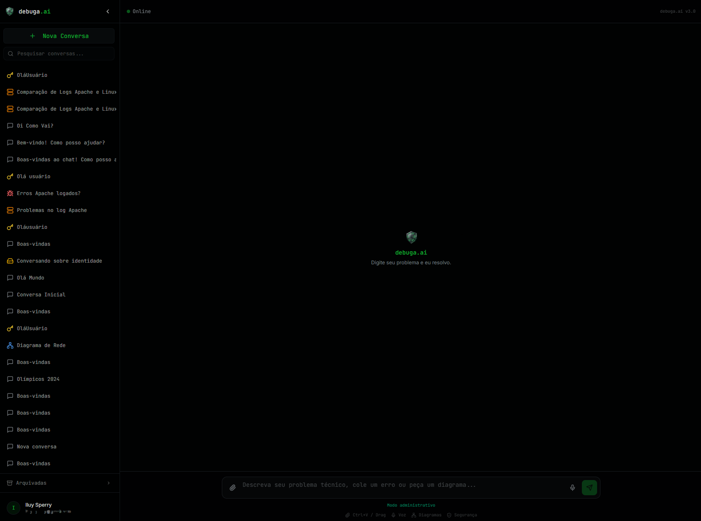 
      <strong>Chat com IA Especializada</strong> 
      Interface conversacional com streaming, entrada multimodal (texto, voz, arquivos) e histórico persistente.
    </td>
    <td align="center" width="50%">
      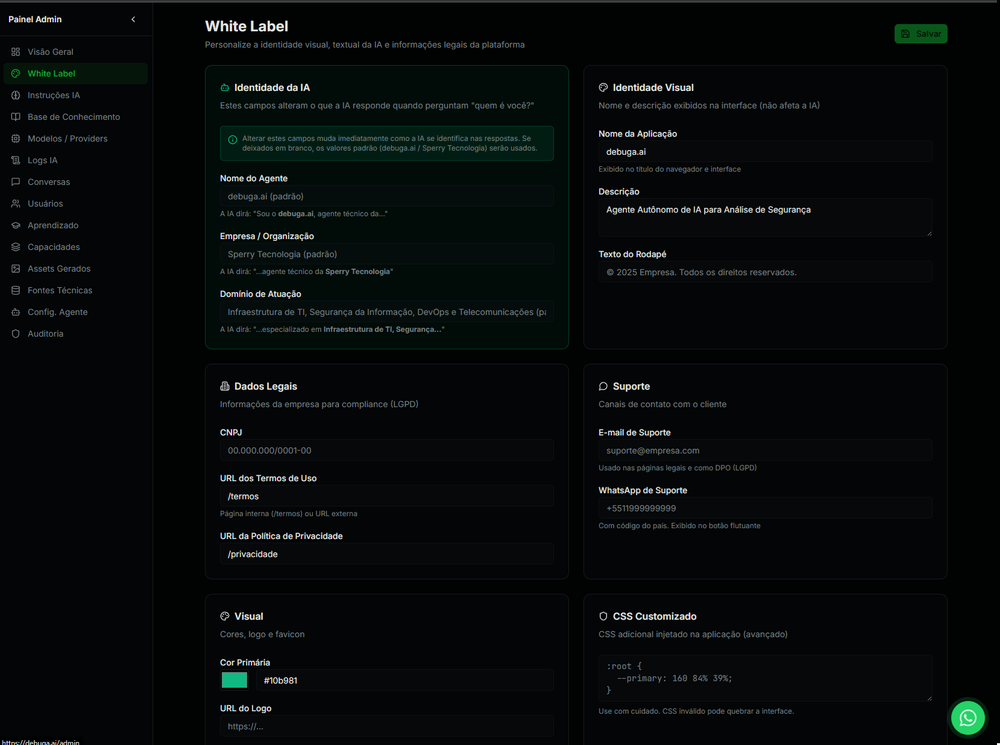 
      <strong>White Label</strong> 
      Plataforma totalmente white label com personalização de identidade visual, branding da IA, domínio, suporte, LGPD e CSS customizado.
    </td>
  </tr>
  <tr>
    <td align="center" width="50%">
      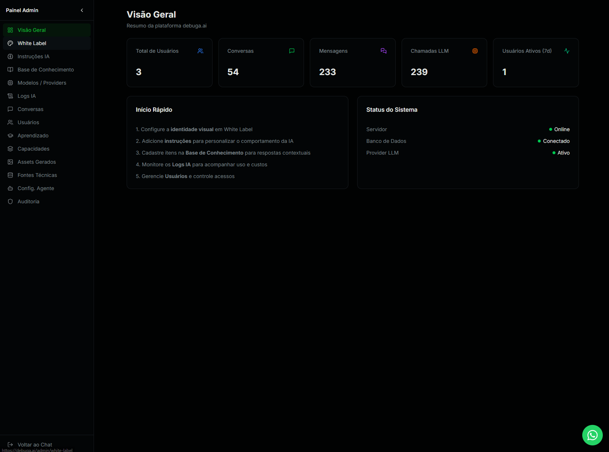 
      <strong>Painel Administrativo</strong> 
      Dashboard com KPIs em tempo real: usuários, conversas, mensagens e chamadas LLM.
    </td>
    <td align="center" width="50%">
      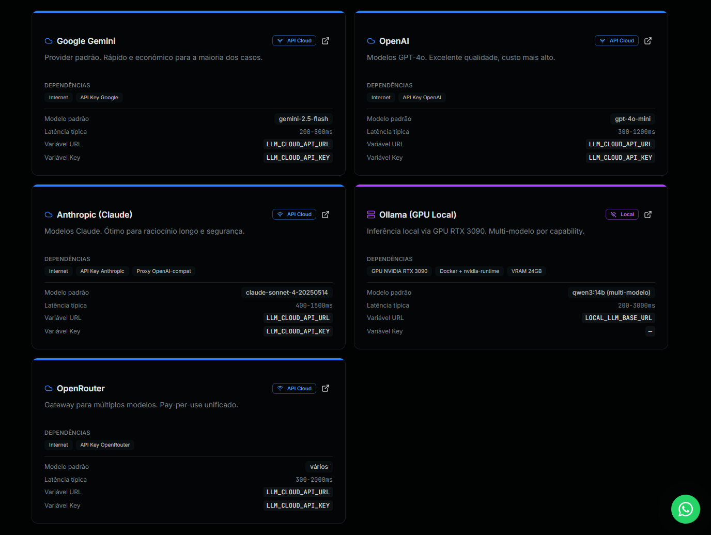 
      <strong>Multi-Provider LLM</strong> 
      5 providers configuráveis (OpenAI, Anthropic, Gemini, Ollama, OpenRouter) com fallback automático.
    </td>
  </tr>
  <tr>
    <td align="center" width="50%">
      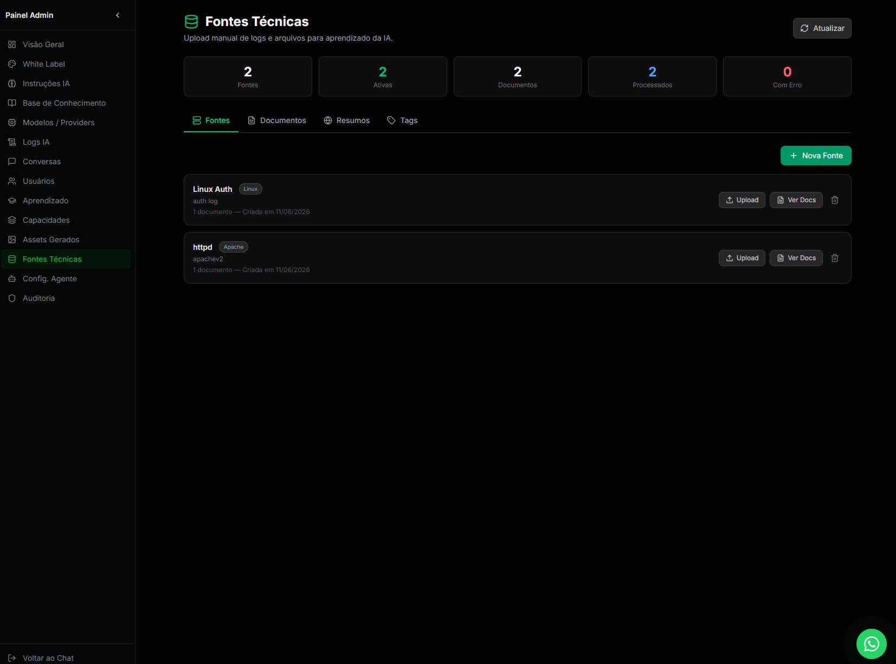 
      <strong>Fontes Técnicas</strong> 
      Upload e processamento automático de logs (Apache, Linux, Syslog) com extração de metadados.
    </td>
    <td align="center" width="50%">
      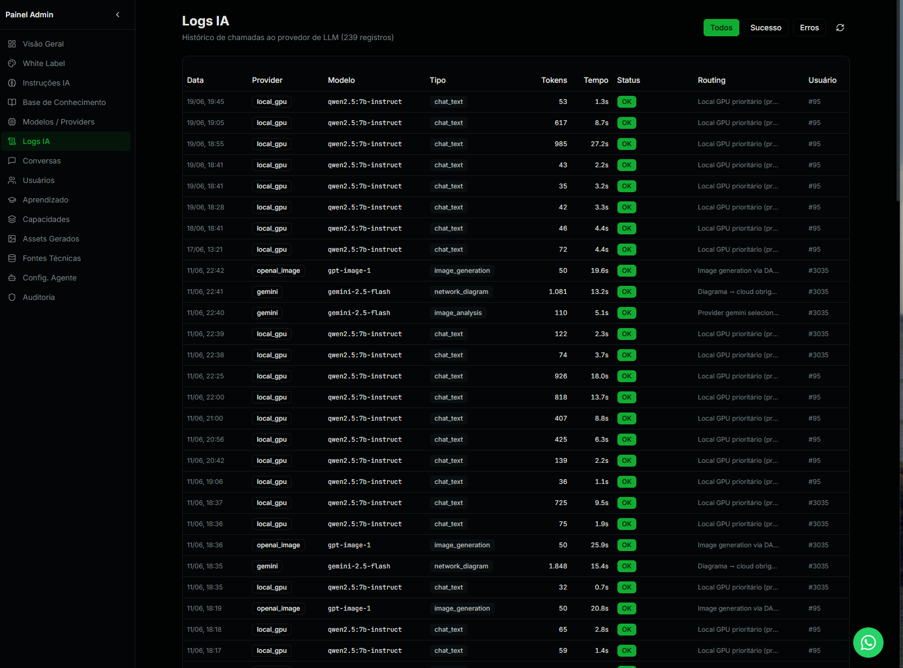 
      <strong>Observabilidade IA</strong> 
      Rastreamento completo de cada chamada: provider, modelo, tokens, latência e custo.
    </td>
  </tr>
</table>

---

## Arquitetura de Inferência Multi-Model

A debuga.ai não depende de um único modelo. O sistema utiliza **roteamento inteligente** que seleciona automaticamente o melhor modelo para cada tipo de tarefa, combinando inferência local (GPU) com providers cloud de alta qualidade.

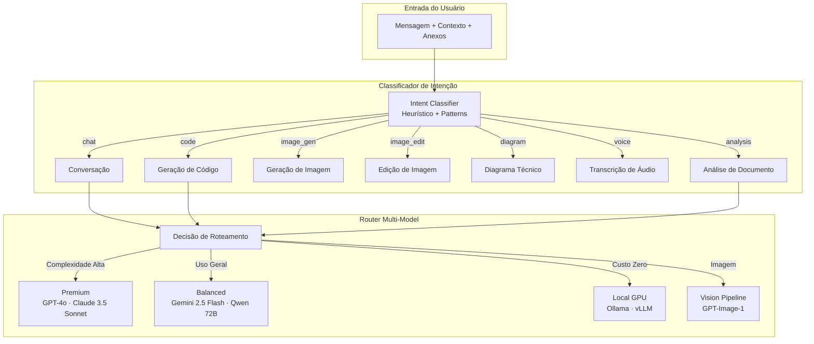

### Diferenciação por Tipo de Inferência

O sistema seleciona automaticamente o modelo ideal para cada tipo de tarefa, otimizando entre qualidade, latência e custo:

| Tipo de Tarefa | Modelo Primário | Fallback | Latência |
|---------------|----------------|----------|----------|
| Conversação técnica | Qwen 2.5 72B | GPT-4o | < 2s |
| Geração de código | Qwen 2.5 Coder | Claude 3.5 Sonnet | < 3s |
| Raciocínio complexo | GPT-4o | Claude 3.5 Sonnet | < 5s |
| Análise de imagem | GPT-4o Vision | Gemini 2.5 Flash | < 4s |
| Geração de imagem | GPT-Image-1 | DALL-E 3 | 5–15s |
| Edição de imagem | GPT-Image-1 | — | 8–20s |
| Transcrição de áudio | Whisper Large V3 | — | < 10s |
| Diagramas Mermaid | Qwen 72B | GPT-4o | < 3s |

### Critérios de Roteamento Automático

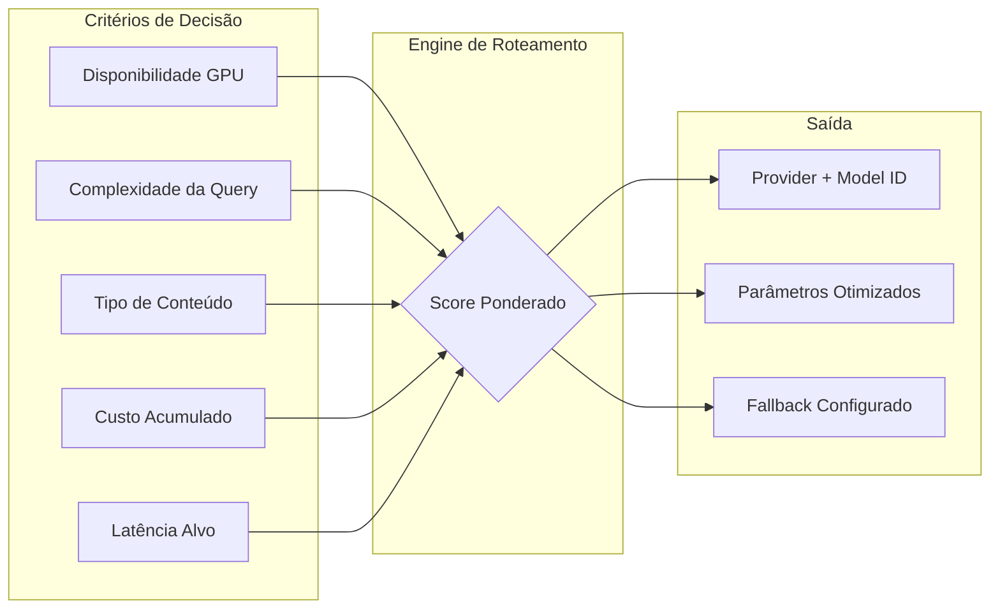

| Cenário | Comportamento |
|---------|--------------|
| GPU disponível e saudável | Inferência local (latência baixa, custo zero) |
| GPU em cold start | Aguarda warmup ou aciona fallback |
| GPU indisponível | Fallback automático para provider cloud |
| Sem GPU instalada | Apenas providers cloud |

---

## RAG — Knowledge Base Contextual

O sistema implementa **Retrieval-Augmented Generation** para injetar conhecimento operacional específico do cliente nas respostas do agente. Runbooks, procedimentos, documentação interna e decisões anteriores são indexados e recuperados automaticamente quando relevantes para a consulta.

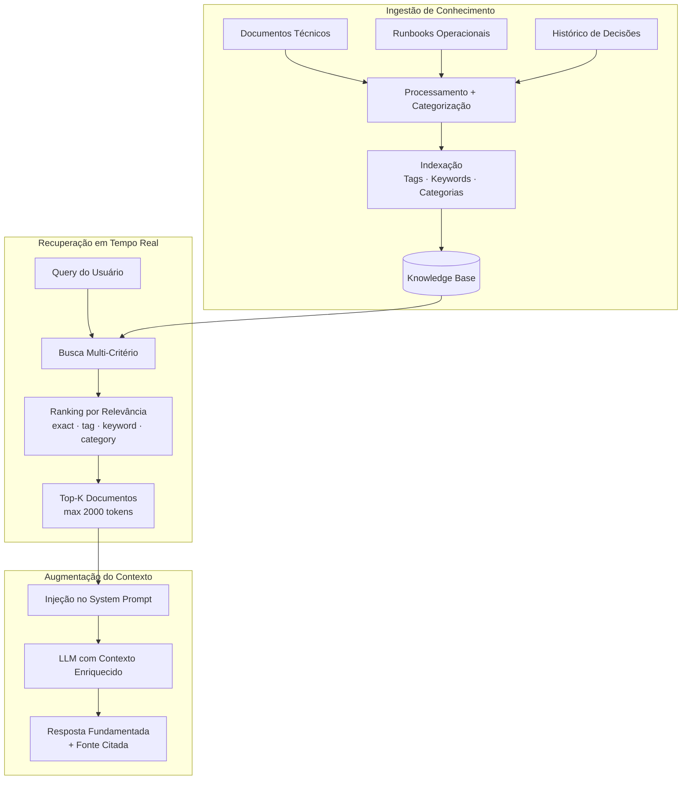

### Capacidades do RAG em Produção

| Funcionalidade | Descrição |
|---------------|-----------|
| Indexação por tags e keywords | Categorização automática de documentos operacionais |
| Busca por relevância ponderada | Score combinado (exact: 1.0, tag: 0.8, keyword: 0.5, category: 0.3) |
| Limite de tokens configurável | Controle preciso do contexto injetado |
| Observabilidade | Log de quais documentos foram utilizados em cada resposta |
| CRUD administrativo | Interface completa para gestão da base de conhecimento |
| Aprendizado contínuo | Sugestões automáticas de novos itens baseadas em interações |
| Instruções dinâmicas | Regras de comportamento configuráveis pelo operador |

---

## Ferramentas do Agente

O agente possui acesso a ferramentas especializadas que executam ações reais — não apenas sugestões textuais.

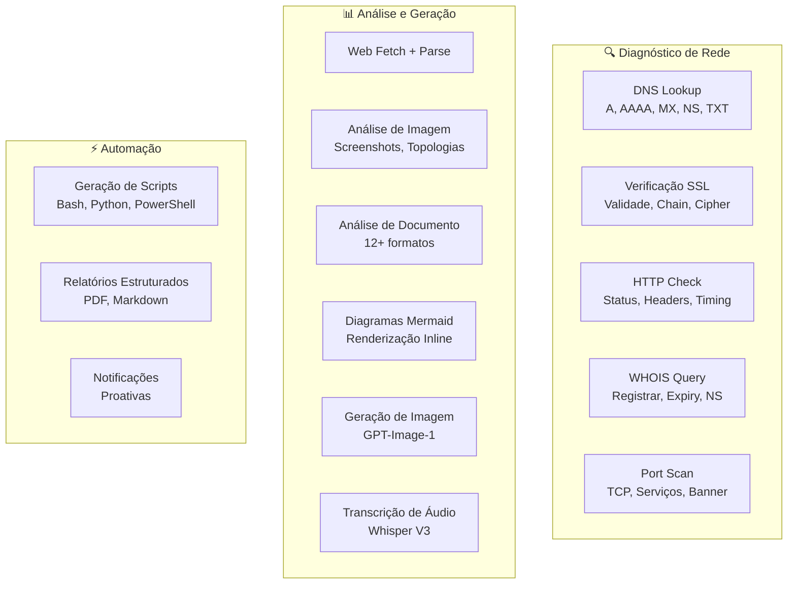

### Pipeline de Imagem

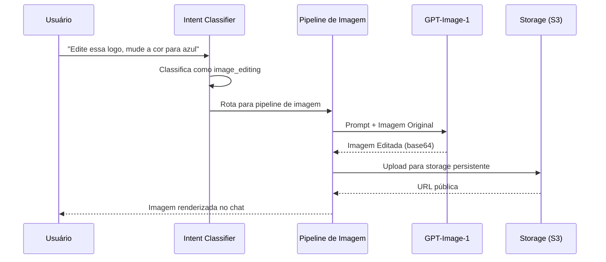

---

## White Label e Implantação Dedicada

A plataforma foi projetada para personalização completa e implantação em infraestrutura própria do cliente.

| Aspecto | Personalização |
|---------|---------------|
| Marca | Nome, logo, cores, domínio próprio |
| Infraestrutura | VM dedicada, on-premise ou cloud privada |
| Dados | Isolamento total por instância |
| Planos e Billing | Stripe integrado, preços configuráveis |
| Knowledge Base | Runbooks e documentação própria do operador |
| Modelos | Escolha de providers e prioridades de roteamento |

---

## Segurança, Auditoria e Governança

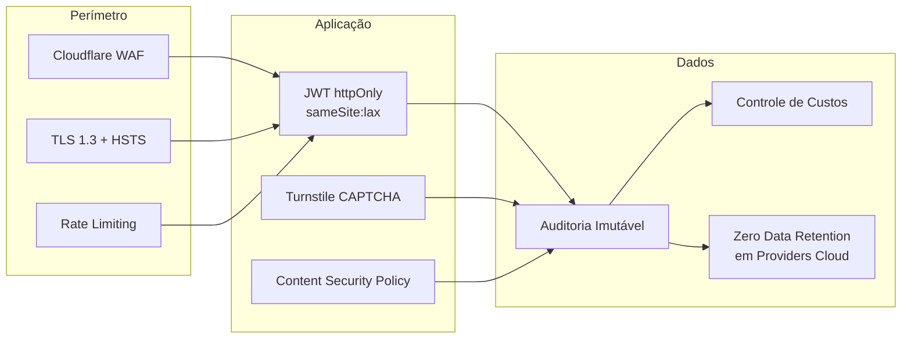

| Camada | Implementação |
|--------|--------------|
| Transporte | TLS 1.3, HSTS preload, CSP restritiva |
| Proteção | Cloudflare WAF, Turnstile CAPTCHA, rate limiting por endpoint |
| Autenticação | JWT httpOnly, sameSite:lax, OAuth 2.0 |
| Auditoria | Log imutável de todas as interações com metadados |
| Controle de custos | Limites configuráveis por usuário e plano |
| Dados | Sem retenção em providers cloud (zero-data-retention) |

---

## Stack Tecnológica

| Camada | Tecnologia |
|--------|-----------|
| Frontend | React 19 + Tailwind CSS 4 + shadcn/ui |
| Backend | Express 4 + tRPC 11 + TypeScript |
| ORM | Drizzle ORM |
| Banco de dados | TiDB (MySQL-compatible, distributed) |
| Inferência local | Ollama / vLLM (NVIDIA GPU) |
| Storage | S3-compatible (MinIO / AWS) |
| Containerização | Docker + Docker Compose |
| CDN/WAF | Cloudflare |
| Billing | Stripe |
| CAPTCHA | Cloudflare Turnstile |

---

## Roadmap

| Item | Status |
|------|--------|
| Agente conversacional com contexto técnico | **Produção** |
| Roteamento multi-model inteligente | **Produção** |
| RAG com Knowledge Base operacional | **Produção** |
| Geração e edição de imagens (GPT-Image-1) | **Produção** |
| Diagramas Mermaid com renderização inline | **Produção** |
| Document Studio (análise de 12+ formatos) | **Produção** |
| Transcrição de áudio (Whisper) | **Produção** |
| Billing com Stripe | **Produção** |
| White label com marca própria | **Produção** |
| Auditoria e logs estruturados | **Produção** |
| Integrações (Zabbix, Wazuh, Graylog, NetBox, Grafana, Ansible) | Planejado |
| Embeddings vetoriais para RAG semântico | Em desenvolvimento |
| WhatsApp Business | Planejado |
| SSO/SAML | Planejado |
| Multi-tenant enterprise | Planejado |

---

## Ecossistema de Repositórios

| Repositório | Descrição |
|-------------|-----------|
| [debuga-ai](https://github.com/SperryTecnologia/debuga-ai) | Documentação pública e visão geral |
| [debuga-llm-stack](https://github.com/SperryTecnologia/debuga-llm-stack) | Estratégia LLM híbrida (GPU + cloud) |
| [debuga-qwen-coder-lab](https://github.com/SperryTecnologia/debuga-qwen-coder-lab) | Avaliação de modelos para code generation |
| [debuga-vllm-engine](https://github.com/SperryTecnologia/debuga-vllm-engine) | Serving local com vLLM |
| [debuga-llm-gateway](https://github.com/SperryTecnologia/debuga-llm-gateway) | Gateway OpenAI-compatible |

---

## Documentação

| Documento | Descrição |
|-----------|-----------|
| [Whitepaper PT-BR](docs/WHITEPAPER_PTBR.md) | Visão estratégica e proposta de valor |
| [Whitepaper EN](docs/WHITEPAPER_EN.md) | English version |
| [Arquitetura PT-BR](docs/ARCHITECTURE_PTBR.md) | Arquitetura de referência |
| [Architecture EN](docs/ARCHITECTURE_EN.md) | English version |
| [Estratégia LLM](docs/R_AND_D_LLM_STACK.md) | Pesquisa e decisões sobre inferência |
| [Roadmap](docs/ROADMAP.md) | Roadmap público detalhado |
| [Providers](docs/PROVIDERS_OVERVIEW.md) | Providers de IA suportados |
| [White Label](docs/WHITE_LABEL_OVERVIEW.md) | Modelo de implantação |
| [Segurança](docs/SECURITY_OVERVIEW.md) | Políticas de segurança |
| [Casos de Uso](docs/USE_CASES.md) | Cenários de aplicação |

---

## Interface do Produto

A debuga.ai apresenta uma interface conversacional especializada com tema escuro e acentos em verde. O chat principal oferece histórico persistente, busca, entrada por voz, drag-and-drop de arquivos e atalhos rápidos para diagramas e segurança. O status de conexão e versão são exibidos em tempo real.

| Tela | Funcionalidade Principal |
|------|-------------------------|
| Chat principal | Conversa com diagnóstico técnico, streaming SSE, entrada multimodal |
| Histórico | Sidebar com busca, títulos automáticos, conversas arquivadas |
| Atalhos | Ctrl+V/Drag para logs, botão de voz, diagramas, segurança |

---

## Painel Administrativo

O painel admin oferece 14 seções de gestão com métricas em tempo real, controle de providers, observabilidade completa e governança centralizada.

| Seção | Funcionalidade |
|-------|---------------|
| Visão Geral | KPIs consolidados (usuários, conversas, mensagens, chamadas LLM) + status do sistema |
| White Label | Identidade da IA, visual, dados legais, suporte, CSS customizado |
| Instruções IA | Regras de comportamento e personalidade configuráveis |
| Base de Conhecimento | RAG ativo — itens indexados com tags, busca e CRUD completo |
| Modelos / Providers | GPU local (Ollama) + 5 providers cloud com teste integrado |
| Logs IA | 239+ registros com provider, modelo, tipo, tokens, tempo e routing |
| Conversas | Supervisão de todas as conversas com busca e métricas |
| Usuários | Gestão de contas e controle de acesso |
| Aprendizado | Ciclo human-in-the-loop para melhoria contínua do RAG |
| Capacidades | Orquestrador multimodal com 13 tipos de tarefa e feature flags |
| Assets Gerados | Central de mídia com galeria, custos e rastreabilidade |
| Fontes Técnicas | Upload e processamento de logs para alimentação do RAG |
| Config. Agente | Governança de runtime, métricas de uso real dos providers |
| Auditoria | 84+ eventos com rastreabilidade completa (ação, entidade, admin, IP) |

---

## Fontes Técnicas e Base de Conhecimento

O sistema permite upload de logs e documentação técnica (auth.log, apache-error.log, configurações) que são processados automaticamente, categorizados por tags e disponibilizados para o RAG. A Base de Conhecimento exibe resumos estruturados com tags semânticas (linux, sshd, httpd, apache, mysql) e indicador de status do RAG.

---

## Observabilidade

A plataforma oferece observabilidade completa sobre o uso de IA:

| Métrica | Visibilidade |
|---------|-------------|
| Chamadas LLM | Provider, modelo, tipo, tokens, tempo, status, routing |
| Custos | Por geração ($0.04/imagem), acumulado por página |
| Erros | Último erro com detalhes (ex: 429 quota exceeded) |
| Fallbacks | Contagem e detecção automática |
| Auditoria | Ações administrativas com timestamp, entidade e IP |

---

## FAQ

**O debuga.ai substitui a equipe de TI?**

Não. O agente é uma ferramenta de produtividade que auxilia profissionais técnicos, acelerando diagnósticos e automatizando tarefas repetitivas. A decisão final permanece com o operador humano.

**Meus dados ficam seguros?**

Sim. Cada instância opera com dados isolados. O sistema suporta zero-data-retention em providers cloud, inferência local via GPU própria, e criptografia em trânsito e repouso.

**Posso usar com minha própria marca?**

Sim. O modelo white label permite personalização completa: marca, domínio, cores, planos e comportamento do agente.

**Quais modelos de IA são suportados?**

O sistema é agnóstico de provider. Suporta OpenAI (GPT-4o), Anthropic (Claude), Google (Gemini), OpenRouter, e modelos locais via Ollama/vLLM.

**Preciso de GPU?**

Não. A GPU é opcional para inferência local (custo zero por token). O sistema funciona perfeitamente apenas com providers cloud.

---

## Licença

Documentação pública sob licença MIT. O código de produção da plataforma é privado e comercial.

Para demonstrações ou implantação, visite [debuga.ai](https://debuga.ai).

---

  Desenvolvido por <a href="https://www.sperrytecnologia.com.br" target="_blank">Sperry Tecnologia</a>

