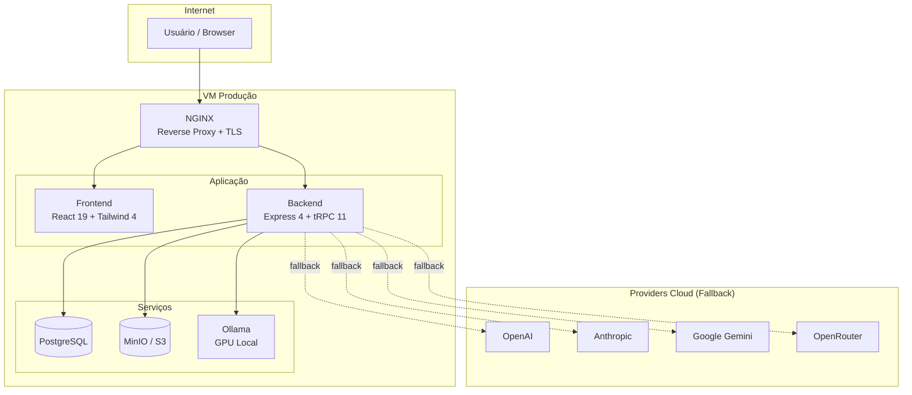
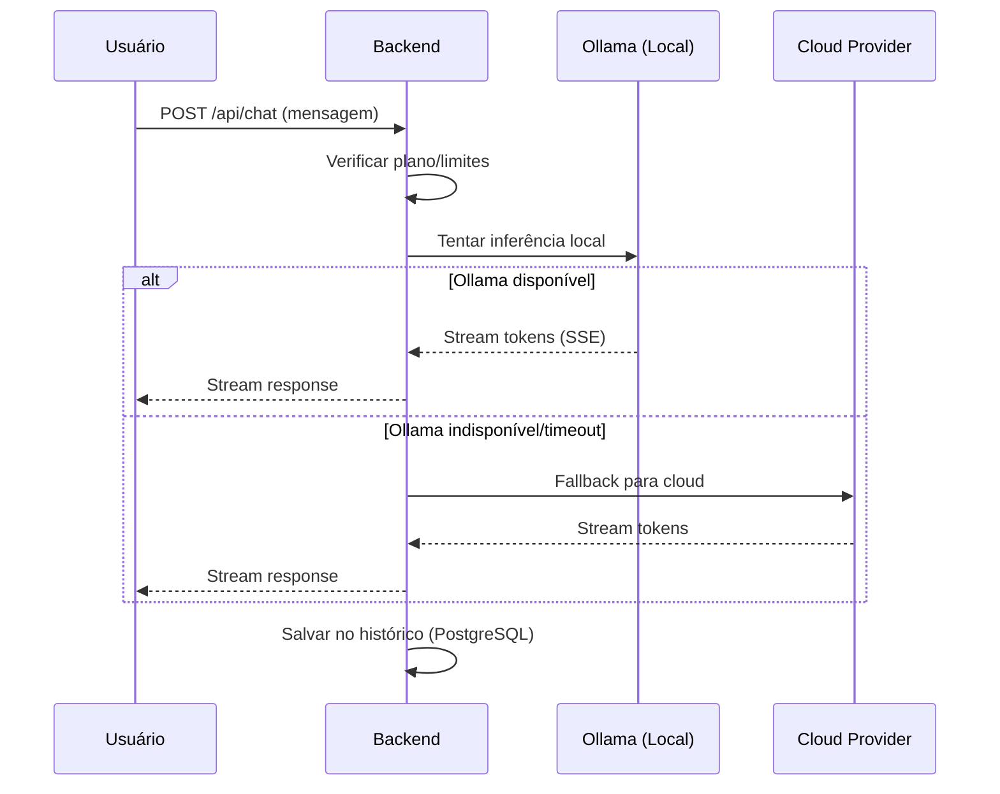
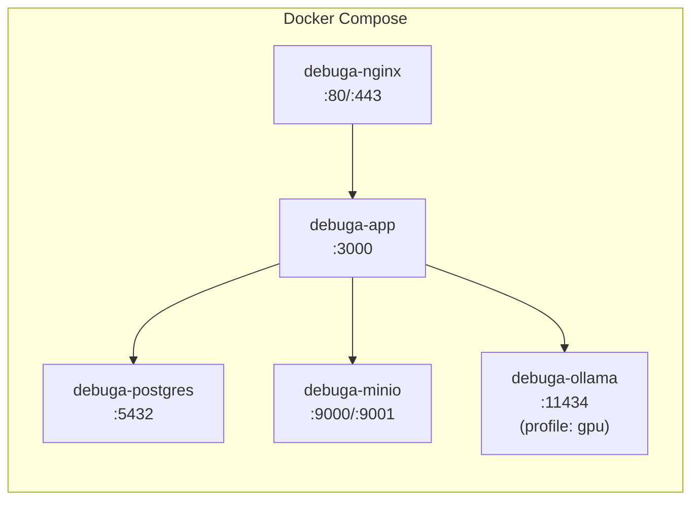

# debuga.ai — Plataforma White Label de IA Operacional

Plataforma white label de inteligência artificial para infraestrutura de TI, segurança da informação, DevOps, suporte técnico, automação, análise técnica e geração multimodal de assets. Projetada para deploy on-premise com GPU local (Ollama) e fallback para providers cloud.

---

## Visão Geral

O **debuga.ai** é uma plataforma completa de IA operacional que combina:

- **Chat inteligente** com streaming SSE e histórico persistente
- **Inferência local** via Ollama com GPU dedicada (NVIDIA)
- **Fallback automático** para providers cloud (OpenAI, Anthropic, Google Gemini, OpenRouter)
- **Geração multimodal** de imagens, vídeos e diagramas técnicos
- **Planos de assinatura** com controle de limites e billing via Stripe
- **Autenticação** local (email/senha) + OAuth (Google)
- **Painel administrativo** com logs, métricas e gestão de usuários
- **Storage S3/MinIO** para assets gerados
- **Deploy containerizado** com Docker Compose

---

## Arquitetura



### Fluxo de Requisição LLM



---

## Stack Tecnológica

| Camada | Tecnologia | Versão |
|--------|-----------|--------|
| Frontend | React + Tailwind CSS | 19 / 4 |
| Backend | Express + tRPC | 4 / 11 |
| ORM | Drizzle ORM | latest |
| Banco de dados | PostgreSQL | 16+ |
| Inferência local | Ollama | latest |
| Storage | MinIO (S3-compatible) | latest |
| Containerização | Docker + Docker Compose | 27+ |
| Reverse proxy | NGINX | latest |
| Billing | Stripe | API v2024 |
| Email | SMTP / Brevo | — |
| CAPTCHA | Cloudflare Turnstile | — |

---

## Requisitos do Servidor

| Recurso | Mínimo | Recomendado |
|---------|--------|-------------|
| CPU | 4 cores | 8+ cores |
| RAM | 8 GB | 16+ GB |
| Disco | 50 GB SSD | 100+ GB NVMe |
| GPU | — | NVIDIA 8GB+ VRAM |
| OS | Ubuntu 22.04 | Ubuntu 24.04 |
| Docker | v24+ | v27+ |
| Docker Compose | v2.20+ | v2.30+ |

GPU é opcional. Sem GPU, o sistema usa providers cloud como fallback.

---

### Containers Docker



---

## Deploy Rápido

```bash
# 1. Clonar repositório
git clone git@github.com:SperryTecnologia/debuga-ai-prod.git /opt/debuga-ai
cd /opt/debuga-ai

# 2. Configurar ambiente
cp templates/.env.production.template .env
chmod 600 .env
nano .env  # preencher secrets obrigatórios

# 3. Instalar (cria diretórios, valida .env, sobe postgres/minio)
sudo bash scripts/install.sh --env .env

# 4. Deploy (build + sobe todos os serviços)
bash scripts/deploy.sh              # sem GPU
bash scripts/deploy.sh --gpu         # com GPU

# 5. (Com GPU) Baixar modelos
bash scripts/pull-models.sh

# 6. Validar
bash scripts/validate-all.sh --env .env
```

Para instruções detalhadas, consulte **docs/PRODUCTION_DEPLOY.md**.

### Templates Disponíveis

| Cenário | Comando |
|---------|--------|
| Produção oficial | `cp templates/.env.production.template .env` |
| Homologação | `cp templates/.env.homolog.template .env` |
| Cliente white label | `cp templates/.env.customer.template .env` |
| On-premise com GPU | `cp templates/.env.onprem-gpu.template .env` |
| On-premise sem GPU | `cp templates/.env.onprem-cpu.template .env` |
| Cloud-only (sem Ollama) | `cp templates/.env.cloud-only.template .env` |

Consulte **templates/README.md** para detalhes de cada cenário.

---

## Providers LLM

O sistema suporta múltiplos providers com prioridade configurável:

| Provider | Tipo | Variável de controle |
|----------|------|---------------------|
| Ollama | Local (GPU) | `ENABLE_LOCAL_INFERENCE=true` |
| OpenAI | Cloud | `OPENAI_API_KEY` |
| Anthropic | Cloud | `ANTHROPIC_API_KEY` |
| Google Gemini | Cloud | `GEMINI_API_KEY` |
| OpenRouter | Cloud | `OPENROUTER_API_KEY` |

Configuração recomendada: `LLM_PROVIDER=local` com `LLM_FALLBACK_PROVIDER=openai`.

Consulte **docs/PROVIDERS.md** para detalhes.

---

## Geração Multimodal

| Capability | Provider | Configuração |
|-----------|----------|-------------|
| Imagens | OpenAI DALL-E / Stability | `IMAGE_GENERATION_PROVIDER` |
| Vídeos | Runway / Replicate | `VIDEO_GENERATION_PROVIDER` |
| Diagramas | Mermaid (client-side) | Automático |

Consulte **docs/MULTIMODAL_ASSETS.md** para pipeline completo.

---

## Planos e Billing

| Plano | Mensagens/dia | Imagens/mês | Vídeos/mês |
|-------|--------------|-------------|------------|
| Free | 5 | 0 | 0 |
| Pro | 100 | 50 | 10 |
| Enterprise | Ilimitado | Ilimitado | Ilimitado |

Billing via Stripe (opcional). Consulte **docs/BILLING_STRIPE.md**.

---

## Segurança

- Autenticação local com bcrypt + rate limiting
- OAuth 2.0 (Google)
- Cloudflare Turnstile (CAPTCHA opcional)
- JWT com rotação de secrets
- Verificação de email (SMTP)
- Bloqueio de contas após tentativas falhas
- Secrets mascarados em logs e scripts
- `.env` com permissão 600

Consulte **docs/SECURITY.md** para hardening completo.

---

## Scripts de Validação

```bash
# Validação completa
bash scripts/validate-all.sh --env /opt/debuga-ai/.env

# Validação rápida (sem chamadas de rede)
bash scripts/validate-all.sh --quick --env /opt/debuga-ai/.env

# Scripts individuais
bash scripts/check-production-readiness.sh --env /opt/debuga-ai/.env
bash scripts/check-llm-provider.sh --env /opt/debuga-ai/.env
bash scripts/check-gpu-readiness.sh --env /opt/debuga-ai/.env
```

Todos os scripts aceitam `--env`, mascaram secrets e tratam features desabilitadas como WARN.

---

## Backup e Restore

```bash
# Backup completo
bash scripts/backup.sh

# Restore
bash scripts/restore.sh /data/debuga/backups/<arquivo>.tar.gz
```

Consulte **docs/BACKUP_RESTORE.md** para automação com cron.

---

## Rollback

```bash
cd /opt/debuga-ai
docker compose -f docker/docker-compose.yml down
git checkout <commit-anterior>
docker compose -f docker/docker-compose.yml up -d --build
```

Consulte **docs/ROLLBACK.md** para procedimento completo.

---

## Documentação

| Documento | Descrição |
|-----------|-----------|
| [PRODUCTION_DEPLOY.md](docs/PRODUCTION_DEPLOY.md) | Deploy completo em produção |
| [HOMOLOG_DEPLOY.md](docs/HOMOLOG_DEPLOY.md) | Ambiente de homologação |
| [WHITE_LABEL_GUIDE.md](docs/WHITE_LABEL_GUIDE.md) | Customização white label |
| [SECURITY.md](docs/SECURITY.md) | Hardening e segurança |
| [ENV_REFERENCE.md](docs/ENV_REFERENCE.md) | Referência de variáveis |
| [PROVIDERS.md](docs/PROVIDERS.md) | Providers LLM |
| [BILLING_STRIPE.md](docs/BILLING_STRIPE.md) | Stripe e planos |
| [STORAGE_MINIO_S3.md](docs/STORAGE_MINIO_S3.md) | Storage S3/MinIO |
| [GPU_OLLAMA.md](docs/GPU_OLLAMA.md) | GPU e Ollama |
| [TROUBLESHOOTING.md](docs/TROUBLESHOOTING.md) | Resolução de problemas |
| [MULTIMODAL_ASSETS.md](docs/MULTIMODAL_ASSETS.md) | Pipeline multimodal |
| [ROLLBACK.md](docs/ROLLBACK.md) | Procedimento de rollback |
| [BACKUP_RESTORE.md](docs/BACKUP_RESTORE.md) | Backup e restauração |
| [R_AND_D_LLM_STACK.md](docs/R_AND_D_LLM_STACK.md) | Pesquisa e evolução LLM |

---

## Pesquisa e Evolução LLM

Para informações sobre repositórios de pesquisa, avaliação de modelos e componentes experimentais, consulte **docs/R_AND_D_LLM_STACK.md**.

---

## Suporte

Desenvolvido por **Sperry Tecnologia** — [www.sperrytecnologia.com.br](https://www.sperrytecnologia.com.br)

Para suporte técnico, entre em contato com a equipe de engenharia.

---

## Licença

Software proprietário. Todos os direitos reservados.
Uso autorizado apenas mediante licença comercial da Sperry Tecnologia.
