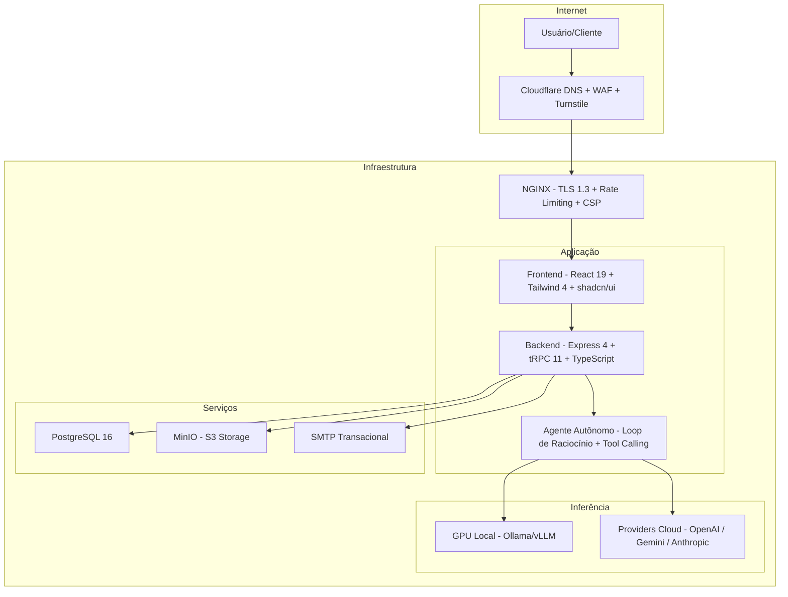
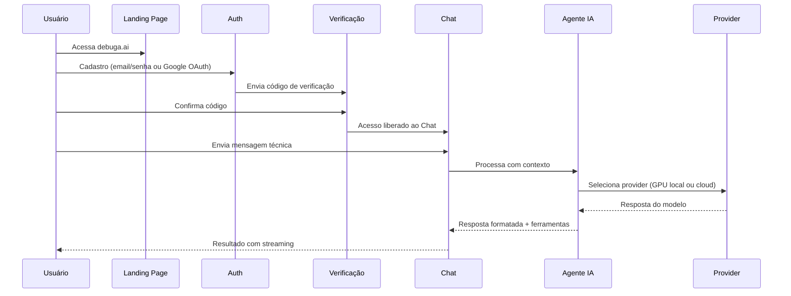
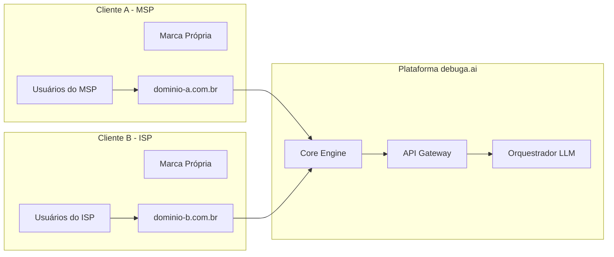
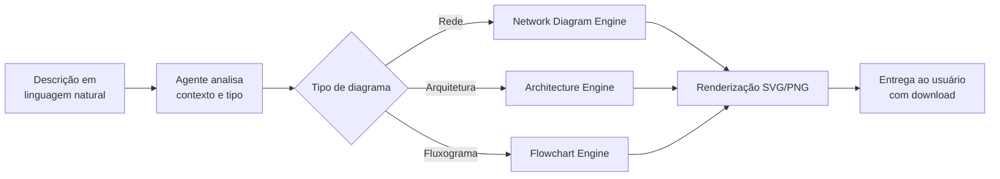
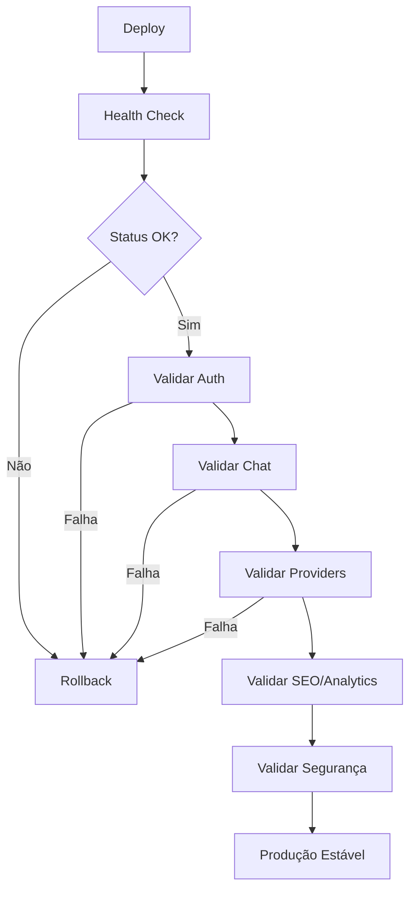

# debuga.ai — Plataforma de IA Operacional para TI, Segurança e Infraestrutura

**Agente de IA para diagnóstico técnico, documentação, automação, análise de ambientes, geração de diagramas e white label para empresas, MSPs, cartórios e operações de suporte.**

Desenvolvida por [Sperry Tecnologia](https://www.sperrytecnologia.com.br).

---

## Visão Geral

A **debuga.ai** é uma plataforma de inteligência artificial operacional que combina modelos de linguagem de última geração com base de conhecimento proprietária, automação de tarefas e suporte humano sênior. Diferente de chatbots genéricos, foi construída para o contexto operacional: diagnóstico de falhas, análise de logs, auditoria de segurança, geração de documentação técnica, criação de diagramas profissionais e automação de rotinas.

A plataforma opera com arquitetura híbrida — inferência local em GPU dedicada para dados sensíveis e fallback transparente para providers cloud quando necessário — garantindo privacidade, desempenho e disponibilidade.

---

## Problemas que Resolve

Equipes de TI, segurança e infraestrutura enfrentam desafios recorrentes que a debuga.ai endereça diretamente:

| Problema | Solução debuga.ai |
|----------|-------------------|
| Diagnóstico lento de incidentes | Análise automatizada de logs, correlação de eventos e sugestão de resolução |
| Documentação técnica desatualizada | Geração automática de runbooks, topologias e relatórios |
| Falta de visibilidade em ambientes | Diagramas de rede e arquitetura gerados a partir de descrições |
| Dependência de especialistas para tarefas repetitivas | Automação de scripts, configurações e validações |
| Custo elevado de ferramentas de IA genéricas | Inferência local em GPU própria com custo zero por token |
| Dificuldade de personalização para clientes | White label completo com marca, domínio e infraestrutura dedicada |

---

## Para Quem É

| Perfil | Caso de Uso |
|--------|-------------|
| MSPs e provedores de serviços gerenciados | Suporte técnico assistido por IA com marca própria |
| Provedores de internet (ISPs) | Diagnóstico de rede, automação de NOC |
| Equipes de segurança (SOC/NOC) | Análise de vulnerabilidades, hardening, auditoria |
| DevOps e SRE | Automação de infraestrutura, troubleshooting |
| Consultorias de TI | Ferramenta interna de produtividade técnica |
| Telecomunicações | Configuração de equipamentos, análise de topologia |
| Cartórios e Governo | Automação de processos, consulta a legislação, atendimento |
| Empresas com dados sensíveis | Inferência local sem envio de dados para cloud |

---

## Capacidades Principais

### Chat Técnico

Conversação em linguagem natural com contexto técnico profundo. O agente compreende logs, configurações, protocolos de rede e padrões de falha. Suporta envio de arquivos (PDF, DOCX, TXT, LOG, CONF, JSON, CSV, YAML, XML, SQL) e análise visual de screenshots e dashboards.

### Diagnóstico de Infraestrutura

Análise automatizada de logs de sistemas, firewalls, switches e servidores. Correlação de eventos entre múltiplas fontes. Ferramentas de rede integradas (DNS lookup, SSL check, HTTP check, WHOIS, port scan, web fetch) invocadas autonomamente pelo agente durante o raciocínio.

### Diagram Studio

Geração de diagramas profissionais a partir de descrições em linguagem natural:

| Tipo | Descrição |
|------|-----------|
| Diagramas de Rede | Topologias LAN/WAN, segmentação, VLANs |
| Diagramas de Arquitetura | Microserviços, cloud, on-premise |
| Fluxogramas | Processos, workflows, decisões |
| Diagramas de Sequência | Interações entre sistemas |
| Diagramas de Infraestrutura | Racks, datacenters, cabeamento |

Exportação em SVG e PNG com qualidade profissional para relatórios e apresentações.

### Geração de Documentação

Criação automática de documentação técnica estruturada: runbooks, procedimentos operacionais, relatórios de auditoria, inventários de ativos e políticas de segurança. Formatação profissional com tabelas, diagramas e referências cruzadas.

### Segurança e Auditoria

Auditoria de configurações e hardening. Análise de vulnerabilidades (CVE). Revisão de políticas de firewall e ACLs. Relatórios de conformidade. Registro completo de todas as interações com metadados para auditoria.

### Geração Multimodal

Geração de imagens técnicas, edição de screenshots, criação de assets para documentação e relatórios. Suporte a múltiplos providers de geração de imagem e vídeo com controle de custos por plano.

### White Label

Personalização completa para operação com marca própria. Domínio dedicado, identidade visual customizada, planos e billing configuráveis, isolamento total de dados por instância.

---

## Arquitetura em Alto Nível

---

## Fluxo de Uso

---

## GPU Local + Fallback Cloud

O debuga.ai opera com arquitetura híbrida: modelos locais (Ollama/vLLM em GPU dedicada) processam requisições sensíveis sem enviar dados para fora. Quando a carga excede a capacidade local ou o modelo requerido não está disponível, o sistema faz fallback transparente para providers cloud.

| Cenário | Comportamento |
|---------|--------------|
| GPU disponível e saudável | Inferência local (latência baixa, custo zero) |
| GPU em cold start | Aguarda warmup ou aciona fallback |
| GPU indisponível | Fallback automático para provider cloud |
| Tarefa especializada (diagramas, imagem) | Provider cloud otimizado para a tarefa |
| Sem GPU instalada | Apenas providers cloud |

Providers cloud suportados: OpenAI (GPT-4o), Google (Gemini 2.0 Flash/Pro), Anthropic (Claude), DeepSeek, Qwen e outros via gateway proprietário.

---

## White Label e Implantação Dedicada

| Aspecto | Personalização |
|---------|---------------|
| Marca | Nome, logo, cores, domínio próprio |
| Infraestrutura | VM dedicada ou on-premise |
| Dados | Isolamento total por instância |
| Planos | Definidos pelo operador |
| Billing | Stripe integrado, configurável |
| Knowledge Base | Runbooks, documentação e procedimentos próprios |
| Modelos | Escolha de modelos locais e cloud por capability |
| Suporte | Canal próprio + escalação para sênior |

---

## Segurança, Auditoria e Governança

**Segurança** — TLS 1.3, HSTS preload, CSP restritiva, Cloudflare WAF, Turnstile CAPTCHA, rate limiting por endpoint, JWT httpOnly com sameSite:lax.

**Auditoria** — Registro completo de todas as interações com metadados (usuário, provider, tokens consumidos, latência). Exportação de logs. Conformidade com políticas internas.

**Controle de Custos** — Limites configuráveis por usuário e plano. Alertas de consumo. Bloqueio automático ao atingir cota. Relatório de custo por provider no painel administrativo.

**Privacidade** — Inferência local mantém dados sensíveis dentro da infraestrutura do cliente. Sem envio para terceiros quando operando em modo GPU-only.

---

## Stack Tecnológica

| Camada | Tecnologia |
|--------|-----------|
| Frontend | React 19 + Tailwind CSS 4 + shadcn/ui |
| Backend | Express 4 + tRPC 11 + TypeScript |
| ORM | Drizzle ORM |
| Banco de dados | PostgreSQL 16 |
| Inferência local | Ollama / vLLM (NVIDIA GPU) |
| Storage | MinIO (S3-compatible) |
| Containerização | Docker + Docker Compose |
| Reverse proxy | NGINX + TLS |
| CDN/WAF | Cloudflare |
| Billing | Stripe |
| Email | SMTP transacional |
| CAPTCHA | Cloudflare Turnstile |

---

## Pipeline do Diagram Studio

---

## Validação e Saúde Operacional

---

## Scripts de Validação

Este repositório inclui scripts de validação para verificar a integridade de deploys e configurações públicas:

| Script | Descrição |
|--------|----------|
| `scripts/check-seo-analytics.sh` | Valida GA4, meta tags, sitemap e robots.txt |
| `scripts/check-public-links.sh` | Verifica links públicos retornam HTTP 200 |
| `scripts/check-sitemap.sh` | Valida estrutura e URLs do sitemap.xml |
| `scripts/check-robots.sh` | Verifica conformidade do robots.txt |
| `scripts/check-security-headers.sh` | Audita headers de segurança (HSTS, CSP, X-Frame) |
| `scripts/check-docs-links.sh` | Verifica links internos da documentação |
| `scripts/check-public-repo-clean.sh` | Garante que o repo público não contém secrets |

Para detalhes de uso, consulte [docs/VALIDATION_SCRIPTS.md](docs/VALIDATION_SCRIPTS.md).

---

## Roadmap Público

| Item | Status |
|------|--------|
| Agente conversacional com contexto técnico | Produção |
| Inferência local via GPU (Ollama/vLLM) | Produção |
| Fallback multi-provider cloud | Produção |
| Diagram Studio (rede, arquitetura, fluxograma) | Produção |
| Geração de imagens e assets | Produção |
| Controle de custos e billing (Stripe) | Produção |
| White label com marca própria | Produção |
| Auditoria e logs estruturados | Produção |
| Auth completa (email + Google OAuth + Turnstile) | Produção |
| Multi-modelo por capability (código, análise, chat) | Produção |
| Ferramentas de rede integradas (DNS, SSL, WHOIS) | Produção |
| Análise de documentos e imagens | Produção |
| Integração com Zabbix/Grafana/Prometheus | Em desenvolvimento |
| RAG com documentação interna | Em desenvolvimento |
| WhatsApp Business | Planejado |
| SSO/SAML | Planejado |
| Multi-tenant enterprise | Planejado |

---

## Ecossistema de Repositórios

| Repositório | Tipo | Descrição |
|-------------|------|-----------|
| [debuga-ai](https://github.com/SperryTecnologia/debuga-ai) | Vitrine | Documentação pública e visão geral |
| debuga-ai-prod | Privado | Código de produção white label |
| [debuga-llm-stack](https://github.com/SperryTecnologia/debuga-llm-stack) | Arquitetura | Estratégia LLM híbrida (GPU + cloud) |
| [debuga-qwen-coder-lab](https://github.com/SperryTecnologia/debuga-qwen-coder-lab) | Pesquisa | Avaliação de modelos para code generation |
| [debuga-vllm-engine](https://github.com/SperryTecnologia/debuga-vllm-engine) | Experimental | Serving local com vLLM |
| [debuga-llm-gateway](https://github.com/SperryTecnologia/debuga-llm-gateway) | Experimental | Gateway OpenAI-compatible |

---

## Documentação

| Documento | Descrição |
|-----------|-----------|
| [Whitepaper PT-BR](docs/WHITEPAPER_PTBR.md) | Visão estratégica e proposta de valor |
| [Whitepaper EN](docs/WHITEPAPER_EN.md) | English version |
| [Arquitetura PT-BR](docs/ARCHITECTURE_PTBR.md) | Arquitetura de referência detalhada |
| [Architecture EN](docs/ARCHITECTURE_EN.md) | English version |
| [Estratégia LLM](docs/R_AND_D_LLM_STACK.md) | Pesquisa e decisões sobre inferência |
| [Roadmap](docs/ROADMAP.md) | Roadmap público detalhado |
| [Providers](docs/PROVIDERS_OVERVIEW.md) | Providers de IA suportados |
| [White Label](docs/WHITE_LABEL_OVERVIEW.md) | Modelo de implantação enterprise |
| [Segurança](docs/SECURITY_OVERVIEW.md) | Políticas de segurança |
| [SEO e Analytics](docs/SEO_ANALYTICS.md) | Estratégia de SEO e monitoramento |
| [Scripts de Validação](docs/VALIDATION_SCRIPTS.md) | Documentação dos scripts públicos |

---

## Links Úteis

| Recurso | URL |
|---------|-----|
| Plataforma | [https://debuga.ai](https://debuga.ai) |
| Documentação online | [https://debuga.ai/docs](https://debuga.ai/docs) |
| Sperry Tecnologia | [https://www.sperrytecnologia.com.br](https://www.sperrytecnologia.com.br) |

---

## Licença

Documentação pública sob licença MIT. O código de produção da plataforma é privado e comercial.

Para informações sobre licenciamento, demonstrações ou implantação white label, entre em contato com a Sperry Tecnologia.

---
