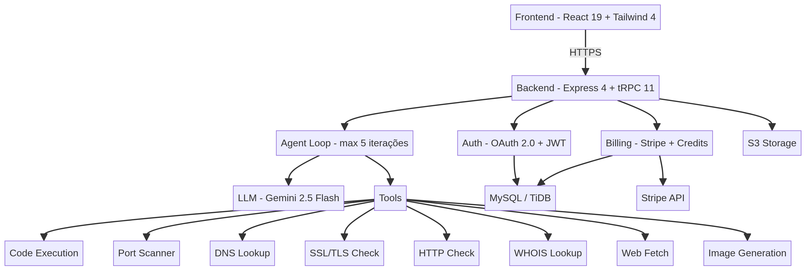
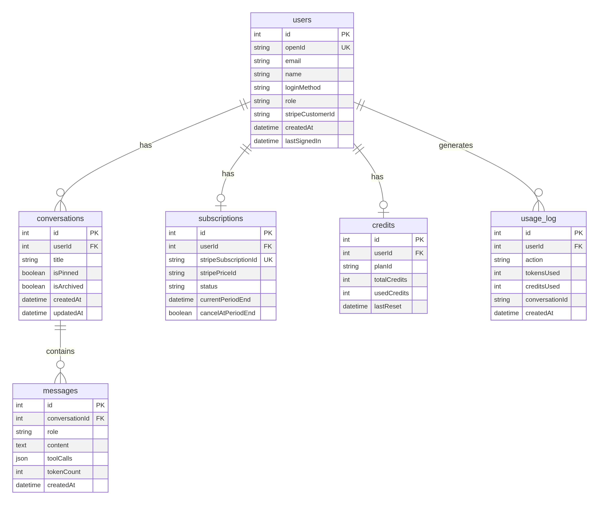
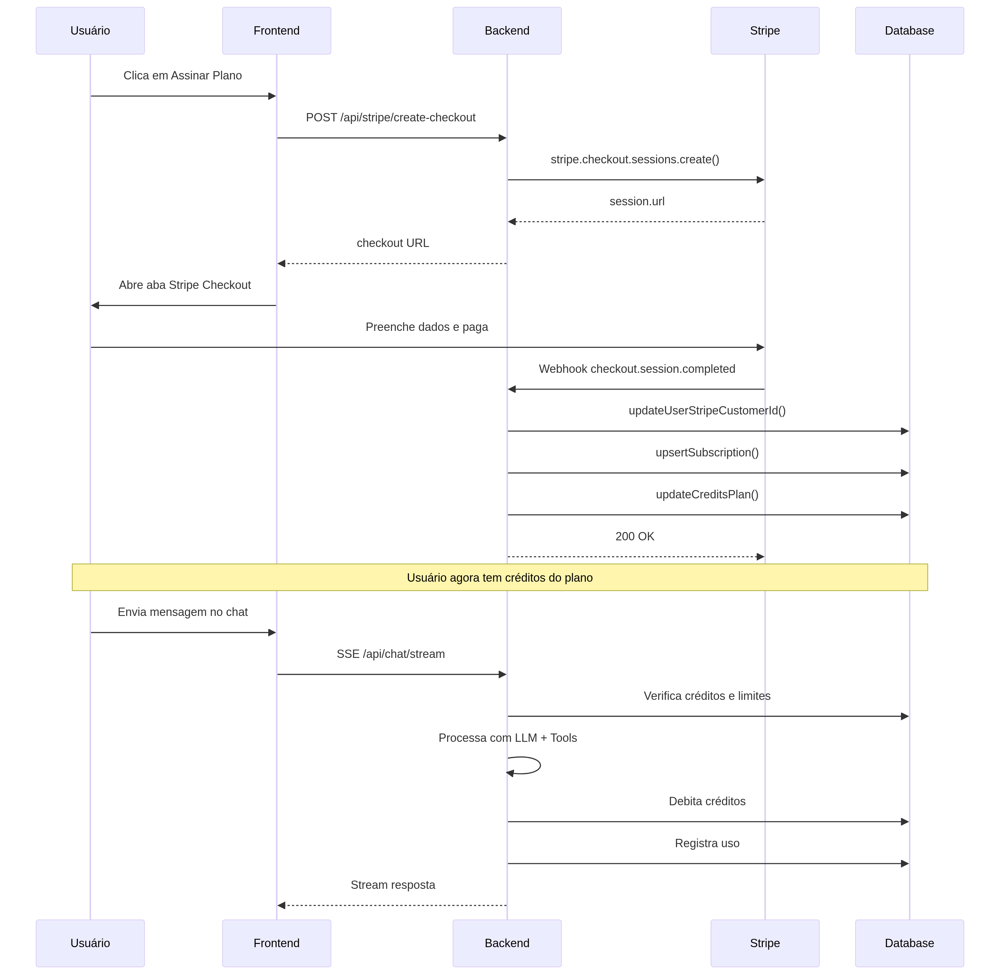

# debuga.ai — Arquitetura do Sistema

**Versão:** 4.0  
**Data:** Maio de 2026  
**Autor:** Sperry Tecnologia  
**Público-alvo:** Desenvolvedores seniores, líderes técnicos e arquitetos de infraestrutura

---

## 1. Visão Geral de Alto Nível

O debuga.ai é uma plataforma SaaS em produção construída sobre uma **arquitetura de três camadas** (cliente, servidor de aplicação, serviços externos) com duas escolhas de design distintas: **segurança de tipos ponta a ponta** via tRPC (eliminando divergências de contrato de API) e **streaming em tempo real** via Server-Sent Events (mantendo a camada de transporte simples e nativa ao HTTP/2). A peça central da arquitetura é o **Agent Loop** — um ciclo autônomo de raciocínio-ação-observação que permite à IA encadear execuções de ferramentas sem intervenção humana.

### Diagrama de Arquitetura do Sistema



O sistema segue uma separação clara de responsabilidades. O SPA React se comunica com o backend Express através de dois canais: tRPC para operações CRUD estruturadas e SSE para streaming em tempo real do agente. O backend orquestra a inferência LLM, execução de ferramentas, controle de faturamento e persistência de dados.

---

## 2. Camada de Inferência LLM

### 2.1 Arquitetura Atual (Produção)

Toda a inferência LLM no deploy de produção atual é gerenciada através da **API cloud de inferência** — um gateway de inferência gerenciado. O sistema envia prompts estruturados (instruções de sistema + histórico de conversa + definições de ferramentas) e recebe completions em streaming.

| Componente | Status | Descrição |
|---|---|---|
| **API cloud de inferência** | **Em produção** | Gateway gerenciado com acesso a modelos de última geração (atualmente Gemini 2.5 Flash) |
| **Modelo** | **Em produção** | `gemini-2.5-flash` — utilizado para raciocínio, orquestração de chamadas de ferramentas e geração de respostas |
| **LLM Wrapper** | **Em produção** | `server/_core/llm.ts` abstrai o provedor, facilitando a troca de endpoints ou adição de novos modelos |

O wrapper LLM é projetado para ser agnóstico ao provedor. Alterar o modelo subjacente requer apenas a atualização da configuração do endpoint — sem alterações no loop do agente, chamadas de ferramentas ou lógica de streaming.

### 2.2 Arquitetura Híbrida de Inferência LLM

A camada de inferência do debuga.ai é projetada como uma **arquitetura híbrida** que combina provedores de API em nuvem (produção) com inferência local/on-premise (laboratório/pesquisa). O deploy de produção atual utiliza um único provedor em nuvem, enquanto o caminho de inferência local está sendo validado através dos repositórios públicos do **debuga.ai LLM Stack**.

#### Diagrama de Inferência Híbrida

```
┌─────────────────────────────────────────────────────────────────────────┐
│                        AGENT LOOP                                       │
│  server/streamRoute.ts → monta contexto + definições de ferramentas     │
│  Envia {messages, tools, stream:true} para o LLM Wrapper                │
└───────────────────────────────────┬─────────────────────────────────────┘
                                    │
                                    ▼
┌─────────────────────────────────────────────────────────────────────────┐
│                  LLM WRAPPER (server/_core/llm.ts)                      │
│  Interface agnóstica ao provedor: invokeLLM({messages, tools, ...})     │
│  Gerencia: streaming, parsing de tool_call, normalização de erros       │
└─────────────────┬─────────────────────────────────────────┬─────────────┘
                  │                                         │
    ┌─────────────▼───────────────┐       ┌─────────▼─────────────────┐
    │  PROVEDOR NUVEM (Prod)      │       │  INFERÊNCIA LOCAL (Lab)   │
    │  ──────────────────────     │       │  ───────────────────────  │
    │  API cloud de inferência            │       │  debuga-llm-gateway       │
    │  (Gemini 2.5 Flash)         │       │  (API compatível OpenAI)  │
    │                             │       │           │               │
    │  • Raciocínio + tool call   │       │           ▼               │
    │  • Completions em streaming │       │  ┌──────────────────┐     │
    │  • SLA de produção          │       │  │ debuga-vllm-     │     │
    │                             │       │  │ engine           │     │
    └─────────────────────────────┘       │  │ (vLLM + CUDA 12) │     │
                                          │  └─────────┬────────┘     │
                                          │            │              │
                                          │            ▼              │
                                          │  ┌──────────────────┐     │
                                          │  │ debuga-qwen-     │     │
                                          │  │ coder-lab        │     │
                                          │  │                  │     │
                                          │  │ Modelos:         │     │
                                          │  │ • Qwen-Coder 7B  │     │
                                          │  │ • Qwen-Coder 14B │     │
                                          │  │ • Qwen-Coder 32B │     │
                                          │  │                  │     │
                                          │  │ Benchmarks:      │     │
                                          │  │ • DevOps         │     │
                                          │  │ • Segurança      │     │
                                          │  │ • Redes          │     │
                                          │  └──────────────────┘     │
                                          └───────────────────────────┘
```

#### Responsabilidades dos Componentes

| Componente | Camada | Status | Responsabilidade |
|---|---|---|---|
| `server/_core/llm.ts` | LLM Wrapper | **Produção** | Interface agnóstica ao provedor; roteia requisições para o endpoint ativo |
| API cloud de inferência | Provedor Nuvem | **Produção** | Gateway de inferência gerenciado; atualmente serve Gemini 2.5 Flash |
| `debuga-llm-gateway` | Gateway Local | Lab/Pesquisa | Camada de roteamento compatível com OpenAI com fallback nuvem/local |
| `debuga-vllm-engine` | Motor de Inferência | Lab/Pesquisa | Configurações de serving vLLM (Docker + CUDA 12, métricas Prometheus) |
| `debuga-qwen-coder-lab` | Avaliação de Modelos | Lab/Pesquisa | Benchmarks Qwen-Coder para domínios de DevOps, segurança e redes |

#### Fluxo de Requisição (Produção)

```
Agent Loop → invokeLLM() → API cloud de inferência → Gemini 2.5 Flash
                                   │
                                   ▼
                          Completion em streaming
                          (texto ou tool_call)
```

#### Fluxo de Requisição (Híbrido Planejado — Roadmap v5.0–v6.0)

```
Agent Loop → invokeLLM() → debuga-llm-gateway (Roteador)
                                   │
                          ┌────────┼──────────────┐
                          ▼        ▼              ▼
                     API Nuvem   vLLM Local     Fallback
                     (velocidade) (soberania)   (resiliência)
```

A decisão de roteamento será baseada em três fatores:

- **Complexidade da consulta** — Consultas simples de chamada de ferramentas são roteadas para a API em nuvem (otimizada para velocidade e custo); diagnósticos complexos de múltiplas etapas são roteados para modelos locais especializados com conhecimento de domínio mais profundo.
- **Sensibilidade dos dados** — Consultas envolvendo dados de infraestrutura do cliente (logs, configurações, topologia) são roteadas para inferência local para evitar o envio de dados sensíveis a APIs externas.
- **Disponibilidade** — Se o provedor primário estiver indisponível, o gateway faz fallback automaticamente para o provedor secundário.

### 2.3 Roteamento Multi-Modelo (Roadmap v5.0)

A camada de roteamento dentro do `debuga-llm-gateway` despachará consultas para diferentes modelos com base na complexidade, especificidade de domínio e requisitos de latência. Esta camada é atualmente um esqueleto comunitário e ainda não está ativa em produção. Quando implantada, permitirá:

- **Consultas simples** (suporte geral de TI, chamadas de ferramentas) → modelos de API em nuvem otimizados para velocidade e custo
- **Análises complexas** (diagnósticos multi-etapa, correlação de segurança) → modelos locais especializados com conhecimento de domínio mais profundo
- **Cargas em lote** (geração de relatórios, análise em massa) → caminhos de inferência otimizados para custo

### 2.4 Inferência On-Premise (Roadmap v6.0)

A estratégia de longo prazo inclui a implantação de infraestrutura GPU para servir modelos open-source ajustados em datasets de infraestrutura de TI e segurança de redes. A pesquisa técnica e benchmarks estão sendo conduzidos nos repositórios públicos do **debuga.ai LLM Stack**. Isso permitirá:

- **Soberania de dados** — Dados sensíveis de infraestrutura processados localmente sem sair da rede do cliente
- **Modelos especializados por domínio** — Modelos ajustados (Qwen-Coder, Mistral, variantes Llama) otimizados para análise de redes, correlação de logs e raciocínio sobre infraestrutura
- **Redução de dependência de API** — Custos operacionais menores e eliminação de limites de taxa de APIs de terceiros para implantações de alto volume

O stack de serving planejado utiliza vLLM com CUDA 12 e paralelismo de tensor em múltiplas GPUs. Requisitos de hardware e configurações de deploy estão documentados no repositório `debuga-vllm-engine`.

### 2.5 debuga.ai LLM Stack (Repositórios Públicos)

A estratégia de inferência híbrida é documentada e validada através de um conjunto de repositórios públicos:

| Repositório | Propósito | Conteúdo Principal |
|---|---|---|
| [debuga-llm-stack](https://github.com/SperryTecnologia/debuga-llm-stack) | Documentação central e arquitetura | Diagramas de arquitetura, visão geral da estratégia, guia de integração |
| [debuga-qwen-coder-lab](https://github.com/SperryTecnologia/debuga-qwen-coder-lab) | Avaliação de modelos para domínio TI/segurança | 3 datasets de benchmark JSONL (DevOps, segurança, redes), scripts de avaliação, relatórios de resultados |
| [debuga-vllm-engine](https://github.com/SperryTecnologia/debuga-vllm-engine) | Configurações de serving vLLM | Dockerfile (CUDA 12), docker-compose (vLLM + Prometheus + Grafana), configs YAML para 7B/14B/32B |
| [debuga-llm-gateway](https://github.com/SperryTecnologia/debuga-llm-gateway) | Esqueleto de gateway compatível com OpenAI | Gateway TypeScript com provedores nuvem/vLLM, roteamento com fallback, streaming SSE, agregação de health |

> **Nota:** O LLM Stack público é uma iniciativa de documentação, laboratório e pesquisa técnica. Não representa código SaaS de produção, não contém prompts internos, dados de clientes ou regras de negócio. A produção do debuga.ai pode incluir integrações e políticas adicionais não publicadas.

---

## 3. Arquitetura do Frontend

### 3.1 Escolhas Tecnológicas

O frontend é um SPA React 19 estilizado com Tailwind CSS 4 e componentes shadcn/ui. A linguagem de design segue uma **estética de terminal escuro** (fundo preto, paleta de acentos verdes) que ressoa com o público-alvo de profissionais de TI e engenheiros de segurança.

A comunicação com o backend ocorre através de dois canais distintos:

| Canal | Protocolo | Propósito | Biblioteca |
|---|---|---|---|
| tRPC Client | HTTP/JSON (fetch) | Operações CRUD (conversas, conta, assinaturas) | `@trpc/react-query` |
| SSE Consumer | Server-Sent Events | Streaming em tempo real das respostas do agente | `EventSource` nativo |

### 3.2 Estrutura de Rotas

| Rota | Componente | Auth Obrigatória | Descrição |
|---|---|---|---|
| `/` | `Home.tsx` | Não | Landing page com hero, recursos, integrações, planos |
| `/chat` | `ChatPage.tsx` | Sim | Interface de chat com sidebar de conversas, busca, arquivo |
| `/pricing` | `PricingPage.tsx` | Não | Planos de assinatura com checkout Stripe |
| `/account` | `AccountPage.tsx` | Sim | Dashboard do usuário com métricas de uso, atividade, perfil |
| `/logout-success` | `LogoutSuccess.tsx` | Não | Página de confirmação pós-logout |
| `/demo/web-analysis` | `DemoWebAnalysis.tsx` | Não | Página estática de demonstração para card de navegação |

### 3.3 Gerenciamento de Estado

O estado é gerenciado através de três mecanismos complementares. O **tRPC React Query** gerencia o cache de dados do servidor com invalidação automática após mutações. O **React Context** (`AuthContext`) mantém o estado de autenticação globalmente. O **estado local do componente** (`useState`) gerencia o estado de UI efêmero como formulários, modais e indicadores de carregamento.

---

## 4. Agent Loop — Motor Central

O Agent Loop é a peça central da arquitetura que transforma o debuga.ai de um chatbot em um agente autônomo. Ele implementa um ciclo de raciocínio-ação-observação no estilo **ReAct** [1] com até 5 iterações por mensagem do usuário.

### Diagrama de Fluxo do Agente


### 4.1 Fluxo de Execução

Quando um usuário envia uma mensagem, o sistema executa um pipeline de verificações pré-voo antes de invocar o LLM:

1. **Verificação de rate limit** — 20 msgs/min por usuário (Map em memória com intervalo de limpeza de 5 min)
2. **Verificação de limite do plano** — Contagem diária de mensagens e contagem mensal de conversas contra as cotas do plano
3. **Verificação de saldo de créditos** — Créditos suficientes restantes para pelo menos uma resposta
4. **Verificação de limites de upload** — Para mensagens com anexos, verificação de cota diária de imagens/documentos contra limites do plano
5. **Montagem de contexto** — Histórico de conversa + prompt de sistema + definições de ferramentas + conteúdo de anexos (imagens como multimodal, documentos como texto extraído)

Se todas as verificações passarem, a mensagem é persistida no banco de dados e o contexto montado é enviado ao LLM. O LLM responde com uma **completion de texto** (resposta final) ou uma **chamada de ferramenta** (requisição de ação). No caso de chamada de ferramenta, o sistema executa a ferramenta solicitada, adiciona o resultado ao contexto e re-invoca o LLM. Este ciclo se repete por até 5 iterações, permitindo diagnósticos complexos de múltiplas etapas.

### 4.2 Registro de Ferramentas

| Ferramenta | Implementação | Timeout | Limite de Saída |
|---|---|---|---|
| `execute_code` | `child_process.spawn` em `/tmp` | 30s | 50KB |
| `port_scan` | Tentativas de conexão TCP socket | 30s | — |
| `dns_lookup` | `dns.promises.resolve` (nativo Node.js) | 10s | — |
| `ssl_check` | `tls.connect` com extração de certificado | 10s | — |
| `http_check` | `fetch` com análise de headers | 10s | — |
| `whois_lookup` | Consulta protocolo WHOIS | 10s | — |
| `web_fetch` | `fetch` + parsing HTML | 15s | 50KB |
| `generate_image` | API interna ImageService | 20s | — |

Todas as implementações de ferramentas incluem validação robusta de argumentos com reparo de JSON (vírgulas finais, chaves faltantes), validação de domínio/URL/hostname e mensagens de erro amigáveis em português. Argumentos inválidos do LLM são capturados e re-solicitados em vez de exibidos como erros brutos.

### 4.3 Protocolo de Eventos SSE

As respostas são transmitidas ao cliente via Server-Sent Events com nomes de eventos tipados:

```
event: token
data: {"content": "trecho parcial de texto"}

event: tool_start
data: {"name": "dns_lookup", "args": {"domain": "example.com", "type": "A"}}

event: tool_result
data: {"name": "dns_lookup", "result": "...registros resolvidos..."}

event: done
data: {"tokensUsed": 1234, "creditsUsed": 5}

event: error
data: {"message": "Limite de taxa excedido", "code": "RATE_LIMITED"}
```

---

## 5. Modelo de Dados

### Diagrama Entidade-Relacionamento



### 5.1 Design do Schema

O schema do banco de dados segue um **design normalizado** com 7 tabelas gerenciadas pelo Drizzle ORM. Todas as tabelas utilizam chaves primárias inteiras auto-incrementais e timestamps UTC.

A tabela **users** armazena contas OAuth com controle de acesso baseado em papéis (`admin` | `user`). O campo `stripeCustomerId` vincula ao objeto de cliente Stripe para operações de faturamento. A tabela **conversations** suporta funcionalidade de fixar e arquivar. Conversas são excluídas permanentemente quando removidas pelo usuário (sem soft-delete). Cada conversa contém múltiplas **messages** que armazenam o papel (user/assistant/system/tool), conteúdo, chamadas de ferramentas serializadas como JSON e contagem de tokens para faturamento.

No lado financeiro, **subscriptions** rastreia o ciclo de vida da assinatura Stripe (active, past_due, canceled) com limites de período e flags de cancelamento. A tabela **credits** mantém o saldo de créditos por usuário com `planId` como fonte de verdade — atualizada exclusivamente por webhooks Stripe para prevenir dessincronização. A tabela **usage_log** fornece uma trilha de auditoria granular de cada operação com contagens de tokens e consumo de créditos.

A tabela **usage_events** fornece contadores de uso à prova de adulteração que são independentes da exclusão de conversas/mensagens. Eventos são registrados para cada mensagem enviada e conversa iniciada, garantindo que excluir o histórico de chat não resete os limites de consumo. Esta tabela é a fonte autoritativa para aplicação de limites do plano.

### 5.2 Estratégia de Índices

| Tabela | Índice | Colunas | Propósito |
|---|---|---|---|
| users | UNIQUE | openId | Busca de identidade OAuth |
| conversations | COMPOSITE | userId, createdAt | Listagem de conversas do usuário (ordenada) |
| messages | COMPOSITE | conversationId, createdAt | Paginação de mensagens dentro da conversa |
| subscriptions | COMPOSITE | userId, status | Busca de assinatura ativa |
| credits | UNIQUE | userId | Registro único de créditos por usuário |
| usage_log | COMPOSITE | userId, createdAt | Histórico de uso com filtro por data |
| usage_events | COMPOSITE | userId, eventType, createdAt | Consultas de contadores de uso com filtro por data |

---

## 6. Arquitetura de Faturamento

### Diagrama do Fluxo de Pagamento



### 6.1 Fluxo de Checkout

O sistema de faturamento segue o padrão **Stripe Checkout Session**. O frontend solicita uma sessão de checkout ao backend, que a cria com metadados vinculando a sessão ao usuário autenticado (`client_reference_id`, `metadata.user_id`). O usuário é redirecionado para a página de checkout hospedada pelo Stripe e, após a conclusão, o Stripe envia um webhook ao backend.

### 6.2 Tratamento de Eventos de Webhook

| Evento | Ação do Backend |
|---|---|
| `checkout.session.completed` | Criar/atualizar assinatura, resetar créditos para alocação do plano, vincular ID de cliente Stripe |
| `customer.subscription.created` | Sincronizar nova assinatura, resolver plano pelo valor do preço |
| `customer.subscription.updated` | Sincronizar status da assinatura, tratar upgrade/downgrade entre planos |
| `customer.subscription.deleted` | Rebaixar para plano gratuito, resetar créditos para 50, registrar evento na conta |
| `invoice.payment_succeeded` | Confirmar pagamento, atualizar período da assinatura |
| `invoice.payment_failed` | Marcar assinatura como `past_due`, registrar evento na conta |

A resolução de plano utiliza uma abordagem multi-estratégia: primeiro pelo cache de Price ID do Stripe, depois por correspondência de valor (`getPlanByPriceAmount`), garantindo resiliência contra mudanças de configuração no Stripe. O handler de webhook é idempotente — eventos duplicados são tratados via `upsertSubscription` com `onDuplicateKeyUpdate`.

### 6.3 Controle de Consumo em Três Camadas

O sistema de créditos implementa defesa em profundidade com três camadas independentes de aplicação:

**Camada 1 — Rate Limiting (anti-flood):** Um `Map<userId, timestamp[]>` em memória rastreia timestamps de mensagens por usuário. Requisições excedendo 20/minuto recebem uma resposta `429 Too Many Requests`. O map passa por garbage collection a cada 5 minutos para prevenir vazamentos de memória. Usuários admin ignoram esta camada.

**Camada 2 — Cotas do Plano (lógica de negócio):** Antes de cada invocação do LLM, o sistema consulta a contagem diária de mensagens e a contagem mensal de conversas em `usage_events` contra os limites do plano do usuário. Isso previne custos desnecessários de API ao rejeitar mensagens antes que cheguem ao LLM. Usuários admin ignoram esta camada.

**Camada 3 — Débito de Créditos (medição):** Após cada resposta bem-sucedida, o consumo de tokens é estimado (~4 caracteres por token + 50 tokens por chamada de ferramenta) e debitado do saldo de créditos do usuário. O débito é registrado em `usage_log` para fins de auditoria.

---

## 7. Arquitetura de Segurança

O codebase passou por uma auditoria de segurança de produção.

**Gerenciamento de Secrets:** Todos os valores sensíveis são injetados via variáveis de ambiente em tempo de execução. O `.gitignore` exclui arquivos `.env*`. O código do frontend acessa apenas variáveis com prefixo `VITE_` (chaves públicas por design). Secrets do lado servidor (`STRIPE_SECRET_KEY`, `JWT_SECRET`, `DATABASE_URL`, `BUILT_IN_FORGE_API_KEY`) nunca chegam ao bundle do cliente.

**Autenticação:** OAuth 2.0 com cookies de sessão JWT assinados por `JWT_SECRET`. A camada tRPC fornece abstrações `publicProcedure` e `protectedProcedure`. Todas as consultas de dados são escopadas para `ctx.user.id` da sessão autenticada (seguro contra IDOR por construção).

**Integridade de Webhooks:** Webhooks do Stripe são verificados usando `stripe.webhooks.constructEvent()` com o secret de assinatura do webhook antes de qualquer processamento de evento.

**Execução de Código:** A ferramenta `execute_code` executa código fornecido pelo usuário em `/tmp` com timeout de 30 segundos e limite de saída de 50KB. A plataforma de deploy fornece isolamento adicional em nível de processo. Um ambiente ambiente isolado dedicado (baseado em Docker) está planejado para versões futuras para fornecer garantias de isolamento mais fortes.

**Feature Flags de Upload:** As funcionalidades de upload de imagens e documentos são controladas por feature flags (`FEATURE_IMAGE_UPLOAD`, `FEATURE_DOCUMENT_UPLOAD`) que permitem desativação imediata sem deploy. Limites por plano (imagens/dia, documentos/dia) adicionam camada de proteção contra abuso.

**Somente HTTPS:** Todas as comunicações são criptografadas em trânsito.

---

## 8. Integrações

### 8.1 Integrações Ativas (Produção)

| Integração | Propósito | Implementação |
|---|---|---|
| **Stripe** | Assinaturas, checkout, webhooks, portal do cliente | `server/stripeRoutes.ts` |
| **API cloud de inferência** | Inferência LLM (Gemini 2.5 Flash) | `server/_core/llm.ts` |
| **OAuth legado** | Autenticação de usuários | `server/_core/oauth.ts` |
| **Storage compatível com S3** | Armazenamento de arquivos e artefatos | `server/storage.ts` |
| **Serviço de geração de imagens** | Geração de imagens por IA | `server/_core/imageGeneration.ts` |
| **pdf-parse** | Extração de texto de PDFs para análise pelo agente | `server/documentProcessor.ts` |
| **mammoth** | Extração de texto de DOCX para análise pelo agente | `server/documentProcessor.ts` |
| **mermaid.js** | Renderização visual de diagramas no chat | `client/src/components/MermaidRenderer.tsx` |

### 8.2 Integrações Planejadas (Roadmap)

As seguintes integrações fazem parte do roadmap do produto. Código scaffold existe em `server/integrations/` como estrutura preparatória, mas estes conectores **não estão ativos em fluxos de produção**:

| Integração | Propósito | Versão Alvo |
|---|---|---|
| **Zabbix** | Monitoramento de infraestrutura — puxar status de hosts, alertas e métricas para o contexto do agente | v5.0 |
| **Wazuh** | SIEM — correlação de eventos de segurança, alertas de detecção de ameaças | v5.0 |
| **Prometheus/Grafana** | Observabilidade — consultas de métricas, dados de dashboards para análise de infraestrutura | v5.0 |

Quando ativados, estes conectores permitirão ao agente consultar dados reais de monitoramento durante o loop de raciocínio, possibilitando diagnósticos fundamentados no estado real da infraestrutura em vez de depender exclusivamente de sondas externas (DNS, SSL, verificações HTTP).

---

## 9. Registro de Decisões Arquiteturais (ADR)

### ADR-001: tRPC em vez de REST

**Contexto:** A aplicação requer acoplamento de tipos forte entre frontend e backend para iteração rápida. **Decisão:** Usar tRPC 11 com serialização Superjson. **Consequência:** Zero arquivos de contrato de API, verificação de tipos em tempo de compilação em toda a stack, serialização nativa de `Date`/`BigInt`. Trade-off: tRPC é menos adequado para consumo de API pública (endereçado no roadmap v6.0 com camada de API REST).

### ADR-002: SSE em vez de WebSocket

**Contexto:** O requisito de streaming é unidirecional (servidor → cliente). **Decisão:** Usar Server-Sent Events em vez de WebSocket. **Consequência:** Implementação mais simples, multiplexação nativa HTTP/2, sem dependência de Socket.io, reconexão automática embutida na API `EventSource`. Trade-off: Sem comunicação bidirecional (não necessária para este caso de uso).

### ADR-003: Drizzle em vez de Prisma

**Contexto:** O ORM deve gerar SQL previsível e suportar migrações SQL puras para gerenciamento de banco de dados em produção. **Decisão:** Usar Drizzle ORM. **Consequência:** API de consulta similar a SQL, runtime mais leve (~50KB vs ~2MB do Prisma), arquivos de migração `.sql` puros que podem ser revisados e aplicados manualmente. Trade-off: Ecossistema e comunidade menores comparados ao Prisma.

### ADR-004: Estratégia LLM Híbrida (Nuvem + Local)

**Contexto:** O produto precisa de inferência LLM confiável desde o primeiro dia, enquanto constrói em direção a modelos especializados por domínio que requerem hardware dedicado. **Decisão:** Lançar com API cloud de inferência (inferência gerenciada em nuvem) como único provedor LLM de produção. Projetar o wrapper LLM (`server/_core/llm.ts`) para ser agnóstico ao provedor. Validar o caminho de inferência local através do debuga.ai LLM Stack público (vLLM + benchmarks Qwen-Coder + esqueleto de gateway compatível com OpenAI). **Consequência:** Time-to-market rápido com inferência de nível de produção. A arquitetura suporta adicionar endpoints de modelos locais quando a infraestrutura on-premise for validada. O LLM Stack público fornece transparência e engajamento da comunidade em torno da estratégia híbrida. Trade-off: Dependência atual de um único provedor de API externo para toda a inferência de produção; caminho local é apenas laboratório.

### ADR-005: Faturamento Baseado em Créditos em vez de Precificação por Requisição

**Contexto:** Os usuários precisam de custos mensais previsíveis enquanto a plataforma precisa prevenir abuso. **Decisão:** Implementar um sistema de créditos com alocação mensal por tier de plano. **Consequência:** Os usuários têm um orçamento claro, a plataforma tem três camadas de controle de consumo, e o modelo de faturamento é simples de comunicar. Trade-off: A estimativa de créditos é aproximada (~4 chars/token), o que pode cobrar ligeiramente a mais ou a menos em requisições individuais.

### ADR-006: Contadores de Uso Independentes (usage_events)

**Contexto:** A aplicação de limites de plano baseada na contagem de conversas/mensagens nas tabelas principais é vulnerável a manipulação — usuários poderiam excluir conversas para resetar seus contadores. **Decisão:** Implementar uma tabela separada `usage_events` que registra cada mensagem enviada e conversa iniciada como eventos imutáveis. Os limites do plano são aplicados contra esta tabela, não contra as tabelas de conversas/mensagens. **Consequência:** Excluir o histórico de chat não afeta os limites de uso. Os contadores são à prova de adulteração e fornecem uma trilha de auditoria precisa. Trade-off: Escrita adicional por mensagem e lógica de consulta ligeiramente mais complexa.

---

## 10. Topologia de Deploy

### Atual (Produção)

```
[Cloudflare CDN] → [debuga.ai / www.debuga.ai]
                        │
                        ▼
                  [Plataforma Cloud]
                    ├── Servidor Express (Node.js)
                    ├── Banco de Dados TiDB
                    ├── Storage S3
                    └── API cloud de inferência (Inferência LLM)
```

### Planejado: Self-Hosted / Enterprise (Roadmap v7.0)

```
[Reverse Proxy] → [debuga.ai]
                      │
                      ▼
                [Docker Compose]
                  ├── app (container Node.js)
                  ├── db (MySQL 8.0)
                  ├── execução isolada (código)
                  └── [Cluster GPU On-Premise]
                        ├── debuga-llm-gateway (roteador)
                        ├── debuga-vllm-engine (inferência)
                        ├── Prometheus + Grafana (monitoramento)
                        └── Modelos: Qwen-Coder, Mistral, Llama
```

O deploy self-hosted é planejado para clientes Enterprise que requerem soberania de dados e inferência on-premise. Os componentes de infraestrutura (motor vLLM, gateway, monitoramento) estão sendo validados através do debuga.ai LLM Stack público. A documentação será publicada quando esta capacidade atingir prontidão para produção.

---

*Documento de Arquitetura Técnica — Sperry Tecnologia © 2026*

[1]: https://arxiv.org/abs/2210.03629 "ReAct: Synergizing Reasoning and Acting in Language Models"
