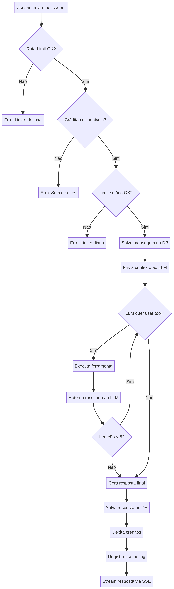

# debuga.ai — System Architecture

**Version:** 3.0  
**Date:** May 2026  
**Author:** Sperry Tecnologia  
**Audience:** Senior developers, technical leads, and infrastructure architects

---

## 1. High-Level Overview

debuga.ai is a production SaaS platform built on a **three-tier architecture** (client, application server, external services) with two distinctive design choices: **end-to-end type safety** via tRPC (eliminating API contract drift) and **real-time streaming** via Server-Sent Events (keeping the transport layer simple and HTTP/2-native). The architectural centerpiece is the **Agent Loop** — an autonomous reasoning-action-observation cycle that allows the AI to chain tool executions without human intervention.

### System Architecture Diagram


The system follows a clear separation of concerns. The React SPA communicates with the Express backend through two channels: tRPC for structured CRUD operations and SSE for real-time agent streaming. The backend orchestrates LLM inference, tool execution, billing enforcement, and data persistence.

---

## 2. LLM Inference Layer

### 2.1 Current Architecture (Production)

All LLM inference in the current production deployment is handled through the **Manus Forge API** — a managed inference gateway. The system sends structured prompts (system instructions + conversation history + tool definitions) and receives streamed completions.

| Component | Status | Description |
|---|---|---|
| **Manus Forge API** | **In production** | Managed gateway providing access to state-of-the-art models (currently Gemini 2.5 Flash) |
| **Model** | **In production** | `gemini-2.5-flash` — used for reasoning, tool calling orchestration, and response generation |
| **LLM Wrapper** | **In production** | `server/_core/llm.ts` abstracts the provider, making it straightforward to swap endpoints or add new models |

The LLM wrapper is designed to be provider-agnostic. Changing the underlying model requires only updating the endpoint configuration — no changes to the agent loop, tool calling, or streaming logic.

### 2.2 Hybrid LLM Inference Architecture

The debuga.ai inference layer is designed as a **hybrid architecture** that combines cloud API providers (production) with local/on-premise inference (lab/research). The current production deployment uses a single cloud provider, while the local inference path is being validated through the public **debuga.ai LLM Stack** repositories.

#### Hybrid Inference Diagram

```
┌─────────────────────────────────────────────────────────────────────────┐
│                        AGENT LOOP                                       │
│  server/streamRoute.ts → assembles context + tool defs                  │
│  Sends {messages, tools, stream:true} to LLM Wrapper                    │
└───────────────────────────────────┬─────────────────────────────────────┘
                                    │
                                    ▼
┌─────────────────────────────────────────────────────────────────────────┐
│                  LLM WRAPPER (server/_core/llm.ts)                      │
│  Provider-agnostic interface: invokeLLM({messages, tools, ...})         │
│  Handles: streaming, tool_call parsing, error normalization             │
└─────────────────┬─────────────────────────────────────┬─────────────────┘
                  │                                     │
    ┌─────────────▼───────────────┐     ┌─────────▼─────────────────┐
    │  CLOUD PROVIDER (Prod)     │     │  LOCAL INFERENCE (Lab)     │
    │  ──────────────────────    │     │  ───────────────────────   │
    │  Manus Forge API           │     │  debuga-llm-gateway        │
    │  (Gemini 2.5 Flash)        │     │  (OpenAI-compatible API)   │
    │                            │     │           │                │
    │  • Reasoning + tool call   │     │           ▼                │
    │  • Streaming completions   │     │  ┌──────────────────┐      │
    │  • Production SLA          │     │  │ debuga-vllm-     │      │
    │                            │     │  │ engine           │      │
    └────────────────────────────┘     │  │ (vLLM + CUDA 12) │      │
                                       │  └─────────┬────────┘      │
                                       │            │               │
                                       │            ▼               │
                                       │  ┌──────────────────┐      │
                                       │  │ debuga-qwen-     │      │
                                       │  │ coder-lab        │      │
                                       │  │                  │      │
                                       │  │ Models:          │      │
                                       │  │ • Qwen-Coder 7B  │      │
                                       │  │ • Qwen-Coder 14B │      │
                                       │  │ • Qwen-Coder 32B │      │
                                       │  │                  │      │
                                       │  │ Benchmarks:      │      │
                                       │  │ • DevOps         │      │
                                       │  │ • Security       │      │
                                       │  │ • Network        │      │
                                       │  └──────────────────┘      │
                                       └────────────────────────────┘
```

#### Component Responsibilities

| Component | Layer | Status | Responsibility |
|---|---|---|---|
| `server/_core/llm.ts` | LLM Wrapper | **Production** | Provider-agnostic interface; routes requests to the active provider endpoint |
| Manus Forge API | Cloud Provider | **Production** | Managed inference gateway; currently serves Gemini 2.5 Flash |
| `debuga-llm-gateway` | Local Gateway | Lab/Research | OpenAI-compatible routing layer with cloud/local fallback |
| `debuga-vllm-engine` | Inference Engine | Lab/Research | vLLM serving configurations (Docker + CUDA 12, Prometheus metrics) |
| `debuga-qwen-coder-lab` | Model Evaluation | Lab/Research | Qwen-Coder benchmarks for DevOps, security, and network domains |

#### Request Flow (Production)

```
Agent Loop → invokeLLM() → Manus Forge API → Gemini 2.5 Flash
                                   │
                                   ▼
                          Streamed completion
                          (text or tool_call)
```

#### Request Flow (Planned Hybrid — Roadmap v5.0–v6.0)

```
Agent Loop → invokeLLM() → debuga-llm-gateway (Router)
                                   │
                          ┌───────┼───────────────┐
                          ▼        ▼              ▼
                     Cloud API   vLLM Local     Fallback
                     (speed)     (sovereignty)  (resilience)
```

The routing decision will be based on three factors:

- **Query complexity** — Simple tool-calling queries route to cloud API (optimized for speed and cost); complex multi-step diagnostics route to specialized local models with deeper domain knowledge.
- **Data sensitivity** — Queries involving customer infrastructure data (logs, configs, topology) route to local inference to avoid sending sensitive data to external APIs.
- **Availability** — If the primary provider is unavailable, the gateway falls back to the secondary provider automatically.

### 2.3 Multi-Model Routing (Roadmap v5.0)

The routing layer within `debuga-llm-gateway` will dispatch queries to different models based on complexity, domain specificity, and latency requirements. This layer is currently a community skeleton and not yet active in production. When deployed, it will enable:

- **Simple queries** (general IT support, tool calling) → cloud API models optimized for speed and cost
- **Complex analysis** (multi-step diagnostics, security correlation) → specialized local models with deeper domain knowledge
- **Batch workloads** (report generation, bulk analysis) → cost-optimized inference paths

### 2.4 On-Premise Inference (Roadmap v6.0)

The long-term strategy includes deploying GPU infrastructure for serving open-source models fine-tuned on IT infrastructure and network security datasets. The technical research and benchmarks are being conducted in the public **debuga.ai LLM Stack** repositories. This will enable:

- **Data sovereignty** — Sensitive infrastructure data processed locally without leaving the customer's network
- **Domain-specialized models** — Fine-tuned models (Qwen-Coder, Mistral, Llama variants) optimized for network analysis, log correlation, and infrastructure reasoning
- **Reduced API dependency** — Lower operational costs and elimination of third-party API rate limits for high-volume deployments

The planned serving stack uses vLLM with CUDA 12 and tensor parallelism across multiple GPUs. Hardware requirements and deployment configurations are documented in the `debuga-vllm-engine` repository.

### 2.5 debuga.ai LLM Stack (Public Repositories)

The hybrid inference strategy is documented and validated through a set of public repositories:

| Repository | Purpose | Key Contents |
|---|---|---|
| [debuga-llm-stack](https://github.com/SperryTecnologia/debuga-llm-stack) | Central documentation and architecture | Architecture diagrams, strategy overview, integration guide |
| [debuga-qwen-coder-lab](https://github.com/SperryTecnologia/debuga-qwen-coder-lab) | Model evaluation for IT/security domain | 3 JSONL benchmark datasets (DevOps, security, network), evaluation scripts, result reports |
| [debuga-vllm-engine](https://github.com/SperryTecnologia/debuga-vllm-engine) | vLLM serving configurations | Dockerfile (CUDA 12), docker-compose (vLLM + Prometheus + Grafana), YAML configs for 7B/14B/32B |
| [debuga-llm-gateway](https://github.com/SperryTecnologia/debuga-llm-gateway) | OpenAI-compatible gateway skeleton | TypeScript gateway with cloud/vLLM providers, fallback routing, SSE streaming, health aggregation |

> **Note:** The public LLM stack is a documentation, lab, and technical research initiative. It does not represent production SaaS code, does not contain internal prompts, customer data, or business rules. The debuga.ai production may include additional integrations and policies not published.

---

## 3. Frontend Architecture

### 3.1 Technology Choices

The frontend is a React 19 SPA styled with Tailwind CSS 4 and shadcn/ui components. The design language follows a **dark terminal aesthetic** (black background, green accent palette) that resonates with the target audience of IT professionals and security engineers.

Communication with the backend occurs through two distinct channels:

| Channel | Protocol | Purpose | Library |
|---|---|---|---|
| tRPC Client | HTTP/JSON (fetch) | CRUD operations (conversations, account, subscriptions) | `@trpc/react-query` |
| SSE Consumer | Server-Sent Events | Real-time agent response streaming | Native `EventSource` |

### 3.2 Route Structure

| Route | Component | Auth Required | Description |
|---|---|---|---|
| `/` | `Home.tsx` | No | Landing page with hero, features, integrations, pricing |
| `/chat` | `ChatPage.tsx` | Yes | Chat interface with conversation sidebar, search, archive |
| `/pricing` | `PricingPage.tsx` | No | Subscription plans with Stripe checkout |
| `/account` | `AccountPage.tsx` | Yes | User dashboard with usage metrics, activity, profile |
| `/logout-success` | `LogoutSuccess.tsx` | No | Post-logout confirmation page |

### 3.3 State Management

State is managed through three complementary mechanisms. **tRPC React Query** handles server data caching with automatic invalidation on mutations. **React Context** (`useAuth()`) provides global authentication state. **Local component state** (`useState` + `useRef`) manages the SSE streaming buffer for real-time chat rendering.

---

## 4. Agent Loop — Core Engine

The Agent Loop is the architectural centerpiece that transforms debuga.ai from a chatbot into an autonomous agent. It implements a **ReAct-style** [1] reasoning-action-observation cycle with up to 5 iterations per user message.

### Agent Flow Diagram



### 4.1 Execution Flow

When a user sends a message, the system executes a pre-flight check pipeline before invoking the LLM:

1. **Rate limit check** — 20 msgs/min per user (in-memory Map with 5-min cleanup interval)
2. **Plan limit check** — Daily message count and monthly conversation count against plan quotas
3. **Credit balance check** — Sufficient credits remaining for at least one response
4. **Context assembly** — Conversation history + system prompt + tool definitions

If all checks pass, the message is persisted to the database and the assembled context is sent to the LLM. The LLM responds with either a **text completion** (final answer) or a **tool call** (action request). In the tool call case, the system executes the requested tool, appends the result to the context, and re-invokes the LLM. This cycle repeats for up to 5 iterations, enabling complex multi-step diagnostics.

### 4.2 Tool Registry

| Tool | Implementation | Timeout | Output Limit |
|---|---|---|---|
| `execute_code` | `child_process.spawn` in `/tmp` | 30s | 50KB |
| `port_scan` | TCP socket connection attempts | 30s | — |
| `dns_lookup` | `dns.promises.resolve` (Node.js native) | 10s | — |
| `ssl_check` | `tls.connect` with certificate extraction | 10s | — |
| `http_check` | `fetch` with header analysis | 10s | — |
| `whois_lookup` | WHOIS protocol query | 10s | — |
| `web_fetch` | `fetch` + HTML parsing | 15s | 50KB |
| `generate_image` | Internal ImageService API | 20s | — |

All tool implementations include robust argument validation with JSON repair (trailing commas, missing braces), domain/URL/hostname validation, and user-friendly error messages in Portuguese. Invalid arguments from the LLM are caught and re-prompted rather than surfaced as raw errors.

### 4.3 SSE Event Protocol

Responses are streamed to the client via Server-Sent Events with typed event names:

```
event: token
data: {"content": "partial text chunk"}

event: tool_start
data: {"name": "dns_lookup", "args": {"domain": "example.com", "type": "A"}}

event: tool_result
data: {"name": "dns_lookup", "result": "...resolved records..."}

event: done
data: {"tokensUsed": 1234, "creditsUsed": 5}

event: error
data: {"message": "Rate limit exceeded", "code": "RATE_LIMITED"}
```

---

## 5. Data Model

### Entity-Relationship Diagram


### 5.1 Schema Design

The database schema follows a **normalized design** with 7 tables managed by Drizzle ORM. All tables use auto-incrementing integer primary keys and UTC timestamps.

The **users** table stores OAuth accounts with role-based access control (`admin` | `user`). The `stripeCustomerId` field links to the Stripe customer object for billing operations. The **conversations** table supports pin and archive functionality. Conversations are hard-deleted when removed by the user (no soft-delete). Each conversation contains multiple **messages** that store the role (user/assistant/system/tool), content, serialized tool calls as JSON, and token count for billing.

On the financial side, **subscriptions** tracks Stripe subscription lifecycle (active, past_due, canceled) with period boundaries and cancellation flags. The **credits** table maintains per-user credit balance with `planId` as the source of truth — updated exclusively by Stripe webhooks to prevent desynchronization. The **usage_log** table provides a granular audit trail of every operation with token counts and credit consumption.

The **usage_events** table provides tamper-resistant usage counters that are independent of conversation/message deletion. Events are recorded for each message sent and conversation started, ensuring that deleting chat history does not reset consumption limits. This table is the authoritative source for plan limit enforcement.

### 5.2 Index Strategy

| Table | Index | Columns | Purpose |
|---|---|---|---|
| users | UNIQUE | openId | OAuth identity lookup |
| conversations | COMPOSITE | userId, createdAt | User conversation listing (sorted) |
| messages | COMPOSITE | conversationId, createdAt | Message pagination within conversation |
| subscriptions | COMPOSITE | userId, status | Active subscription lookup |
| credits | UNIQUE | userId | Single credit record per user |
| usage_log | COMPOSITE | userId, createdAt | Usage history with date filtering |
| usage_events | COMPOSITE | userId, eventType, createdAt | Usage counter queries with date filtering |

---

## 6. Billing Architecture

### Payment Flow Diagram


### 6.1 Checkout Flow

The billing system follows the **Stripe Checkout Session** pattern. The frontend requests a checkout session from the backend, which creates it with metadata linking the session to the authenticated user (`client_reference_id`, `metadata.user_id`). The user is redirected to Stripe's hosted checkout page, and upon completion, Stripe sends a webhook to the backend.

### 6.2 Webhook Event Handling

| Event | Backend Action |
|---|---|
| `checkout.session.completed` | Create/update subscription, reset credits to plan allocation, link Stripe customer ID |
| `customer.subscription.created` | Sync new subscription, resolve plan by price amount |
| `customer.subscription.updated` | Sync subscription status, handle upgrade/downgrade between plans |
| `customer.subscription.deleted` | Downgrade to free tier, reset credits to 50, record account event |
| `invoice.payment_succeeded` | Confirm payment, update subscription period |
| `invoice.payment_failed` | Mark subscription as `past_due`, record account event |

Plan resolution uses a multi-strategy approach: first by Stripe Price ID cache, then by price amount matching (`getPlanByPriceAmount`), ensuring resilience against Stripe configuration changes. The webhook handler is idempotent — duplicate events are handled via `upsertSubscription` with `onDuplicateKeyUpdate`.

### 6.3 Three-Layer Consumption Control

The credit system implements defense-in-depth with three independent enforcement layers:

**Layer 1 — Rate Limiting (anti-flood):** An in-memory `Map<userId, timestamp[]>` tracks message timestamps per user. Requests exceeding 20/minute receive a `429 Too Many Requests` response. The map is garbage-collected every 5 minutes to prevent memory leaks. Admin users bypass this layer.

**Layer 2 — Plan Quotas (business logic):** Before each LLM invocation, the system queries daily message count and monthly conversation count from `usage_events` against the user's plan limits. This prevents unnecessary API costs by rejecting messages before they reach the LLM. Admin users bypass this layer.

**Layer 3 — Credit Debit (metering):** After each successful response, token consumption is estimated (~4 characters per token + 50 tokens per tool call) and debited from the user's credit balance. The debit is logged to `usage_log` for audit purposes.

---

## 7. Security Architecture

The codebase has passed a production security audit.

**Secret Management:** All sensitive values are injected via environment variables at runtime. The `.gitignore` excludes `.env*` files. Frontend code only accesses `VITE_`-prefixed variables (public keys by design). Server-side secrets (`STRIPE_SECRET_KEY`, `JWT_SECRET`, `DATABASE_URL`, `BUILT_IN_FORGE_API_KEY`) never reach the client bundle.

**Authentication:** OAuth 2.0 with JWT session cookies signed by `JWT_SECRET`. The tRPC layer provides `publicProcedure` and `protectedProcedure` abstractions. All data queries are scoped to `ctx.user.id` from the authenticated session (IDOR-safe by construction).

**Webhook Integrity:** Stripe webhooks are verified using `stripe.webhooks.constructEvent()` with the webhook signing secret before any event processing.

**Code Execution:** The `execute_code` tool runs user-provided code in `/tmp` with a 30-second timeout and 50KB output limit. The deployment platform provides additional process-level isolation. A dedicated sandbox environment (Docker-based) is planned for future versions to provide stronger isolation guarantees.

**HTTPS Only:** All communications are encrypted in transit.

---

## 8. Integrations

### 8.1 Active Integrations (Production)

| Integration | Purpose | Implementation |
|---|---|---|
| **Stripe** | Subscriptions, checkout, webhooks, customer portal | `server/stripeRoutes.ts` |
| **Manus Forge API** | LLM inference (Gemini 2.5 Flash) | `server/_core/llm.ts` |
| **Manus OAuth** | User authentication | `server/_core/oauth.ts` |
| **S3-compatible storage** | File and artifact storage | `server/storage.ts` |
| **Manus Image Service** | AI image generation | `server/_core/imageGeneration.ts` |

### 8.2 Planned Integrations (Roadmap)

The following integrations are part of the product roadmap. Scaffold code exists in `server/integrations/` as a preparatory structure, but these connectors are **not active in production flows**:

| Integration | Purpose | Target Version |
|---|---|---|
| **Zabbix** | Infrastructure monitoring — pull host status, alerts, and metrics into agent context | v5.0 |
| **Wazuh** | SIEM — security event correlation, threat detection alerts | v5.0 |
| **Prometheus/Grafana** | Observability — metrics queries, dashboard data for infrastructure analysis | v5.0 |

When activated, these connectors will allow the agent to query real monitoring data during the reasoning loop, enabling diagnostics grounded in actual infrastructure state rather than relying solely on external probes (DNS, SSL, HTTP checks).

---

## 9. Architectural Decisions Record (ADR)

### ADR-001: tRPC over REST

**Context:** The application requires tight frontend-backend type coupling for rapid iteration. **Decision:** Use tRPC 11 with Superjson serialization. **Consequence:** Zero API contract files, compile-time type checking across the stack, native `Date`/`BigInt` serialization. Trade-off: tRPC is less suitable for public API consumption (addressed in v6.0 roadmap with REST API layer).

### ADR-002: SSE over WebSocket

**Context:** The streaming requirement is unidirectional (server → client). **Decision:** Use Server-Sent Events instead of WebSocket. **Consequence:** Simpler implementation, native HTTP/2 multiplexing, no Socket.io dependency, automatic reconnection built into the `EventSource` API. Trade-off: No bidirectional communication (not needed for this use case).

### ADR-003: Drizzle over Prisma

**Context:** The ORM must generate predictable SQL and support pure SQL migrations for production database management. **Decision:** Use Drizzle ORM. **Consequence:** SQL-like query API, lighter runtime (~50KB vs Prisma's ~2MB), pure `.sql` migration files that can be reviewed and applied manually. Trade-off: Smaller ecosystem and community compared to Prisma.

### ADR-004: Hybrid LLM Strategy (Cloud + Local)

**Context:** The product needs reliable LLM inference from day one, while building toward domain-specialized models that require dedicated hardware. **Decision:** Launch with Manus Forge API (managed cloud inference) as the sole production LLM provider. Design the LLM wrapper (`server/_core/llm.ts`) to be provider-agnostic. Validate the local inference path through the public debuga.ai LLM Stack (vLLM + Qwen-Coder benchmarks + OpenAI-compatible gateway skeleton). **Consequence:** Fast time-to-market with production-grade inference. The architecture supports adding local model endpoints when the on-premise infrastructure is validated. The public LLM Stack provides transparency and community engagement around the hybrid strategy. Trade-off: Current dependency on a single external API provider for all production inference; local path is lab-only.

### ADR-005: Credit-Based Billing over Per-Request Pricing

**Context:** Users need predictable monthly costs while the platform needs to prevent abuse. **Decision:** Implement a credit system with monthly allocation per plan tier. **Consequence:** Users get a clear budget, the platform has three layers of consumption control, and the billing model is simple to communicate. Trade-off: Credit estimation is approximate (~4 chars/token), which may slightly over- or under-charge individual requests.

### ADR-006: Independent Usage Counters (usage_events)

**Context:** Plan limit enforcement based on counting conversations/messages in the main tables is vulnerable to manipulation — users could delete conversations to reset their counters. **Decision:** Implement a separate `usage_events` table that records each message sent and conversation started as immutable events. Plan limits are enforced against this table, not against the conversation/message tables. **Consequence:** Deleting chat history does not affect usage limits. Counters are tamper-resistant and provide an accurate audit trail. Trade-off: Additional write per message and slightly more complex query logic.

---

## 10. Deployment Topology

### Current (Production)

```
[Cloudflare CDN] → [debuga.ai / www.debuga.ai]
                        │
                        ▼
                  [Cloud Platform]
                    ├── Express Server (Node.js)
                    ├── TiDB Database
                    ├── S3 Storage
                    └── Manus Forge API (LLM Inference)
```

### Planned: Self-Hosted / Enterprise (Roadmap v7.0)

```
[Reverse Proxy] → [debuga.ai]
                      │
                      ▼
                [Docker Compose]
                  ├── app (Node.js container)
                  ├── db (MySQL 8.0)
                  ├── sandbox (isolated code execution)
                  └── [On-Premise GPU Cluster]
                        ├── debuga-llm-gateway (router)
                        ├── debuga-vllm-engine (inference)
                        ├── Prometheus + Grafana (monitoring)
                        └── Models: Qwen-Coder, Mistral, Llama
```

The self-hosted deployment is planned for Enterprise customers who require data sovereignty and on-premise inference. The infrastructure components (vLLM engine, gateway, monitoring) are being validated through the public debuga.ai LLM Stack. Documentation will be published when this capability reaches production readiness.

---

*Technical Architecture Document — Sperry Tecnologia © 2026*

[1]: https://arxiv.org/abs/2210.03629 "ReAct: Synergizing Reasoning and Acting in Language Models"
