# Technical Architecture — debuga.ai

**Detailed Architecture Documentation for the Operational AI Platform**

Version 2.0 | May 2026 | Sperry Tecnologia

---

## Overview

debuga.ai is built on a layered architecture with clear separation of concerns, enabling horizontal scalability, component replacement, and flexible deployment (cloud, VPS, on-premise, or hybrid). Each layer communicates exclusively via well-defined internal APIs.

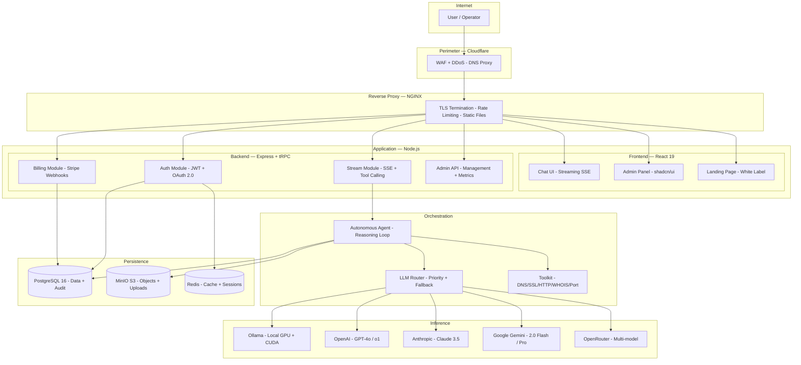

---

## Presentation Layer

The interface is built with React 19, Tailwind CSS 4, and shadcn/ui, served as a SPA with SSE for streaming agent responses.

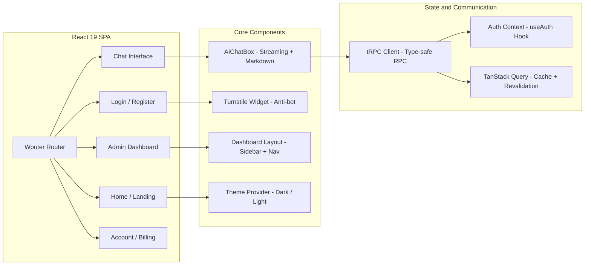

| Component | Technology | Responsibility |
|-----------|-----------|----------------|
| **Chat UI** | React 19 + Tailwind 4 + Streamdown | Conversational interface with SSE streaming, Markdown rendering, code blocks with syntax highlighting |
| **Admin Panel** | React + shadcn/ui + Recharts | User management, usage metrics, system settings, audit logs |
| **Landing Page** | React + Tailwind (white label) | Customizable public page: branding, colors, text, plans, custom domain |
| **Login / Register** | React + Turnstile + OAuth | Local authentication with email verification, Google OAuth, anti-bot protection |
| **Account / Billing** | React + Stripe Elements | Account management, plans, payment history, usage limits |

---

## API Layer

The API uses tRPC for end-to-end type-safe communication between frontend and backend, eliminating the need for shared schemas or code generation.

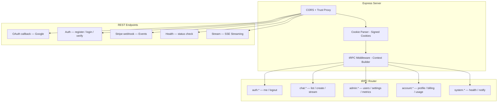

| Module | Type | Function | Authentication |
|--------|------|----------|----------------|
| **auth** | tRPC | Session state, logout | Public (me) / Protected (logout) |
| **chat** | tRPC + REST | Conversation CRUD, SSE streaming | Protected |
| **admin** | tRPC | User management, settings, metrics | Admin only |
| **account** | tRPC | Profile, billing, usage, limits | Protected |
| **system** | tRPC | Health check, notifications | Public / Protected |
| **OAuth** | REST | Google OAuth 2.0 callback | Public |
| **Local Auth** | REST | Register, login, verify email, forgot password | Public (rate limited) |
| **Stripe** | REST | Payment webhooks | Signature verification |
| **Stream** | REST (SSE) | Agent response streaming | Protected + email verification |

---

## Orchestration Layer

The autonomous agent operates in a reasoning loop that analyzes the query, decides which tools to invoke, executes them sequentially, and synthesizes the final response.

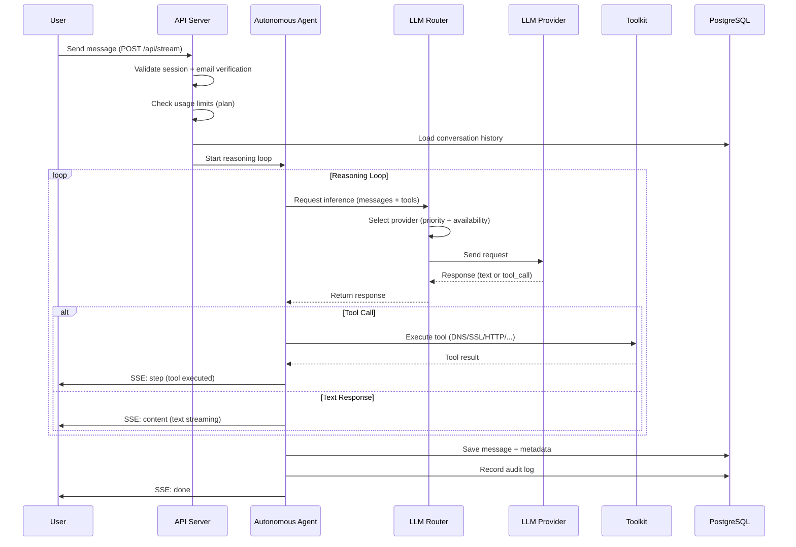

### Multi-Provider LLM Routing

The router selects the most suitable provider based on a configurable priority chain:

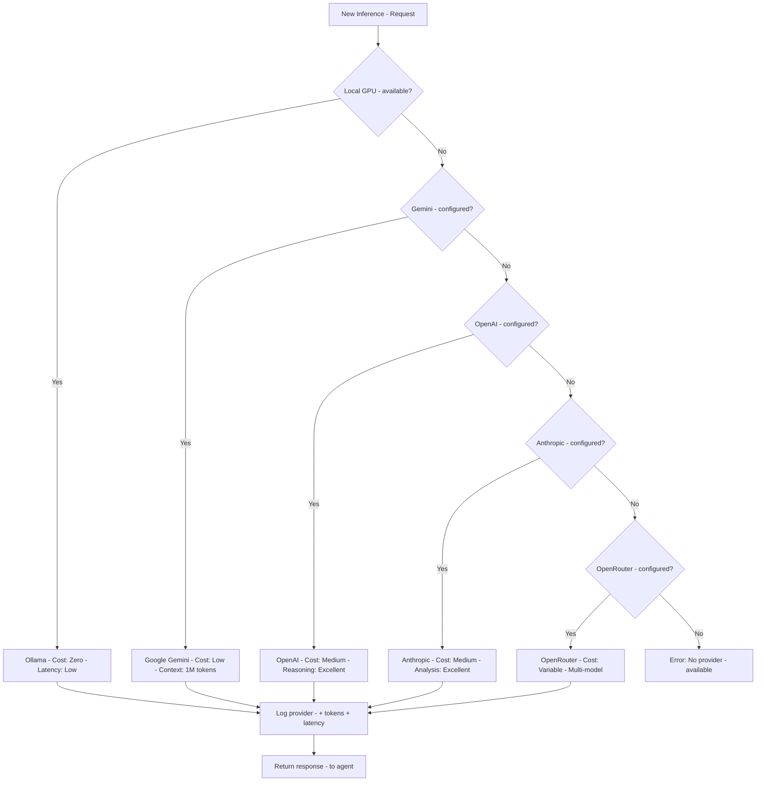

| Provider | Priority | Type | Default Model | Use Case |
|----------|----------|------|---------------|----------|
| **Ollama** | 1 (highest) | Local | Qwen 2.5 Coder 32B | General use, zero cost, local data |
| **Google Gemini** | 2 | Cloud | Gemini 2.0 Flash | Long context (1M tokens), cost-effective |
| **OpenAI** | 3 | Cloud | GPT-4o | Complex reasoning, advanced tool calling |
| **Anthropic** | 4 | Cloud | Claude 3.5 Sonnet | Long analysis, code, documentation |
| **OpenRouter** | 5 | Cloud | Variable | Access to additional models, final fallback |

---

## Inference Layer

### Local GPU with Ollama

Local inference uses Ollama with NVIDIA CUDA support, ensuring sensitive data never leaves the operator's environment:

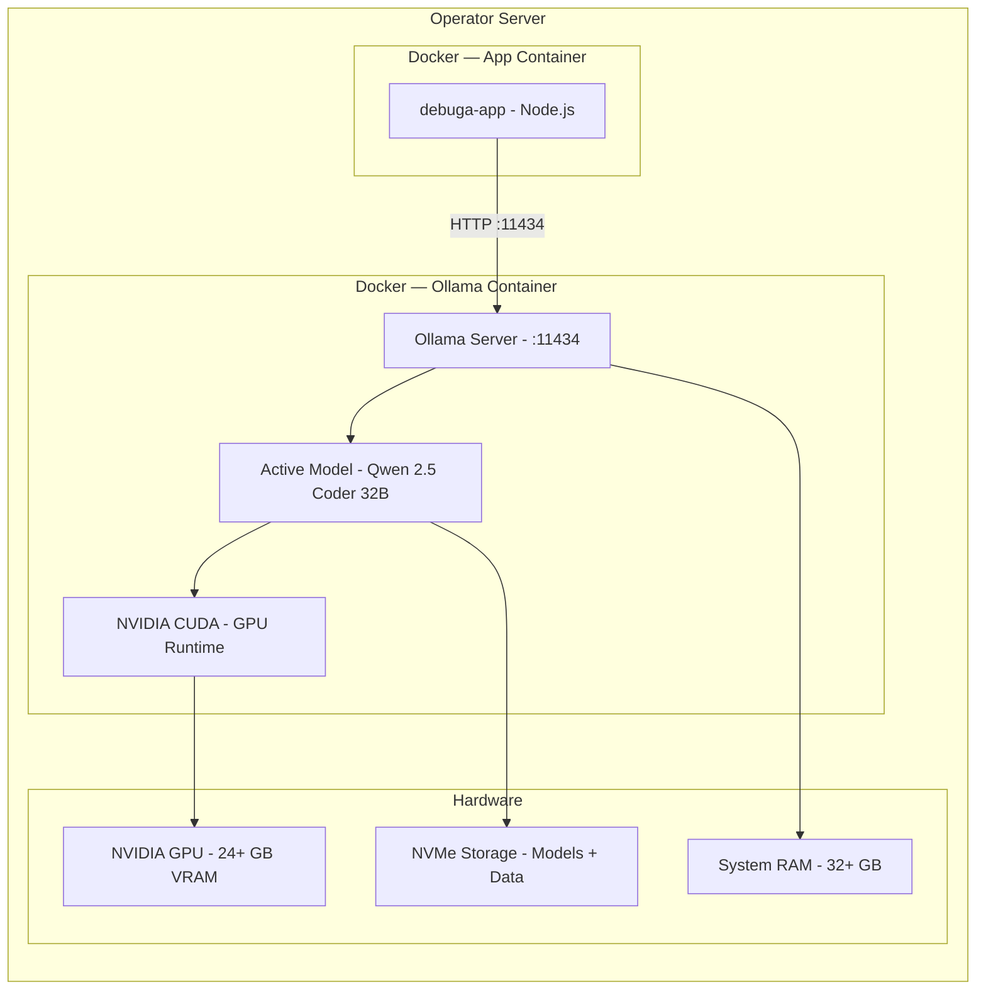

| Aspect | Specification |
|--------|---------------|
| **Runtime** | Ollama with NVIDIA Container Toolkit |
| **GPU** | NVIDIA with 24+ GB VRAM (RTX 3090/4090, A100, H100) |
| **Default Model** | Qwen 2.5 Coder 32B (optimized for technical context) |
| **Quantization** | GGUF Q4_K_M (balance between quality and performance) |
| **Context Window** | 32,768 tokens (expandable to 128K with RoPE) |
| **API** | OpenAI-compatible (drop-in replacement) |
| **Isolation** | Dedicated container with GPU passthrough |
| **Fallback** | Automatic to cloud providers on failure or overload |

---

## Persistence Layer

### Data Model

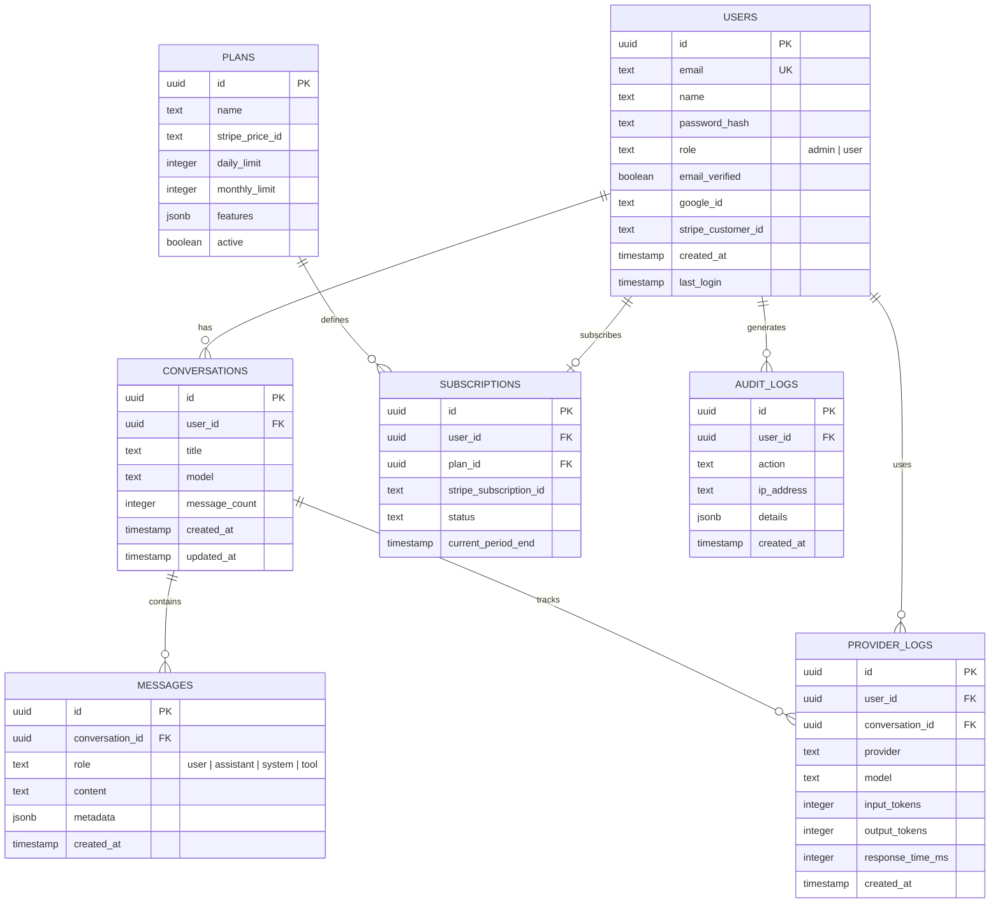

| Service | Technology | Function | Volume |
|---------|-----------|----------|--------|
| **PostgreSQL 16** | Relational + JSONB | Users, conversations, messages, plans, audit, provider logs | Structured data |
| **MinIO / S3** | Object Storage | User uploads, generated images, exports, backups | Binary files |
| **Redis** | In-memory | Session cache, rate limiting, temporary queues | Ephemeral data |

---

## Security

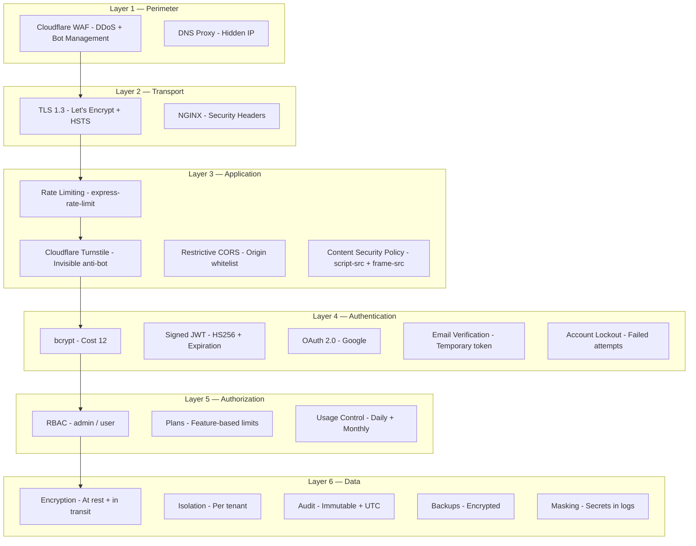

| Layer | Component | Implementation | Compliance |
|-------|-----------|----------------|------------|
| Perimeter | Cloudflare WAF | Managed rules + custom rules | OWASP Top 10 |
| Transport | TLS 1.3 | Let's Encrypt + Full (Strict) | PCI DSS |
| Application | Rate Limiting | 5 req/min (auth), 60 req/min (API) | Anti-abuse |
| Application | Turnstile | Invisible challenge on login/register | Anti-bot |
| Application | CSP | script-src, frame-src, connect-src | XSS prevention |
| Authentication | bcrypt | Cost 12, timing-safe comparison | OWASP |
| Authentication | JWT | HS256, 7d expiry, httpOnly cookie | Session security |
| Authentication | Email verification | Temporary token, mandatory gate | Account validation |
| Authorization | RBAC | admin/user with dedicated middleware | Least privilege |
| Data | Isolation | Queries filtered by user_id/tenant | LGPD Art. 46 |
| Data | Audit | Immutable logs with IP + UTC timestamp | SOC 2, LGPD Art. 37 |
| Data | Backups | Encrypted, under operator control | Business continuity |

---

## Deploy Topology

| Container | Image | Port | Function | Resources |
|-----------|-------|------|----------|-----------|
| **debuga-nginx** | nginx:alpine | 80, 443 | Reverse proxy, TLS, static files, rate limiting | 256 MB RAM |
| **debuga-app** | node:22-slim | 3000 | Application (frontend + backend + streaming) | 2-4 GB RAM |
| **debuga-postgres** | postgres:16-alpine | 5432 | Primary database | 1-2 GB RAM |
| **debuga-minio** | minio/minio | 9000, 9001 | Object storage (uploads, images) | 512 MB RAM |
| **debuga-ollama** | ollama/ollama | 11434 | Local inference with GPU | 24+ GB VRAM |
| **debuga-redis** | redis:7-alpine | 6379 | Cache, sessions, rate limiting | 256 MB RAM |

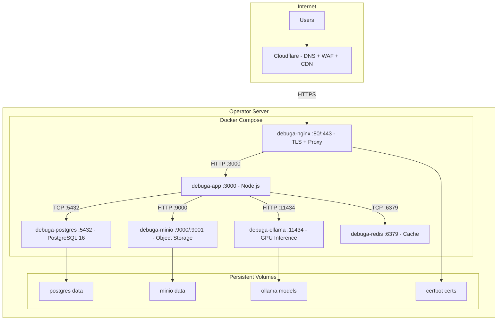

---

## Observability and Monitoring

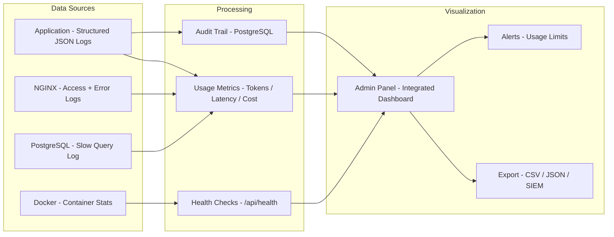

| Metric | Source | Granularity | Retention |
|--------|--------|-------------|-----------|
| **Tokens consumed** | Provider logs | Per request | Unlimited |
| **Response latency** | App logs | Per request | 90 days |
| **Estimated cost** | Provider logs + pricing | Per day/month | Unlimited |
| **Uptime** | Health checks | 1 minute | 365 days |
| **Errors** | App + NGINX logs | Per occurrence | 90 days |
| **Per-user usage** | Provider logs | Per day | Unlimited |

---

## Architectural Decisions

| Decision | Alternative Considered | Justification |
|----------|----------------------|---------------|
| **tRPC** (not REST/GraphQL) | REST with OpenAPI, GraphQL | End-to-end type-safety without code generation, lower overhead |
| **Express** (not Fastify) | Fastify, Hono | Mature ecosystem, compatibility with existing middlewares |
| **PostgreSQL** (not MySQL/MongoDB) | MySQL, MongoDB, SQLite | Native JSONB, extensions, reliability, complex query performance |
| **Drizzle ORM** (not Prisma) | Prisma, TypeORM, Knex | Type-safe without code generation, SQL-like, zero runtime overhead |
| **Ollama** (not vLLM) | vLLM, TGI, llama.cpp | Deployment simplicity, OpenAI-compatible API, model management |
| **Docker Compose** (not K8s) | Kubernetes, Nomad | Single-node simplicity, operators without DevOps teams |
| **JWT** (not DB sessions) | Sessions in Redis/DB | Stateless, scalable, no per-request lookup |
| **SSE** (not WebSocket) | WebSocket, Long polling | Unidirectional (server-to-client), proxy-compatible, simple |
| **Tailwind 4** (not CSS Modules) | CSS Modules, Styled Components | Utility-first, consistent design system, zero runtime |
| **shadcn/ui** (not Material UI) | Material UI, Chakra, Ant Design | Copyable components, customizable, no vendor lock-in |

---

## Authentication Flow

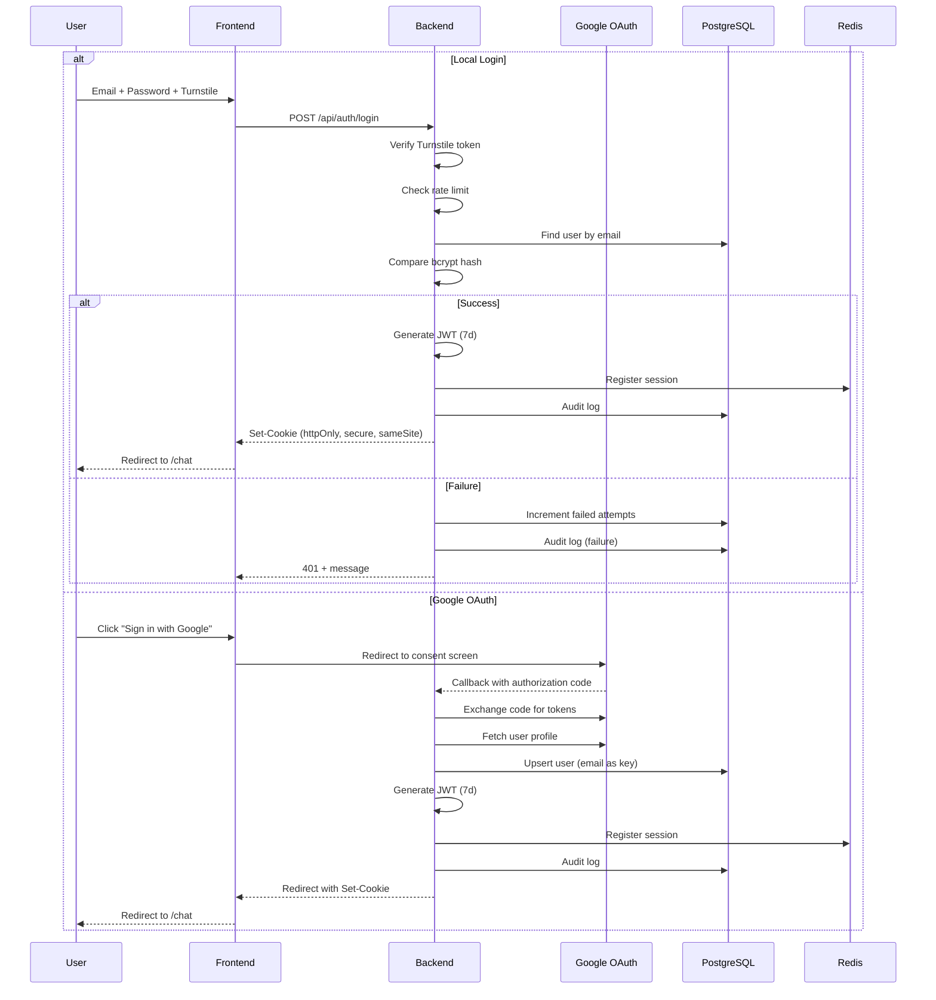

---

## Scalability

The architecture supports growth across multiple dimensions:

| Dimension | Strategy | Implementation |
|-----------|----------|----------------|
| **Concurrent users** | Horizontal app scaling | Multiple instances behind NGINX |
| **Inference volume** | Multi-provider + local GPU | Automatic fallback distributes load |
| **Storage** | Distributed object storage | MinIO with erasure coding |
| **Database** | Read replicas + connection pooling | PgBouncer + streaming replication |
| **Network** | CDN + edge caching | Cloudflare for static assets |

---

## Related Documentation

| Document | Description |
|----------|-------------|
| [Whitepaper](WHITEPAPER_EN.md) | Executive overview of the platform |
| [White Label](WHITE_LABEL_OVERVIEW.md) | Deployment model and customization |
| [Security](SECURITY_OVERVIEW.md) | Security policies and compliance |
| [AI Providers](PROVIDERS_OVERVIEW.md) | Supported providers and routing |
| [Roadmap](ROADMAP.md) | Planned platform evolution |

---

*Sperry Tecnologia — [sperrytecnologia.com.br](https://www.sperrytecnologia.com.br)*
