# Arquitetura Técnica — debuga.ai

**Documentação Detalhada da Arquitetura da Plataforma de IA Operacional**

Versão 2.0 | Maio 2026 | Sperry Tecnologia

---

## Visão Geral

A debuga.ai é construída sobre uma arquitetura em camadas com separação clara de responsabilidades, permitindo escalabilidade horizontal, substituição de componentes e implantação flexível (cloud, VPS, on-premise ou híbrida). Cada camada se comunica exclusivamente via APIs internas bem definidas.

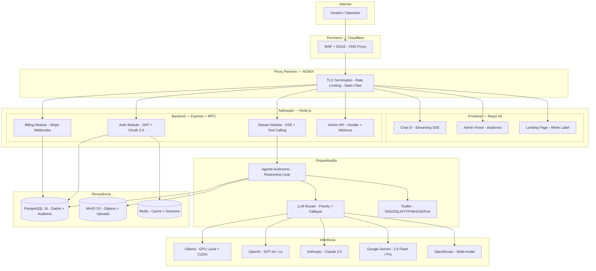

---

## Camada de Apresentação

A interface é construída com React 19, Tailwind CSS 4 e shadcn/ui, servida como SPA com SSE para streaming de respostas do agente.

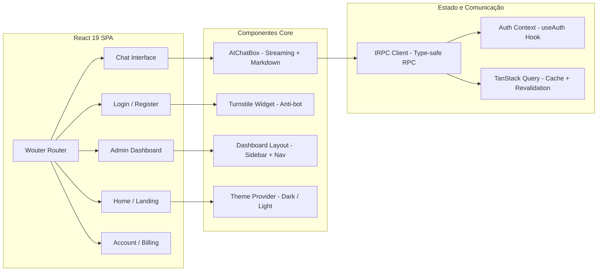

| Componente | Tecnologia | Responsabilidade |
|-----------|-----------|-----------------|
| **Chat UI** | React 19 + Tailwind 4 + Streamdown | Interface conversacional com streaming SSE, renderização Markdown, code blocks com syntax highlighting |
| **Admin Panel** | React + shadcn/ui + Recharts | Gestão de usuários, métricas de uso, configurações do sistema, logs de auditoria |
| **Landing Page** | React + Tailwind (white label) | Página pública personalizável: marca, cores, textos, planos, domínio próprio |
| **Login / Register** | React + Turnstile + OAuth | Autenticação local com verificação de email, OAuth Google, proteção anti-bot |
| **Account / Billing** | React + Stripe Elements | Gestão de conta, planos, histórico de pagamentos, limites de uso |

---

## Camada de API

A API utiliza tRPC para comunicação type-safe end-to-end entre frontend e backend, eliminando a necessidade de schemas compartilhados ou geração de código.

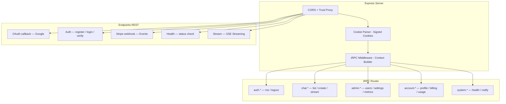

| Módulo | Tipo | Função | Autenticação |
|--------|------|--------|--------------|
| **auth** | tRPC | Estado de sessão, logout | Pública (me) / Protegida (logout) |
| **chat** | tRPC + REST | CRUD de conversas, streaming SSE | Protegida |
| **admin** | tRPC | Gestão de usuários, configurações, métricas | Admin only |
| **account** | tRPC | Perfil, billing, uso, limites | Protegida |
| **system** | tRPC | Health check, notificações | Pública / Protegida |
| **OAuth** | REST | Callback Google OAuth 2.0 | Pública |
| **Local Auth** | REST | Register, login, verify email, forgot password | Pública (rate limited) |
| **Stripe** | REST | Webhooks de pagamento | Signature verification |
| **Stream** | REST (SSE) | Streaming de respostas do agente | Protegida + verificação de email |

---

## Camada de Orquestração

O agente autônomo opera em um loop de raciocínio (reasoning loop) que analisa a consulta, decide quais ferramentas invocar, executa-as sequencialmente e sintetiza a resposta final.

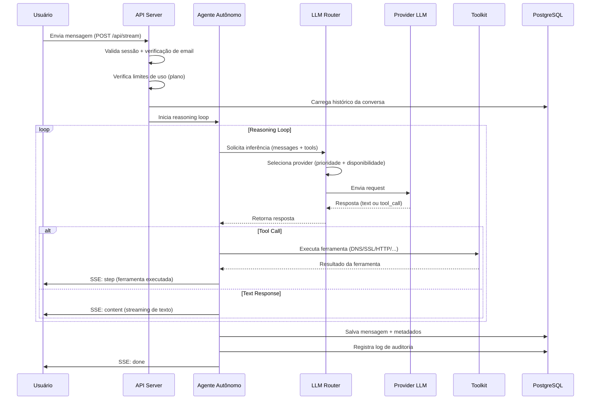

### Roteamento LLM Multi-Provider

O roteador seleciona o provider mais adequado com base em uma cadeia de prioridade configurável:

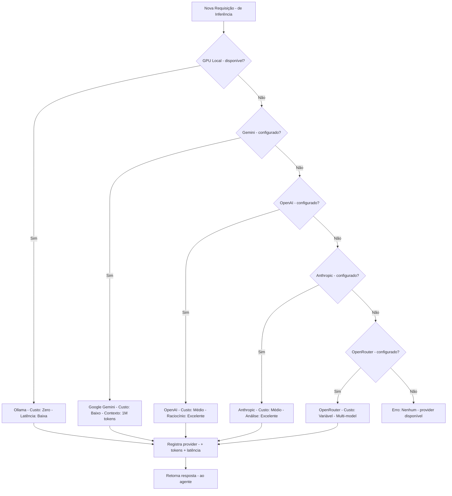

| Provider | Prioridade | Tipo | Modelo Padrão | Caso de Uso |
|----------|-----------|------|---------------|-------------|
| **Ollama** | 1 (máxima) | Local | Qwen 2.5 Coder 32B | Uso geral, custo zero, dados locais |
| **Google Gemini** | 2 | Cloud | Gemini 2.0 Flash | Contexto longo (1M tokens), custo-benefício |
| **OpenAI** | 3 | Cloud | GPT-4o | Raciocínio complexo, tool calling avançado |
| **Anthropic** | 4 | Cloud | Claude 3.5 Sonnet | Análise longa, código, documentação |
| **OpenRouter** | 5 | Cloud | Variável | Acesso a modelos adicionais, fallback final |

---

## Camada de Inferência

### GPU Local com Ollama

A inferência local utiliza Ollama com suporte a NVIDIA CUDA, permitindo que dados sensíveis nunca saiam do ambiente do operador:

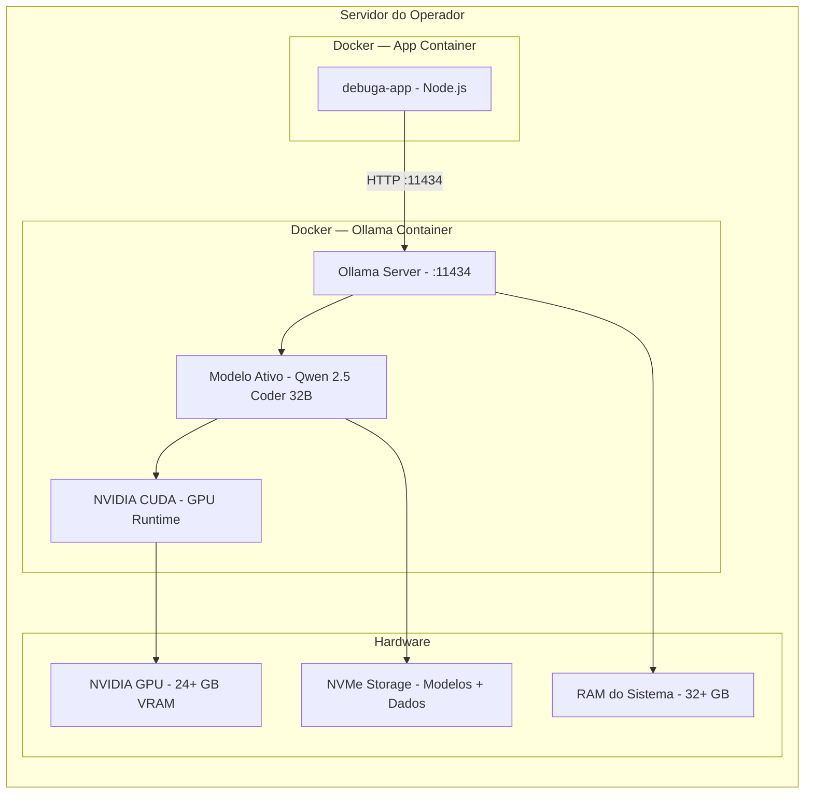

| Aspecto | Especificação |
|---------|--------------|
| **Runtime** | NVIDIA Container Toolkit + CUDA 12.x |
| **Modelo padrão** | Qwen 2.5 Coder 32B (Q4_K_M) |
| **VRAM necessária** | 20-24 GB para 32B quantizado |
| **Throughput** | 30-50 tokens/s (RTX 4090) |
| **Contexto** | 32.768 tokens |
| **Protocolo** | HTTP REST (:11434) compatível com OpenAI API |

### Providers Cloud (Fallback)

Quando a GPU local não está disponível ou o operador opta por não utilizá-la, o sistema faz fallback automático para providers cloud na ordem de prioridade configurada. Cada provider é testado na inicialização e monitorado continuamente.

---

## Camada de Persistência

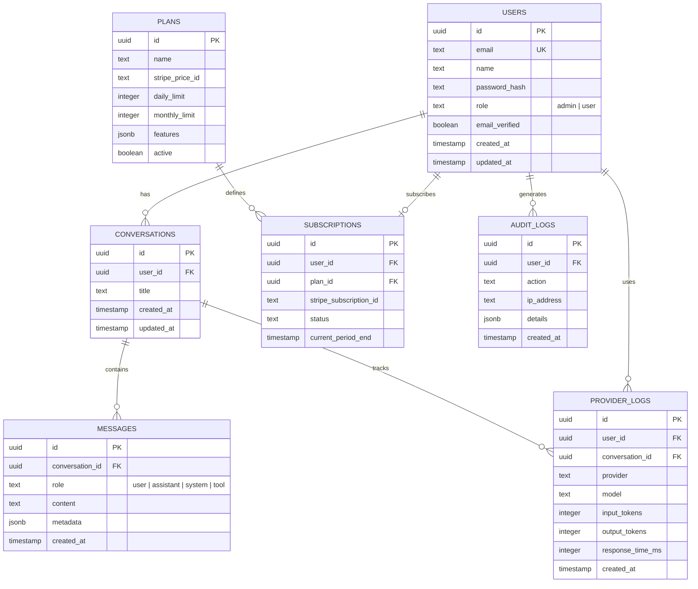

| Serviço | Tecnologia | Função | Volume |
|---------|-----------|--------|--------|
| **PostgreSQL 16** | Relacional + JSONB | Usuários, conversas, mensagens, planos, auditoria, logs de provider | Dados estruturados |
| **MinIO / S3** | Object Storage | Uploads de usuários, imagens geradas, exports, backups | Arquivos binários |
| **Redis** | In-memory | Cache de sessões, rate limiting, filas temporárias | Dados efêmeros |

---

## Segurança

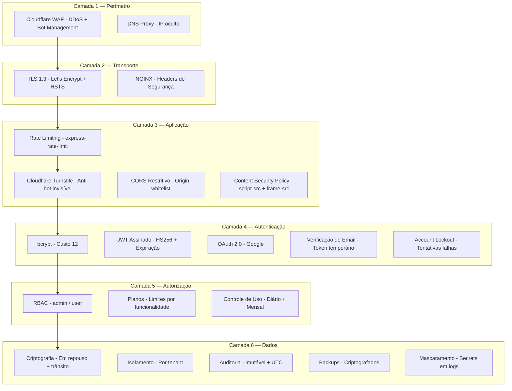

| Camada | Componente | Implementação | Conformidade |
|--------|-----------|--------------|--------------|
| Perímetro | Cloudflare WAF | Regras gerenciadas + custom rules | OWASP Top 10 |
| Transporte | TLS 1.3 | Let's Encrypt + Full (Strict) | PCI DSS |
| Aplicação | Rate Limiting | 5 req/min (auth), 60 req/min (API) | Anti-abuse |
| Aplicação | Turnstile | Challenge invisível no login/register | Anti-bot |
| Aplicação | CSP | script-src, frame-src, connect-src | XSS prevention |
| Autenticação | bcrypt | Custo 12, timing-safe comparison | OWASP |
| Autenticação | JWT | HS256, 7d expiry, httpOnly cookie | Session security |
| Autenticação | Email verification | Token temporário, gate obrigatório | Account validation |
| Autorização | RBAC | admin/user com middleware dedicado | Least privilege |
| Dados | Isolamento | Queries filtradas por user_id/tenant | LGPD Art. 46 |
| Dados | Auditoria | Logs imutáveis com IP + timestamp UTC | SOC 2, LGPD Art. 37 |
| Dados | Backups | Criptografados, sob controle do operador | Business continuity |

---

## Topologia de Deploy

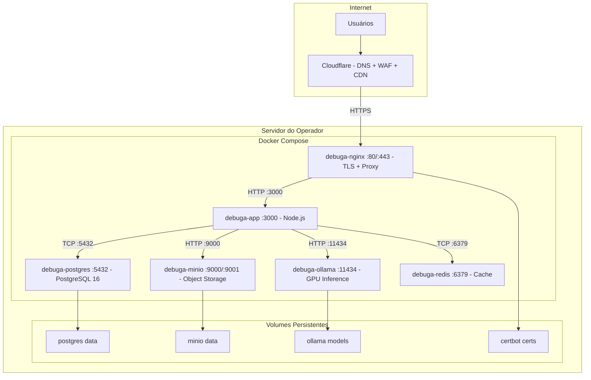

| Container | Imagem | Porta | Função | Recursos |
|-----------|--------|-------|--------|----------|
| **debuga-nginx** | nginx:alpine | 80, 443 | Proxy reverso, TLS, static files, rate limiting | 256 MB RAM |
| **debuga-app** | node:22-slim | 3000 | Aplicação (frontend + backend + streaming) | 2-4 GB RAM |
| **debuga-postgres** | postgres:16-alpine | 5432 | Banco de dados principal | 1-2 GB RAM |
| **debuga-minio** | minio/minio | 9000, 9001 | Object storage (uploads, imagens) | 512 MB RAM |
| **debuga-ollama** | ollama/ollama | 11434 | Inferência local com GPU | 24+ GB VRAM |
| **debuga-redis** | redis:7-alpine | 6379 | Cache, sessões, rate limiting | 256 MB RAM |

---

## Requisitos de Hardware

| Componente | Mínimo (sem GPU) | Recomendado (com GPU) | Enterprise |
|-----------|-----------------|----------------------|------------|
| **CPU** | 4 cores | 8 cores | 16+ cores |
| **RAM** | 8 GB | 32 GB | 64+ GB |
| **Storage** | 50 GB SSD | 500 GB NVMe | 1+ TB NVMe RAID |
| **GPU** | — | NVIDIA RTX 4090 (24 GB) | NVIDIA A100 (80 GB) |
| **Rede** | 100 Mbps | 1 Gbps | 10 Gbps |
| **OS** | Ubuntu 22.04+ | Ubuntu 22.04+ | Ubuntu 22.04+ |

A GPU é **opcional**. Sem GPU, a plataforma opera exclusivamente com providers cloud. Com GPU, a inferência local tem prioridade máxima (custo zero por token, dados não saem do ambiente).

---

## Monitoramento e Observabilidade

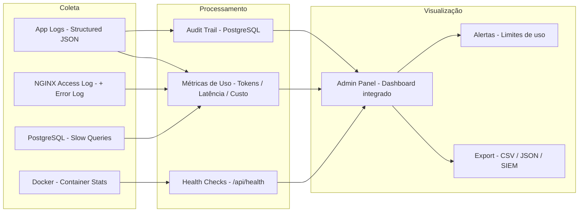

| Métrica | Fonte | Granularidade | Retenção |
|---------|-------|--------------|----------|
| **Tokens consumidos** | Provider logs | Por request | Ilimitada |
| **Latência de resposta** | App logs | Por request | 90 dias |
| **Custo estimado** | Provider logs + pricing | Por dia/mês | Ilimitada |
| **Uptime** | Health checks | 1 minuto | 365 dias |
| **Erros** | App + NGINX logs | Por ocorrência | 90 dias |
| **Uso por usuário** | Provider logs | Por dia | Ilimitada |

---

## Decisões Arquiteturais

| Decisão | Alternativa Considerada | Justificativa |
|---------|------------------------|---------------|
| **tRPC** (não REST/GraphQL) | REST com OpenAPI, GraphQL | Type-safety end-to-end sem code generation, menor overhead |
| **Express** (não Fastify) | Fastify, Hono | Ecossistema maduro, compatibilidade com middlewares existentes |
| **PostgreSQL** (não MySQL/MongoDB) | MySQL, MongoDB, SQLite | JSONB nativo, extensões, confiabilidade, performance em queries complexas |
| **Drizzle ORM** (não Prisma) | Prisma, TypeORM, Knex | Type-safe sem code generation, SQL-like, zero runtime overhead |
| **Ollama** (não vLLM) | vLLM, TGI, llama.cpp | Simplicidade de deploy, API compatível com OpenAI, gestão de modelos |
| **Docker Compose** (não K8s) | Kubernetes, Nomad | Simplicidade para single-node, operadores sem equipe de DevOps |
| **JWT** (não sessions DB) | Sessions em Redis/DB | Stateless, escalável, sem lookup por request |
| **SSE** (não WebSocket) | WebSocket, Long polling | Unidirecional (server→client), compatível com proxies, simples |
| **Tailwind 4** (não CSS Modules) | CSS Modules, Styled Components | Utility-first, design system consistente, zero runtime |
| **shadcn/ui** (não Material UI) | Material UI, Chakra, Ant Design | Componentes copiáveis, customizáveis, sem vendor lock-in |

---

## Fluxo de Autenticação

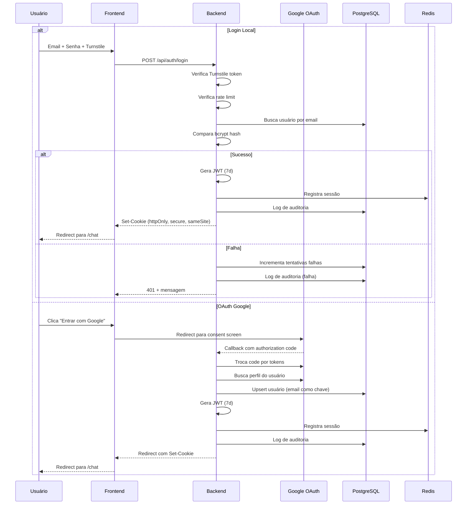

---

## Escalabilidade

A arquitetura suporta crescimento em múltiplas dimensões:

| Dimensão | Estratégia | Implementação |
|----------|-----------|---------------|
| **Usuários simultâneos** | Horizontal scaling da app | Múltiplas instâncias atrás do NGINX |
| **Volume de inferência** | Multi-provider + GPU local | Fallback automático distribui carga |
| **Armazenamento** | Object storage distribuído | MinIO com erasure coding |
| **Banco de dados** | Read replicas + connection pooling | PgBouncer + streaming replication |
| **Rede** | CDN + edge caching | Cloudflare para assets estáticos |

---

## Documentação Relacionada

| Documento | Descrição |
|-----------|-----------|
| [Whitepaper](WHITEPAPER_PTBR.md) | Visão executiva da plataforma |
| [White Label](WHITE_LABEL_OVERVIEW.md) | Modelo de implantação e personalização |
| [Segurança](SECURITY_OVERVIEW.md) | Políticas de segurança e compliance |
| [Providers de IA](PROVIDERS_OVERVIEW.md) | Providers suportados e roteamento |
| [Roadmap](ROADMAP.md) | Evolução planejada da plataforma |

---

*Sperry Tecnologia — [sperrytecnologia.com.br](https://www.sperrytecnologia.com.br)*
