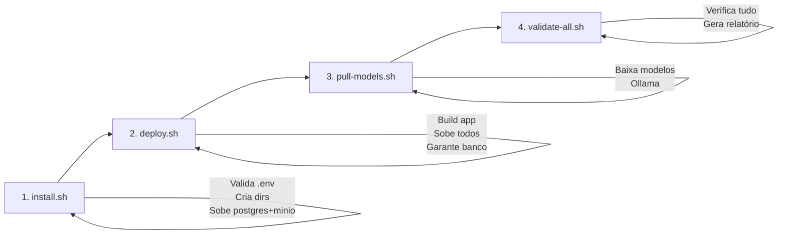

# Deploy de Produção — debuga.ai

Guia operacional completo para deploy em produção. Cobre desde a preparação do servidor até a validação final.

---

## Pré-requisitos

| Componente | Requisito Mínimo | Recomendado |
|---|---|---|
| VPS/Servidor | 2 vCPU, 4GB RAM, 40GB SSD | 4 vCPU, 8GB RAM, 80GB SSD |
| GPU (opcional) | NVIDIA com 8GB VRAM | NVIDIA com 16GB+ VRAM |
| SO | Ubuntu 22.04 LTS | Ubuntu 24.04 LTS |
| Docker | v24+ | v27+ |
| Docker Compose | v2.20+ | v2.30+ |
| Domínio | DNS A record apontando para o IP | + Wildcard para subdomínios |
| SSL | Let's Encrypt via Traefik/Nginx | Cloudflare Full (Strict) |

---

## 1. Preparar o Servidor

```bash
# Atualizar sistema
sudo apt update && sudo apt upgrade -y

# Instalar Docker
curl -fsSL https://get.docker.com | sh
sudo usermod -aG docker $USER

# Instalar Docker Compose (se não veio com Docker)
sudo apt install docker-compose-plugin -y

# Verificar
docker --version
docker compose version
```

---

## 2. Clonar o Repositório

```bash
cd /opt
git clone git@github.com:SperryTecnologia/debuga-ai-prod.git debuga-ai
cd debuga-ai
```

---

## 3. Configurar Variáveis de Ambiente

```bash
# Escolher o template adequado (ver templates/README.md para detalhes)
cp templates/.env.production.template .env
chmod 600 .env
nano .env  # preencher todos os CHANGE_ME

# Gerar secrets seguros
openssl rand -base64 64  # para JWT_SECRET e SESSION_SECRET
openssl rand -base64 48  # para senhas de banco e MinIO
```

### Templates Disponíveis

| Cenário | Template |
|---------|----------|
| Produção oficial | `templates/.env.production.template` |
| Homologação | `templates/.env.homolog.template` |
| Cliente white label | `templates/.env.customer.template` |
| On-premise com GPU | `templates/.env.onprem-gpu.template` |
| On-premise sem GPU | `templates/.env.onprem-cpu.template` |
| Cloud-only (sem Ollama) | `templates/.env.cloud-only.template` |

### Variáveis Obrigatórias

| Variável | Descrição | Como Obter |
|---|---|---|
| `DOMAIN` | Domínio sem https:// | Ex: `debuga.ai` |
| `APP_URL` | URL completa com https:// | Ex: `https://debuga.ai` |
| `GOOGLE_CLIENT_ID` | OAuth 2.0 Client ID | [Google Cloud Console](https://console.cloud.google.com/apis/credentials) |
| `GOOGLE_CLIENT_SECRET` | OAuth 2.0 Client Secret | Mesmo local acima |
| `JWT_SECRET` | Token de sessão | `openssl rand -hex 32` |
| `SESSION_SECRET` | Session Express | `openssl rand -hex 32` |
| `POSTGRES_PASSWORD` | Senha do banco | `openssl rand -base64 24` |
| `S3_ACCESS_KEY` | MinIO access key | `openssl rand -hex 16` |
| `S3_SECRET_KEY` | MinIO secret key | `openssl rand -hex 24` |
| `MINIO_ROOT_USER` | Mesmo que S3_ACCESS_KEY | Copiar de S3_ACCESS_KEY |
| `MINIO_ROOT_PASSWORD` | Mesmo que S3_SECRET_KEY | Copiar de S3_SECRET_KEY |

### Variáveis de LLM (pelo menos 1 provider)

| Variável | Descrição |
|---|---|
| `LLM_CLOUD_API_URL` | Ex: `https://api.openai.com/v1` |
| `LLM_CLOUD_API_KEY` | Chave da API |
| `LLM_CLOUD_MODEL` | Ex: `gpt-4o-mini` |

### Variáveis de Turnstile (CAPTCHA — opcional)

| Variável | Descrição |
|---|---|
| `ENABLE_TURNSTILE` | `true` para ativar |
| `TURNSTILE_SITE_KEY` | Obtido no [Cloudflare Dashboard](https://dash.cloudflare.com/?to=/:account/turnstile) |
| `TURNSTILE_SECRET_KEY` | Secret key do Turnstile |
| `TURNSTILE_ON_LOGIN` | `true` para exigir no login também |
| `VITE_TURNSTILE_SITE_KEY` | Mesmo valor de `TURNSTILE_SITE_KEY` |

### Variáveis de Stripe (opcional)

| Variável | Descrição |
|---|---|
| `STRIPE_SECRET_KEY` | `sk_live_...` (produção) ou `sk_test_...` |
| `VITE_STRIPE_PUBLISHABLE_KEY` | `pk_live_...` ou `pk_test_...` |
| `STRIPE_WEBHOOK_SECRET` | `whsec_...` do endpoint configurado |

---

## 4. Instalar e Deploy

### Pipeline de Deploy



### Instalação (primeira vez)

```bash
# Valida .env, cria diretórios, sobe serviços base
sudo bash scripts/install.sh --env .env
```

### Deploy padrão (sem GPU)

```bash
bash scripts/deploy.sh
```

### Deploy com GPU (Ollama)

```bash
# Instalar NVIDIA Container Toolkit (se ainda não instalado)
distribution=$(. /etc/os-release;echo $ID$VERSION_ID)
curl -fsSL https://nvidia.github.io/libnvidia-container/gpgkey | sudo gpg --dearmor -o /usr/share/keyrings/nvidia-container-toolkit-keyring.gpg
curl -s -L https://nvidia.github.io/libnvidia-container/$distribution/libnvidia-container.list | \
  sed 's#deb https://#deb [signed-by=/usr/share/keyrings/nvidia-container-toolkit-keyring.gpg] https://#g' | \
  sudo tee /etc/apt/sources.list.d/nvidia-container-toolkit.list
sudo apt update && sudo apt install -y nvidia-container-toolkit
sudo nvidia-ctk runtime configure --runtime=docker
sudo systemctl restart docker

# Deploy com GPU
bash scripts/deploy.sh --gpu

# Baixar modelos
bash scripts/pull-models.sh
```

---

## 5. Banco de Dados

O `install.sh` e `deploy.sh` já garantem que o banco existe via `ensure-database.sh`. Migrations são aplicadas automaticamente pela aplicação no startup (Drizzle ORM).

```bash
# Verificar manualmente se necessário
bash scripts/ensure-database.sh --env .env

# Aplicar migrations manualmente (se necessário)
for f in app/drizzle/00*.sql; do
  echo "Aplicando: $f"
  docker exec debuga-postgres psql -U "$POSTGRES_USER" -d "$POSTGRES_DB" < "$f"
done
```

---

## 6. Configurar Webhook do Stripe

1. Acesse [Stripe Dashboard → Developers → Webhooks](https://dashboard.stripe.com/webhooks)
2. Adicione endpoint: `https://SEU_DOMINIO/api/stripe/webhook`
3. Selecione eventos:
   - `checkout.session.completed`
   - `customer.subscription.created`
   - `customer.subscription.updated`
   - `customer.subscription.deleted`
   - `invoice.paid`
   - `invoice.payment_failed`
4. Copie o Signing Secret para `STRIPE_WEBHOOK_SECRET`

---

## 7. Configurar Google OAuth

1. [Google Cloud Console](https://console.cloud.google.com/apis/credentials)
2. Criar OAuth 2.0 Client ID (Web application)
3. Authorized redirect URIs:
   - `https://SEU_DOMINIO/api/auth/google/callback`
4. Copiar Client ID e Secret para `.env`

---

## 8. Validar Deploy

```bash
# Validação completa (recomendado)
bash scripts/validate-all.sh --env .env

# Validação rápida (sem chamadas de rede)
bash scripts/validate-all.sh --quick --env .env

# Verificar logs
docker compose -f docker/docker-compose.yml logs --tail=50 app

# Testar health
curl -sf https://SEU_DOMINIO/api/health

# Testar login
# Abrir https://SEU_DOMINIO no navegador e fazer login com Google
```

### Resultados Possíveis

| Resultado | Significado | Ação |
|-----------|-------------|------|
| APROVADO PARA PRODUÇÃO | Tudo OK | Nenhuma |
| APROVADO COM AVISOS | Features opcionais desabilitadas | Configurar se necessário |
| NÃO APROVADO | Falhas bloqueantes | Corrigir itens listados |

---

## 9. Configurar Backups Automáticos

```bash
# Adicionar ao crontab
crontab -e

# Backup diário às 3h da manhã
0 3 * * * cd /opt/debuga-ai && ./scripts/backup-db.sh >> /var/log/debuga-backup.log 2>&1
```

---

## 10. Monitoramento

### Logs em tempo real
```bash
docker compose logs -f app
```

### Verificar uso de recursos
```bash
docker stats
```

### Verificar GPU (se aplicável)
```bash
nvidia-smi
docker compose exec ollama nvidia-smi
```

---

## Troubleshooting

| Problema | Causa Provável | Solução |
|---|---|---|
| Login falha com 500 | Google OAuth mal configurado | Verificar redirect URI e Client ID |
| Chat não responde | Nenhum LLM provider configurado | Verificar LLM_CLOUD_API_KEY |
| Imagens somem ao recarregar | S3/MinIO não configurado | Verificar S3_ENDPOINT, ACCESS_KEY, SECRET_KEY |
| "CAPTCHA obrigatória" sem widget | TURNSTILE_SECRET_KEY sem VITE_TURNSTILE_SITE_KEY | Preencher ambos ou desabilitar |
| Checkout Stripe falha | Chaves não configuradas | Verificar STRIPE_SECRET_KEY |
| GPU timeout | Modelo não carregado | `docker compose exec ollama ollama pull MODEL` |
| 502 Bad Gateway | Container app não rodando | `docker compose restart app` |
| Banco não conecta | POSTGRES_PASSWORD incorreto | Verificar .env e recriar container db |

---

## Atualização

```bash
cd /opt/debuga-ai
git pull origin main

# Rebuild e redeploy
bash scripts/deploy.sh
# ou com GPU:
bash scripts/deploy.sh --gpu

# Validar após atualização
bash scripts/validate-all.sh --env .env
```

Para rollback em caso de problemas, consulte **docs/ROLLBACK.md**.

---

## Segurança

- **Nunca** commitar `.env` no Git
- **Nunca** usar senhas padrão (minioadmin, postgres, etc.)
- Manter Docker e dependências atualizados
- Configurar firewall (apenas 80, 443, 22)
- Ativar Turnstile para proteger contra bots
- Monitorar logs de tentativas de login falhadas
- Configurar alertas de custo no Capability Orchestrator (`COST_DAILY_LIMIT_USD`)
