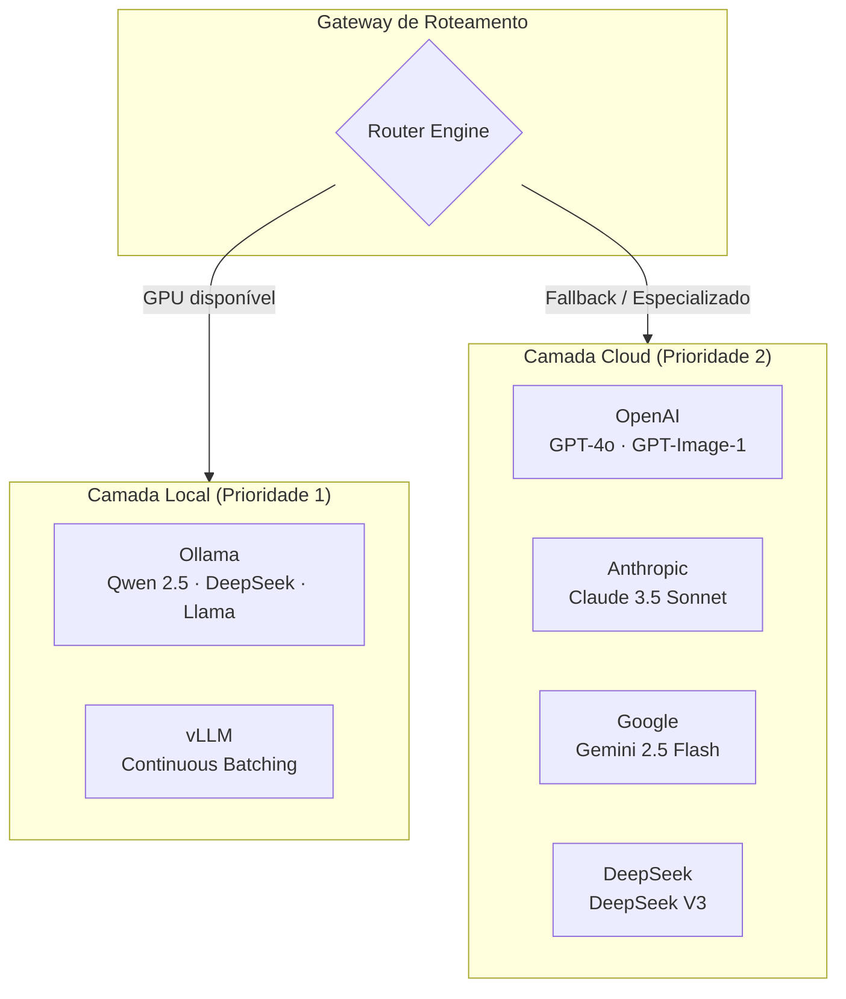
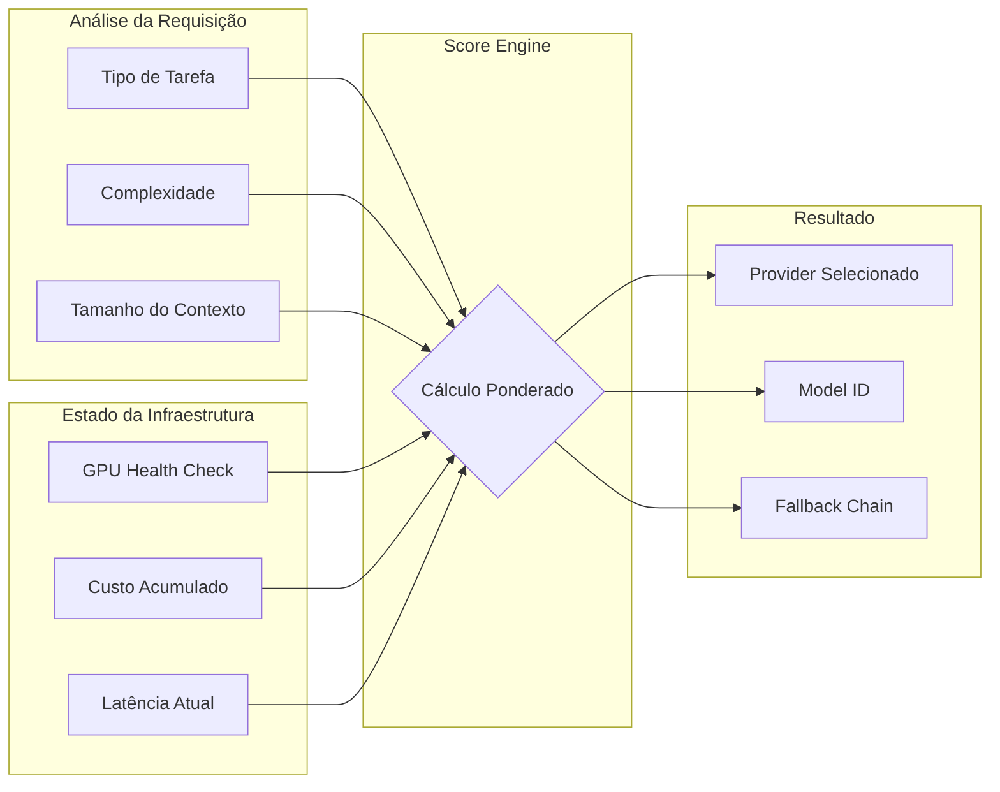
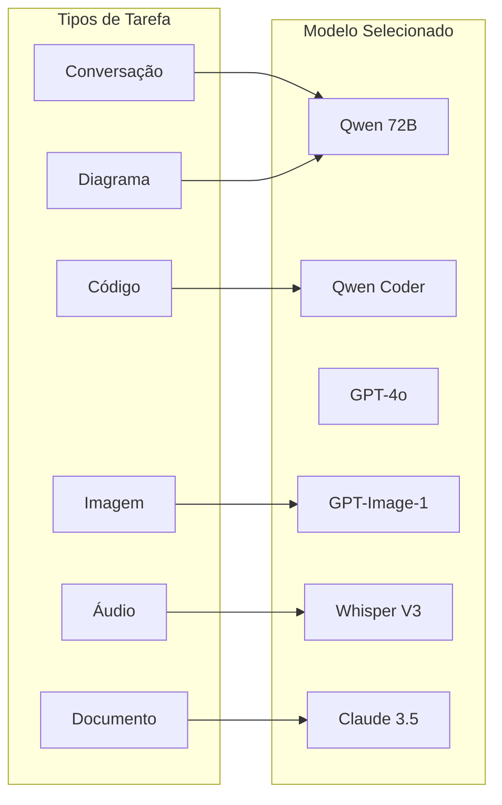
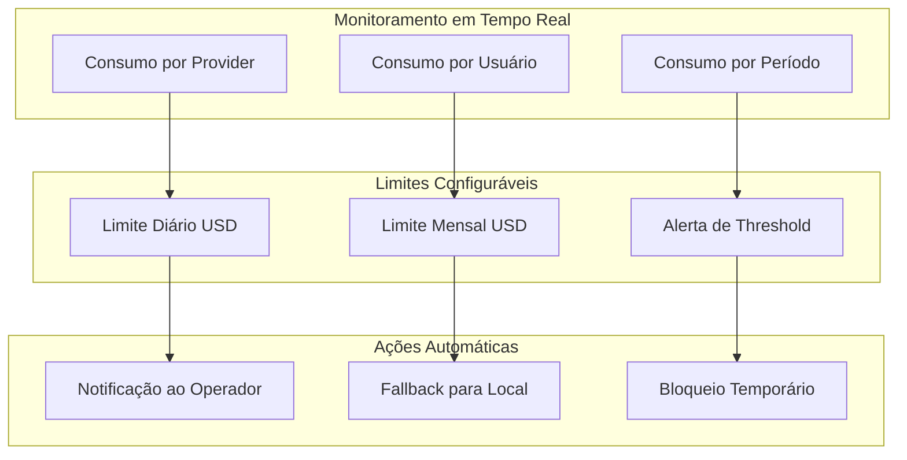

# Providers de Inferência — debuga.ai

**Visão geral dos providers de inferência e estratégia de roteamento multi-model.**

---

## Arquitetura de Providers

A debuga.ai suporta múltiplos providers de inferência, organizados em camadas de prioridade. O roteamento é automático e transparente para o usuário final, selecionando o melhor modelo para cada tipo de tarefa.

---

## Providers Suportados

| Provider | Tipo | Modelos | Caso de Uso |
|----------|------|---------|-------------|
| Ollama | Local (GPU) | Qwen 2.5 72B, Qwen Coder, DeepSeek, Llama | Uso geral, custo zero, dados locais |
| vLLM | Local (GPU) | Qwen 2.5, DeepSeek V3 | Alta concorrência, continuous batching |
| OpenAI | Cloud | GPT-4o, GPT-4o-mini, GPT-Image-1, Whisper V3 | Raciocínio complexo, imagem, áudio |
| Anthropic | Cloud | Claude 3.5 Sonnet, Claude 3 Haiku | Análise longa, documentação |
| Google Gemini | Cloud | Gemini 2.5 Flash, Gemini Pro | Custo-benefício, multimodal |
| DeepSeek | Cloud | DeepSeek V3, DeepSeek Coder | Código, raciocínio matemático |

---

## Roteamento Inteligente

O sistema decide automaticamente qual provider utilizar com base em múltiplos critérios ponderados:

| Critério | Peso | Descrição |
|----------|------|-----------|
| Disponibilidade | Alto | GPU local disponível e saudável? |
| Complexidade | Alto | Consulta simples ou raciocínio complexo? |
| Tipo de conteúdo | Médio | Código, texto, imagem, análise? |
| Custo acumulado | Médio | Dentro dos limites configurados? |
| Latência | Baixo | Tempo de resposta aceitável? |

---

## Diferenciação por Tipo de Tarefa

Cada tipo de tarefa é roteado para o modelo mais adequado:

| Tarefa | Modelo Primário | Fallback | Justificativa |
|--------|----------------|----------|---------------|
| Chat técnico | Qwen 2.5 72B (local) | GPT-4o | Custo zero + qualidade |
| Geração de código | Qwen Coder (local) | Claude 3.5 Sonnet | Especializado em código |
| Raciocínio complexo | GPT-4o | Claude 3.5 Sonnet | Melhor reasoning |
| Análise de imagem | GPT-4o Vision | Gemini 2.5 Flash | Multimodal avançado |
| Geração de imagem | GPT-Image-1 | DALL-E 3 | Qualidade superior |
| Transcrição | Whisper V3 | — | Único provider |
| Documentação longa | Claude 3.5 Sonnet | GPT-4o | Contexto de 200K tokens |

---

## Configuração pelo Operador

O operador controla completamente a estratégia de inferência:

| Configuração | Descrição |
|-------------|-----------|
| Providers habilitados | Ativar/desativar providers individualmente |
| Ordem de prioridade | Definir fallback chain personalizada |
| Limites de custo | USD/dia e USD/mês por provider |
| Modelos por tarefa | Mapear tipo de tarefa → modelo específico |
| Fallback automático | Habilitar/desabilitar fallback transparente |
| GPU local | Configurar modelos disponíveis no Ollama/vLLM |

---

## Controle de Custos

| Mecanismo | Descrição |
|-----------|-----------|
| Limite diário | Bloqueio ao atingir USD/dia configurado |
| Limite mensal | Bloqueio ao atingir USD/mês configurado |
| Alerta de threshold | Notificação ao atingir % do limite |
| Prioridade local | GPU local sempre preferida (custo zero) |
| Relatório detalhado | Consumo por provider, por usuário, por período |
| Zero-data-retention | Dados não retidos em providers cloud |

---

*Sperry Tecnologia*
