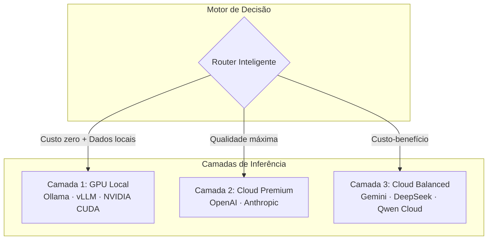
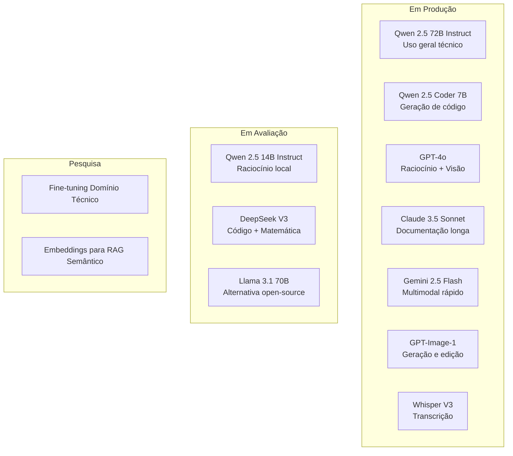

# Pesquisa e Desenvolvimento — Stack LLM

**Decisões técnicas e estratégia de inferência da debuga.ai.**

---

## Contexto

A debuga.ai utiliza uma arquitetura de inferência híbrida que combina modelos locais (GPU) com providers cloud. Este documento registra as decisões técnicas, avaliações de modelos e estratégias adotadas para o domínio operacional (infraestrutura, segurança, DevOps).

---

## Estratégia de Inferência

| Camada | Tecnologia | Função |
|--------|-----------|--------|
| Primária | Ollama + vLLM + GPU NVIDIA | Inferência local, baixa latência, custo zero, dados não saem |
| Premium | OpenAI, Anthropic | Raciocínio complexo, visão, geração de imagem |
| Balanced | Gemini, DeepSeek, Qwen Cloud | Custo-benefício para tarefas de média complexidade |
| Roteamento | Engine proprietário | Decisão automática baseada em contexto e disponibilidade |

---

## Modelos Avaliados e Status

| Modelo | Parâmetros | Caso de Uso | Status |
|--------|-----------|-------------|--------|
| Qwen 2.5 72B Instruct | 72B | Uso geral técnico, tool calling | **Produção** |
| Qwen 2.5 Coder 7B | 7B | Geração de código, scripts | **Produção** |
| GPT-4o | — | Raciocínio complexo, visão, fallback | **Produção** |
| Claude 3.5 Sonnet | — | Análise longa, documentação | **Produção** |
| Gemini 2.5 Flash | — | Multimodal rápido, custo-benefício | **Produção** |
| GPT-Image-1 | — | Geração e edição de imagens | **Produção** |
| Whisper Large V3 | — | Transcrição de áudio multilíngue | **Produção** |
| Qwen 2.5 14B Instruct | 14B | Raciocínio local (upgrade GPU) | Avaliação |
| DeepSeek V3 | 671B MoE | Código e matemática | Avaliação |
| Llama 3.1 70B | 70B | Alternativa open-source | Avaliação |

---

## Critérios de Seleção de Modelos

| Critério | Peso | Justificativa |
|----------|------|---------------|
| Qualidade em domínio técnico | Alto | Infraestrutura, segurança, DevOps |
| Capacidade de tool calling | Alto | Agente precisa invocar ferramentas |
| Performance em hardware disponível | Alto | RTX 3090, 24 GB VRAM |
| Latência para uso interativo | Médio | < 3s para primeira resposta |
| Licença comercial | Médio | Compatível com white label |
| Custo de inferência cloud | Médio | Sustentabilidade operacional |
| Tamanho de contexto | Baixo | Mínimo 32K tokens |

---

## Benchmarks Internos (Domínio Técnico)

Avaliação em tarefas reais de infraestrutura e DevOps:

| Tarefa | Qwen 72B (local) | GPT-4o | Claude 3.5 | Gemini 2.5 |
|--------|------------------|--------|-------------|------------|
| Diagnóstico de rede | Excelente | Excelente | Bom | Bom |
| Geração de scripts Bash | Excelente | Excelente | Excelente | Bom |
| Análise de logs | Bom | Excelente | Excelente | Bom |
| Tool calling confiável | Bom | Excelente | Bom | Bom |
| Documentação técnica | Bom | Bom | Excelente | Bom |
| Latência (local) | < 2s | N/A | N/A | N/A |
| Custo por 1M tokens | $0 | ~$5 | ~$3 | ~$0.35 |

---

## Infraestrutura de GPU

| Componente | Especificação |
|-----------|---------------|
| GPU | NVIDIA RTX 3090 (24 GB VRAM) |
| Framework | Ollama (produção) / vLLM (avaliação) |
| Quantização | Q4_K_M (modelos > 14B) |
| Concorrência | 2-4 requests simultâneos |
| Cold start | < 5s (modelo em memória) |
| Fallback | Automático para cloud se GPU indisponível |

---

## Repositórios Relacionados

| Repositório | Foco |
|-------------|------|
| [debuga-llm-stack](https://github.com/SperryTecnologia/debuga-llm-stack) | Arquitetura completa da stack LLM |
| [debuga-qwen-coder-lab](https://github.com/SperryTecnologia/debuga-qwen-coder-lab) | Avaliação de Qwen-Coder para code generation |
| [debuga-vllm-engine](https://github.com/SperryTecnologia/debuga-vllm-engine) | Estudos com vLLM e continuous batching |
| [debuga-llm-gateway](https://github.com/SperryTecnologia/debuga-llm-gateway) | Gateway OpenAI-compatible |

---

## Próximos Passos

1. **Embeddings vetoriais** — Migração do RAG de keyword-based para busca semântica com pgvector.
2. **Fine-tuning** — Treinamento de modelo especializado em domínio técnico operacional.
3. **vLLM em produção** — Substituição do Ollama por vLLM para melhor throughput.
4. **Modelos maiores** — Avaliação de Qwen 72B com quantização em hardware atualizado.

---

*Sperry Tecnologia*
