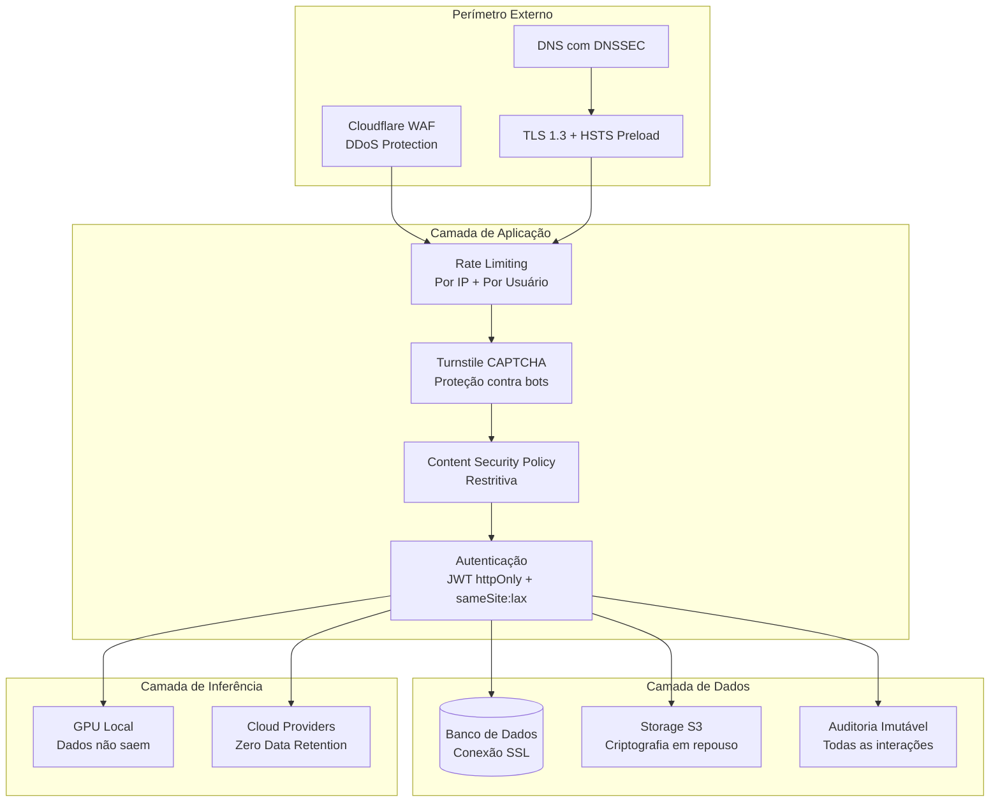
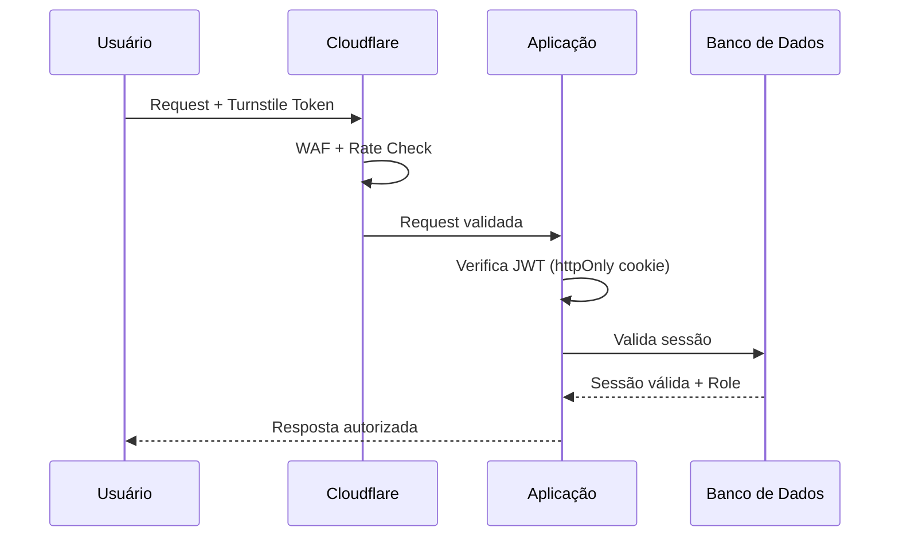
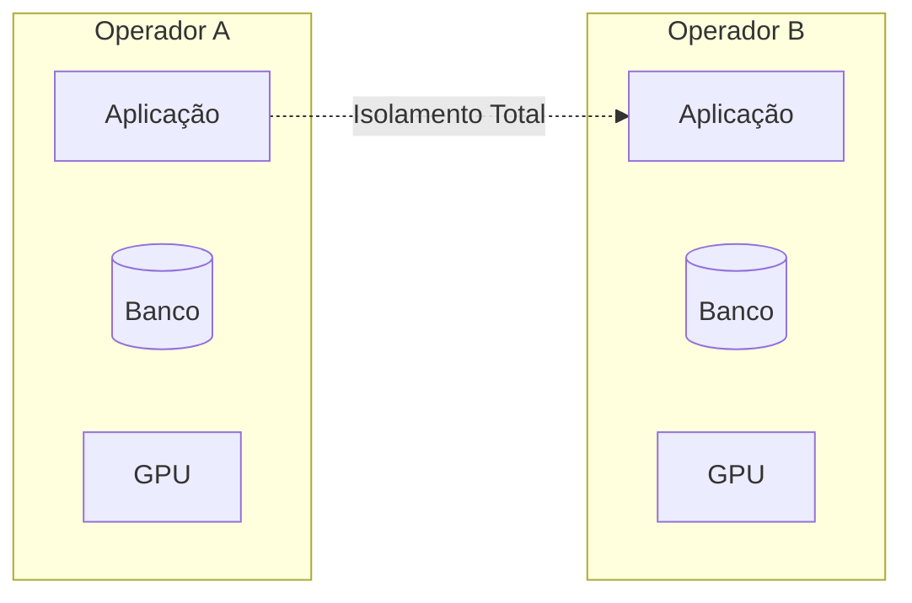

# Segurança — debuga.ai

**Políticas de segurança, conformidade e governança da plataforma debuga.ai.**

---

## Princípios

- Dados sob controle total do operador
- Inferência local quando possível (dados não saem do ambiente)
- Secrets nunca em código-fonte
- Logs de auditoria imutáveis
- Isolamento entre tenants
- Mínimo privilégio em todos os componentes

---

## Arquitetura de Segurança

---

## Autenticação

| Mecanismo | Descrição |
|-----------|-----------|
| OAuth 2.0 | Autenticação segura com sessão persistente |
| JWT | Tokens httpOnly com sameSite:lax e expiração |
| Rate limiting | Por IP e por usuário (proteção contra brute force) |
| CAPTCHA | Cloudflare Turnstile em ações sensíveis |
| Bloqueio | Após tentativas falhas consecutivas |

---

## Autorização

| Papel | Permissões |
|-------|-----------|
| Admin | Gestão completa (usuários, planos, Knowledge Base, configurações) |
| User | Acesso ao chat e funcionalidades do plano contratado |

---

## Proteção de Dados

| Aspecto | Implementação |
|---------|--------------|
| Transporte | TLS 1.3 com HSTS preload |
| Armazenamento | Banco de dados com conexão SSL obrigatória |
| Secrets | Variáveis de ambiente, nunca em código-fonte |
| Backups | Criptografados, sob controle do operador |
| Logs | Secrets mascarados automaticamente |
| Inferência cloud | Zero-data-retention em todos os providers |

---

## Isolamento

- Cada implantação opera em infraestrutura dedicada
- Sem compartilhamento de dados entre operadores
- Containers com rede isolada
- Acesso ao banco apenas via aplicação

---

## Auditoria

Todas as ações são registradas com:

| Campo | Descrição |
|-------|-----------|
| Timestamp | UTC com precisão de milissegundos |
| Usuário | ID e papel do usuário |
| Ação | Tipo de operação realizada |
| IP de origem | Endereço do cliente |
| Provider | Modelo e provider utilizado |
| Tokens | Consumo de tokens (input/output) |
| Custo | Custo estimado da operação |
| Resultado | Sucesso ou falha com detalhes |

Logs são imutáveis e exportáveis para SIEM.

---

## Hardening de Aplicação (Sprint 9)

A partir do Sprint 9, o debuga.ai implementa camadas adicionais de proteção no nível da aplicação, complementando as defesas de perímetro já existentes.

### Security Headers (Helmet.js)

Todos os responses HTTP incluem headers de segurança configurados via Helmet.js:

| Header | Valor | Propósito |
|--------|-------|----------|
| `X-Content-Type-Options` | `nosniff` | Previne MIME-type sniffing |
| `X-Frame-Options` | `SAMEORIGIN` | Previne clickjacking |
| `X-XSS-Protection` | `0` | Desabilitado (CSP é preferível) |
| `Strict-Transport-Security` | `max-age=31536000; includeSubDomains` | Força HTTPS |
| `Referrer-Policy` | `strict-origin-when-cross-origin` | Controla vazamento de referrer |
| `X-Download-Options` | `noopen` | Previne execução de downloads (IE) |
| `X-Permitted-Cross-Domain-Policies` | `none` | Bloqueia políticas cross-domain |
| `Cross-Origin-Opener-Policy` | `same-origin` | Isola contexto de janela |
| `Cross-Origin-Resource-Policy` | `same-origin` | Restringe carregamento cross-origin |

### CORS (Cross-Origin Resource Sharing)

A política CORS é restritiva por padrão:

- **Origins permitidas:** apenas o domínio da própria aplicação (configurável via `APP_URL`)
- **Métodos:** GET, POST, PUT, DELETE, PATCH
- **Credentials:** habilitado (cookies httpOnly)
- **Headers customizados:** `Content-Type`, `Authorization`

### Limites de Body (Request Size)

| Tipo | Limite | Aplicação |
|------|--------|----------|
| JSON body | 1 MB | Todas as rotas API |
| Upload de arquivo | 16 MB | Rotas de upload específicas |
| URL-encoded | 1 MB | Formulários |

Requisições que excedem estes limites recebem `413 Payload Too Large`.

### Validação de Upload

Todos os uploads passam por validação em múltiplas camadas:

| Verificação | Descrição |
|-------------|----------|
| Extensão | Whitelist de extensões permitidas por tipo de upload |
| MIME type | Validação do Content-Type declarado |
| Magic bytes | Verificação dos primeiros bytes do arquivo (file signature) |
| Tamanho | Máximo 16 MB por arquivo |
| Nome | Sanitização de caracteres especiais e path traversal |

### Controles de Execução de Código

A funcionalidade de execução de código (Python/Bash) opera com restrições de segurança:

| Controle | Implementação |
|----------|---------------|
| Blacklist de comandos | `rm -rf /`, `dd`, `mkfs`, `shutdown`, `reboot`, `kill -9 1`, `:(){ :|:& };:` e variantes |
| Timeout | Máximo 30 segundos por execução |
| Output limit | Máximo 50KB de output capturado |
| Feature flag | Desabilitado por padrão (`ENABLE_CODE_EXECUTION=false`) |
| Auditoria | Toda execução é logada com input, output e usuário |
| Rede | Acesso de rede restrito durante execução |

> **Nota:** A execução de código não opera em sandbox isolado (container separado). As proteções são baseadas em blacklist e limites de recurso. Para ambientes de alta segurança, recomenda-se desabilitar esta funcionalidade (`ENABLE_CODE_EXECUTION=false`) ou implementar containerização adicional.

### Rate Limiting Granular

| Endpoint | Limite | Janela |
|----------|--------|--------|
| Auth (login/register) | 10 tentativas | 15 minutos |
| Chat (mensagens) | 30 mensagens | 60 minutos |
| API geral | 100 requisições | 60 minutos |
| Upload | 20 arquivos | 60 minutos |

Limites são configuráveis via variáveis de ambiente. Violações retornam `429 Too Many Requests` com header `Retry-After`.

### Circuit Breaker de Custos

O sistema monitora custos de API em tempo real e interrompe operações quando limites são atingidos:

| Limite | Configuração | Comportamento |
|--------|-------------|---------------|
| Diário | `COST_DAILY_LIMIT_USD` | Bloqueia novas requisições LLM até reset diário |
| Mensal | `COST_MONTHLY_LIMIT_USD` | Bloqueia até reset mensal |

---

## Reporte de Vulnerabilidades

Para reportar vulnerabilidades de segurança, utilize os canais indicados no arquivo [SECURITY.md](../SECURITY.md) na raiz do repositório. Não divulgar publicamente antes da correção. Resposta em até 48 horas úteis.

---

## Código de Produção

O código de produção é mantido em repositório privado. Repositórios públicos contêm apenas documentação e componentes de pesquisa.

---

*Sperry Tecnologia*
