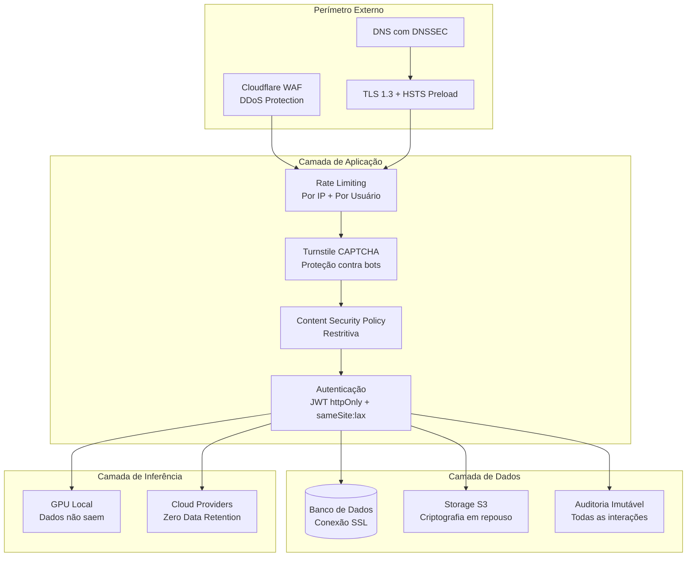
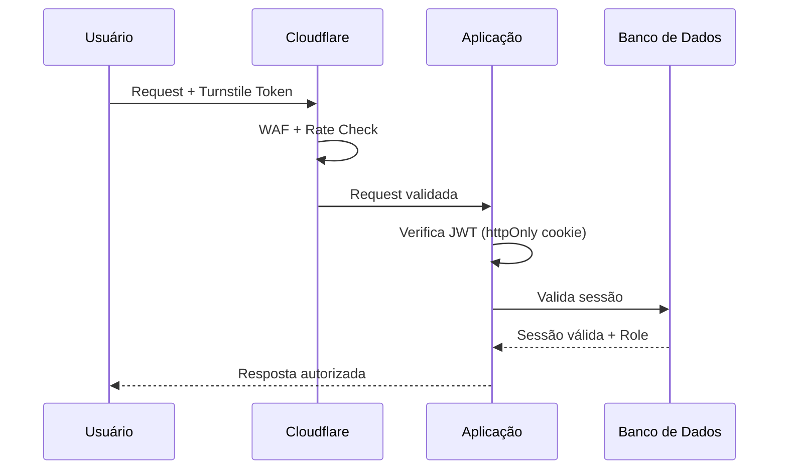
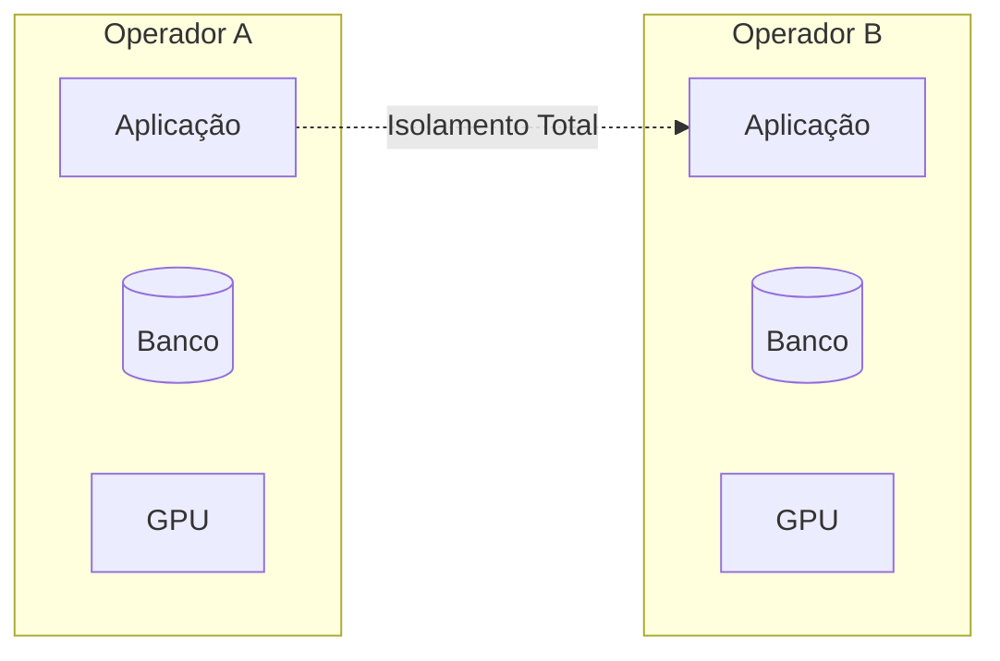

# Segurança — debuga.ai

**Políticas de segurança, conformidade e governança da plataforma debuga.ai.**

---

## Princípios

- Dados sob controle total do operador
- Inferência local quando possível (dados não saem do ambiente)
- Secrets nunca em código-fonte
- Logs de auditoria imutáveis
- Isolamento entre tenants
- Mínimo privilégio em todos os componentes

---

## Arquitetura de Segurança

---

## Autenticação

| Mecanismo | Descrição |
|-----------|-----------|
| OAuth 2.0 | Autenticação segura com sessão persistente |
| JWT | Tokens httpOnly com sameSite:lax e expiração |
| Rate limiting | Por IP e por usuário (proteção contra brute force) |
| CAPTCHA | Cloudflare Turnstile em ações sensíveis |
| Bloqueio | Após tentativas falhas consecutivas |

---

## Autorização

| Papel | Permissões |
|-------|-----------|
| Admin | Gestão completa (usuários, planos, Knowledge Base, configurações) |
| User | Acesso ao chat e funcionalidades do plano contratado |

---

## Proteção de Dados

| Aspecto | Implementação |
|---------|--------------|
| Transporte | TLS 1.3 com HSTS preload |
| Armazenamento | Banco de dados com conexão SSL obrigatória |
| Secrets | Variáveis de ambiente, nunca em código-fonte |
| Backups | Criptografados, sob controle do operador |
| Logs | Secrets mascarados automaticamente |
| Inferência cloud | Zero-data-retention em todos os providers |

---

## Isolamento

- Cada implantação opera em infraestrutura dedicada
- Sem compartilhamento de dados entre operadores
- Containers com rede isolada
- Acesso ao banco apenas via aplicação

---

## Auditoria

Todas as ações são registradas com:

| Campo | Descrição |
|-------|-----------|
| Timestamp | UTC com precisão de milissegundos |
| Usuário | ID e papel do usuário |
| Ação | Tipo de operação realizada |
| IP de origem | Endereço do cliente |
| Provider | Modelo e provider utilizado |
| Tokens | Consumo de tokens (input/output) |
| Custo | Custo estimado da operação |
| Resultado | Sucesso ou falha com detalhes |

Logs são imutáveis e exportáveis para SIEM.

---

## Reporte de Vulnerabilidades

Para reportar vulnerabilidades de segurança, utilize os canais indicados no arquivo [SECURITY.md](../SECURITY.md) na raiz do repositório. Não divulgar publicamente antes da correção. Resposta em até 48 horas úteis.

---

## Código de Produção

O código de produção é mantido em repositório privado. Repositórios públicos contêm apenas documentação e componentes de pesquisa.

---

*Sperry Tecnologia*
