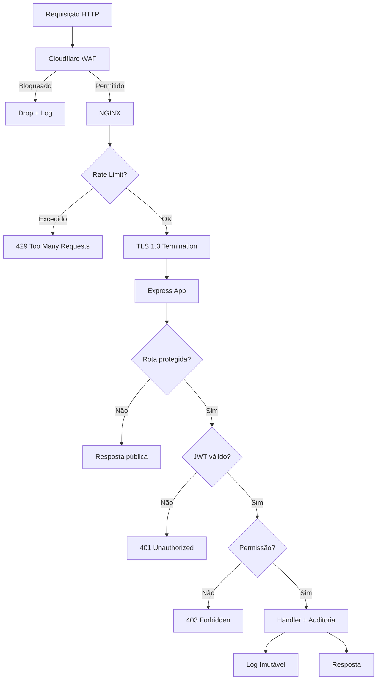

# Segurança — debuga.ai

**Políticas de segurança e conformidade da plataforma debuga.ai.**

---

## Princípios

- Dados sob controle total do operador
- Inferência local quando possível (dados não saem do ambiente)
- Secrets nunca em código-fonte
- Logs de auditoria imutáveis
- Isolamento entre tenants
- Mínimo privilégio em todos os componentes

---

## Autenticação

| Mecanismo | Descrição |
|-----------|-----------|
| Local | Email/senha com bcrypt (custo 12) |
| OAuth 2.0 | Google (extensível) |
| JWT | Tokens com rotação e expiração |
| Verificação de email | Obrigatória para novos cadastros |
| Bloqueio | Após tentativas falhas consecutivas |
| Rate limiting | Por IP e por usuário |

---

## Autorização

| Papel | Permissões |
|-------|-----------|
| Admin | Gestão completa (usuários, planos, configurações) |
| User | Acesso ao chat e funcionalidades do plano |

---

## Proteção de Dados

| Aspecto | Implementação |
|---------|--------------|
| Transporte | TLS 1.3 (NGINX + Let's Encrypt) |
| Armazenamento | PostgreSQL com conexão SSL |
| Secrets | Variáveis de ambiente, nunca em código |
| Backups | Criptografados, sob controle do operador |
| Logs | Secrets mascarados automaticamente |

---

## Isolamento

- Cada implantação opera em infraestrutura dedicada
- Sem compartilhamento de dados entre operadores
- Containers com rede isolada
- Acesso ao banco apenas via aplicação

---

## Fluxo de Segurança — Requisição HTTP

---

## Auditoria

Todas as ações são registradas com:
- Timestamp (UTC)
- Usuário
- Ação realizada
- IP de origem
- Resultado (sucesso/falha)

Logs são imutáveis e exportáveis para SIEM.

---

## Reporte de Vulnerabilidades

Para reportar vulnerabilidades de segurança, utilize o canal de contato disponível em [sperrytecnologia.com.br](https://www.sperrytecnologia.com.br). Solicitamos que não divulgue publicamente antes da correção. Resposta em até 48 horas úteis.

---

## Código de Produção

O código de produção é mantido em repositório privado (SperryTecnologia/debuga-ai-prod). Repositórios públicos contêm apenas documentação e componentes de pesquisa.

---

*Sperry Tecnologia*
