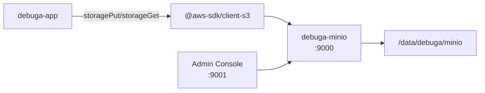

# Storage — MinIO (S3-Compatível)

Documentação do subsistema de storage de arquivos do debuga.ai.

---

## Arquitetura



---

## Configuração (.env)

| Variável | Descrição | Exemplo |
|----------|-----------|---------|
| `S3_ENDPOINT` | URL interna do MinIO | `http://minio:9000` |
| `S3_ACCESS_KEY` | Access key (= MINIO_ROOT_USER) | `debuga_s3_prod` |
| `S3_SECRET_KEY` | Secret key (= MINIO_ROOT_PASSWORD) | (gerado com openssl) |
| `S3_BUCKET` | Nome do bucket | `debuga-prod` |
| `S3_REGION` | Região (qualquer valor) | `us-east-1` |
| `MINIO_ROOT_USER` | Mesmo que S3_ACCESS_KEY | `debuga_s3_prod` |
| `MINIO_ROOT_PASSWORD` | Mesmo que S3_SECRET_KEY | (gerado com openssl) |

**IMPORTANTE:** Nunca use `minioadmin` como credencial em produção. O `validate-all.sh` bloqueia deploy com credenciais padrão.

---

## Bucket

O bucket é criado automaticamente pelo `install.sh`. Para criar manualmente:

```bash
docker exec debuga-minio mc alias set local http://localhost:9000 "$MINIO_ROOT_USER" "$MINIO_ROOT_PASSWORD"
docker exec debuga-minio mc mb local/debuga-prod
docker exec debuga-minio mc anonymous set download local/debuga-prod  # acesso público de leitura (opcional)
```

---

## Uso no Código

```typescript
import { storagePut, storageGet } from "../server/storage";

// Upload
const { url, key } = await storagePut(
  `uploads/${userId}/${filename}`,
  fileBuffer,
  "image/png"
);

// Download (presigned URL)
const { url } = await storageGet(`uploads/${userId}/${filename}`);
```

---

## Console Web

O console administrativo do MinIO está disponível em `http://127.0.0.1:9001` (apenas acesso local via SSH tunnel ou VPN).

```bash
# SSH tunnel para acessar remotamente
ssh -L 9001:127.0.0.1:9001 user@servidor
# Abrir http://localhost:9001 no browser
```

---

## Backup

```bash
# Backup do volume MinIO
tar -czf /data/debuga/backups/minio-$(date +%Y%m%d).tar.gz /data/debuga/minio/

# Ou via mc mirror
docker exec debuga-minio mc mirror local/debuga-prod /tmp/minio-backup/
```

---

## Troubleshooting

| Problema | Causa | Solução |
|----------|-------|---------|
| `S3_ENDPOINT not configured` | Variável não definida no .env | Adicionar `S3_ENDPOINT=http://minio:9000` |
| `Access Denied` | Credenciais incorretas | Verificar MINIO_ROOT_USER/PASSWORD |
| Upload falha | Bucket não existe | `bash scripts/install.sh --env .env` |
| Timeout | MinIO não está rodando | `docker compose up -d minio` |
| Arquivos inacessíveis | Política do bucket | Configurar anonymous access ou usar presigned URLs |
