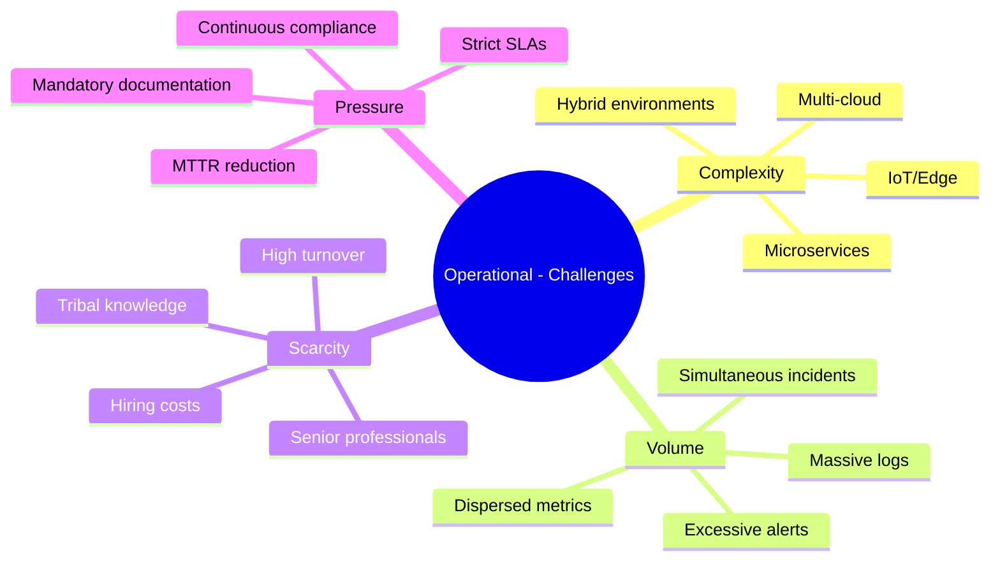
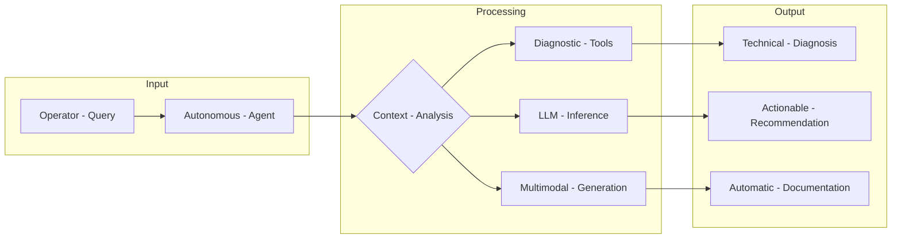
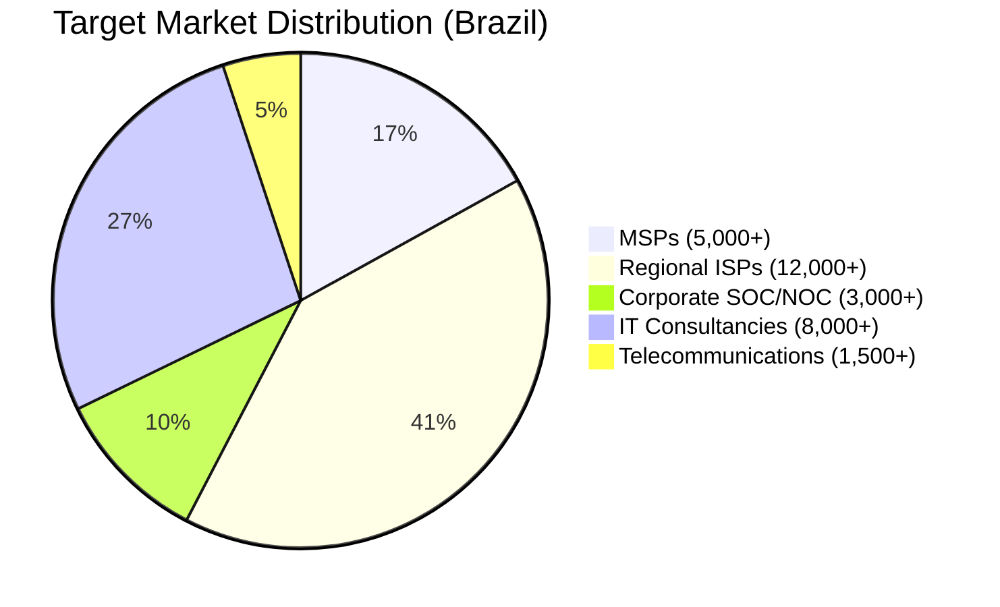
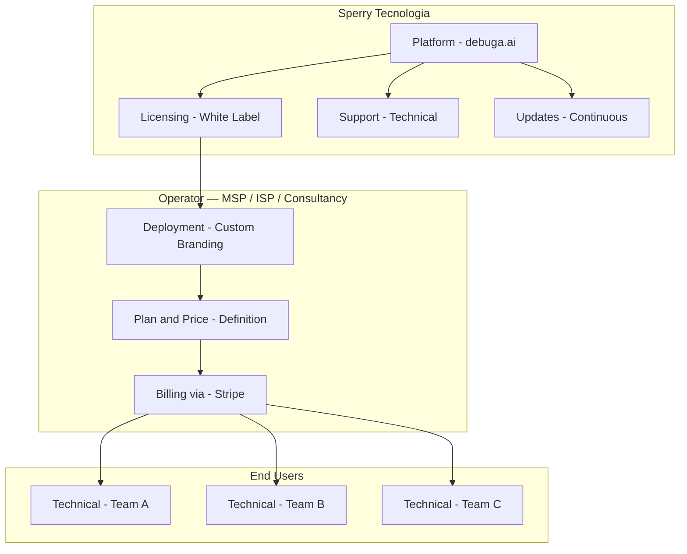
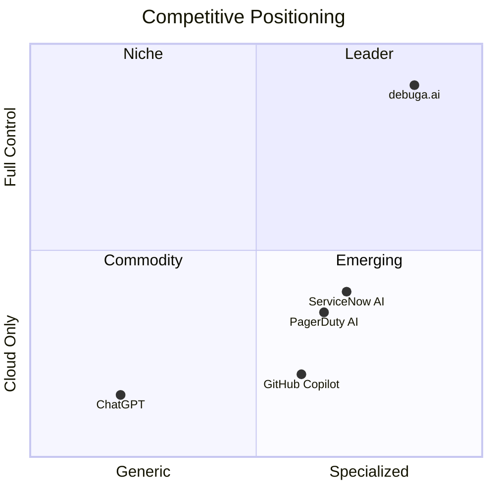
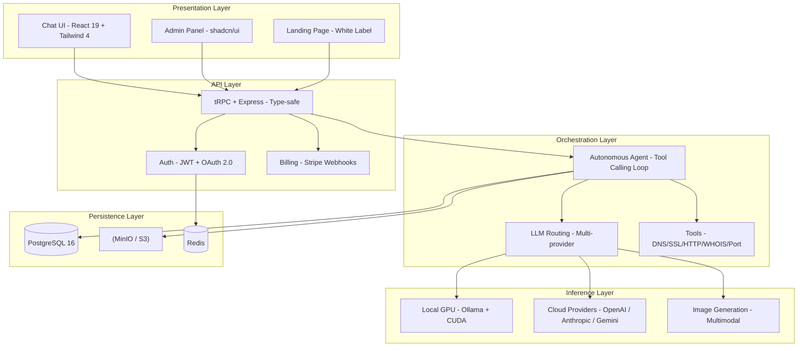
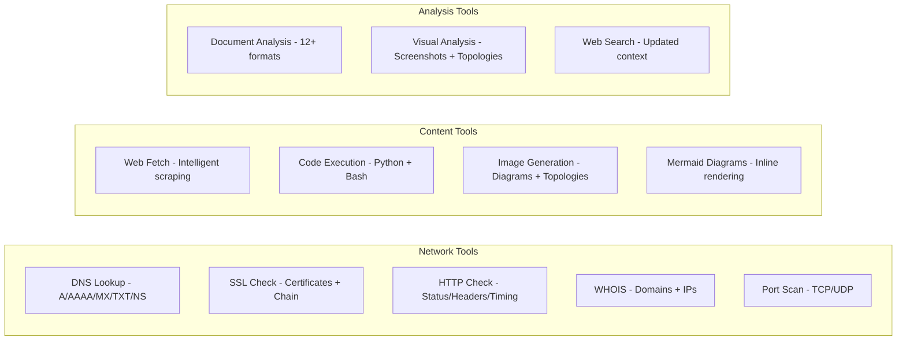
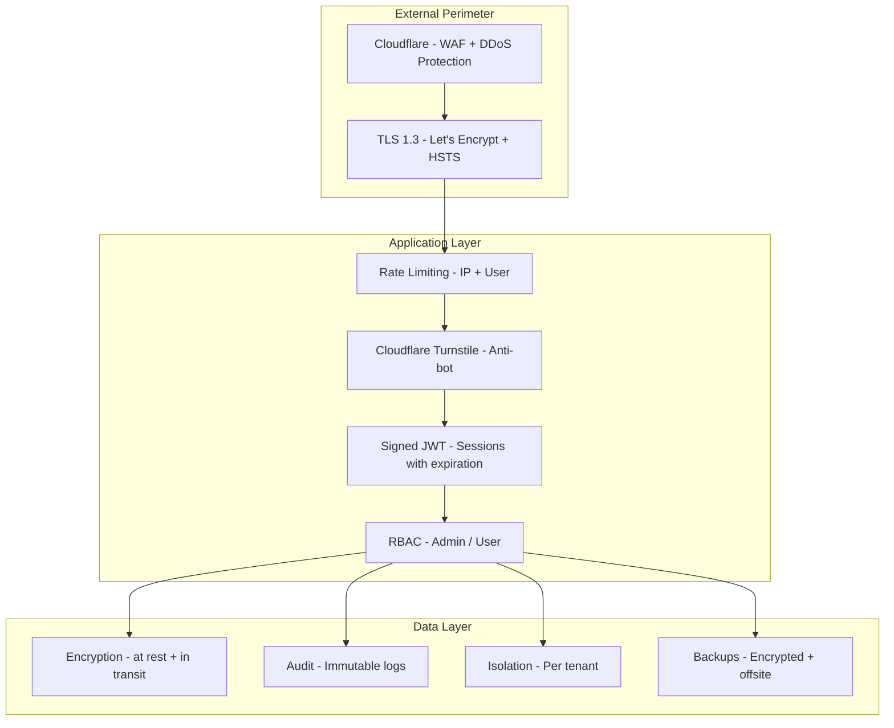
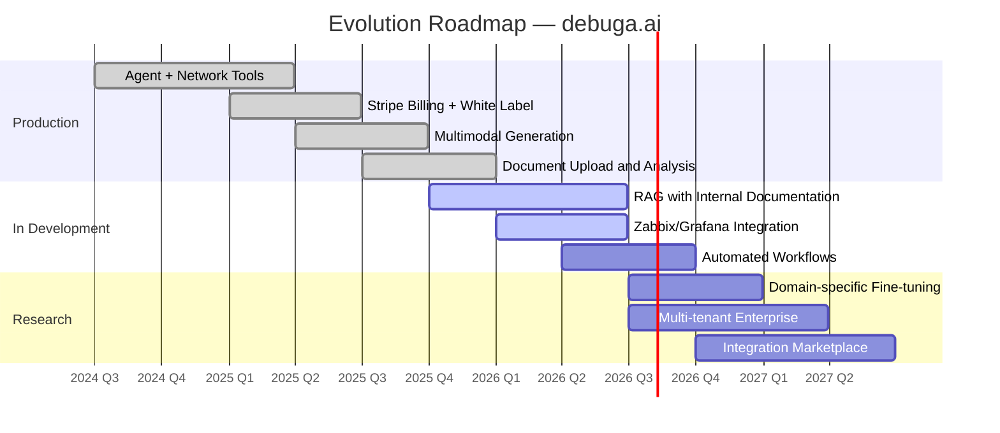

# Whitepaper — debuga.ai

**Operational AI Platform for Infrastructure, Security, and Technical Automation**

Version 2.0 | May 2026 | Sperry Tecnologia

---

## Executive Summary

**debuga.ai** is an operational artificial intelligence platform developed by Sperry Tecnologia, designed for teams operating IT infrastructure, information security, DevOps, telecommunications, and technical automation. The platform combines local GPU inference, intelligent cloud provider fallback, capability-based routing, and multimodal generation in a white label solution deployable with custom branding on dedicated infrastructure.

Unlike generic AI assistants, debuga.ai was built from day one for the operational context: it understands network topologies, executes real-time diagnostics, automatically generates technical documentation, and operates with data fully under the operator's control.

---

## Market Problem

Technical infrastructure teams face a convergence of challenges that intensify with the growing complexity of modern environments:

Generic AI assistants fail in operational contexts because they lack specialized tools, cannot understand network topologies, do not integrate with existing technical workflows, and offer no control over sensitive data.

---

## Value Proposition

debuga.ai addresses these challenges by providing an AI agent that operates as a senior engineer available 24/7:

| Capability | Description | Impact |
|-----------|-------------|--------|
| **Real-time diagnostics** | DNS, SSL, HTTP, WHOIS, port scan, traceroute | 70% reduction in triage time |
| **Native technical context** | Understands topologies, protocols, logs | Precise responses without re-explanation |
| **Multimodal generation** | Diagrams, documentation, scripts, images | Automatic incident documentation |
| **Local inference** | Dedicated GPU with optimized models | Data never leaves the environment |
| **Full white label** | Branding, domain, billing, plans | Own product without development |
| **Cost control** | Configurable limits with alerts | Complete financial predictability |

---

## Target Market

| Segment | Estimated TAM (Brazil) | Primary Pain | debuga.ai Solution |
|---------|----------------------|--------------|-------------------|
| **MSPs** | 5,000+ companies | Scale support without proportional hiring | Automated first-level agent |
| **Regional ISPs** | 12,000+ providers | Automate first-level NOC | Real-time network diagnostics |
| **Corporate SOC/NOC** | 3,000+ operations | Reduce MTTR and document incidents | Automated triage with audit trail |
| **IT Consultancies** | 8,000+ companies | Technical productivity and standardization | Technical assistant with knowledge base |
| **Telecommunications** | 1,500+ operators | Equipment configuration and troubleshooting | Integrated diagnostic tools |

---

## Business Model

debuga.ai operates as a B2B white label product, where the **operator** (MSP, ISP, consultancy) acquires the platform and offers it to their own clients with custom branding and pricing.

| Modality | Description | Ideal for |
|----------|-------------|-----------|
| **White label license** | Dedicated deployment with operator branding | MSPs and ISPs with own infrastructure |
| **Managed SaaS** | Sperry-operated with client domain | Consultancies without infra teams |
| **Implementation consulting** | Setup, training, and operational support | Companies in transition |
| **Ongoing support** | Maintenance, updates, and technical support | All operators |

The operator defines their own plans and pricing for end users, with integrated billing via Stripe. Sperry has no access to end-user data.

---

## Competitive Positioning

| Differentiator | debuga.ai | Generic Assistants | Legacy Tools |
|----------------|-----------|-------------------|--------------|
| Native technical context | Built for infrastructure | Adapted from generic AI | Static rules |
| Integrated tools | DNS, SSL, HTTP, WHOIS, port scan | None | Vendor-limited |
| Local inference (GPU) | Data stays on-premise | Everything in the cloud | N/A |
| White label | Complete operator branding | Impossible | Partial |
| Intelligent fallback | Multi-provider with routing | Single provider | N/A |
| Multimodal generation | Text, images, diagrams | Text only | N/A |
| Cost control | Configurable limits | Unpredictable pay-per-use | Fixed license |
| Audit | Complete immutable logs | Limited | Partial |
| Data sovereignty | 100% under operator control | Data at provider | Partial |

---

## Reference Architecture

The platform is composed of independent layers communicating via internal APIs, enabling horizontal scalability and component replacement:

Full details in the [architecture documentation](ARCHITECTURE_EN.md).

---

## Diagnostic Tools

The agent has access to specialized tools that it executes autonomously during reasoning:

| Tool | Function | Example Use Case |
|------|----------|------------------|
| **DNS Lookup** | DNS record resolution (A, AAAA, MX, TXT, NS, SOA, CNAME) | Propagation diagnostics, SPF/DKIM verification |
| **SSL Check** | Certificate validation, chain, expiration, protocols | Security audit, HTTPS troubleshooting |
| **HTTP Check** | Status, headers, timing, redirects, TLS handshake | Availability monitoring, CDN debugging |
| **WHOIS** | Domain and IP registration information | Ownership investigation, ASN verification |
| **Port Scan** | TCP/UDP port scanning | Exposure audit, firewall verification |
| **Web Fetch** | Intelligent web content extraction | Public configuration analysis, documentation |
| **Code Execution** | Python and Bash in isolated environment | Automation scripts, calculations, transformations |
| **Image Generation** | Diagrams, topologies, visual assets | Automatic visual documentation |
| **Document Analysis** | PDF, DOCX, XLSX, CSV, JSON, YAML, logs | Information extraction from manuals and reports |
| **Visual Analysis** | Screenshots, diagrams, topologies | Interface and dashboard interpretation |

---

## Security and Compliance

| Aspect | Implementation | Compliance |
|--------|----------------|------------|
| **Transport** | TLS 1.3 via NGINX + Cloudflare | PCI DSS, LGPD |
| **Authentication** | JWT + bcrypt (cost 12) + OAuth 2.0 | OWASP Top 10 |
| **Authorization** | RBAC with granular roles | Least privilege principle |
| **Anti-bot** | Cloudflare Turnstile | Automation protection |
| **Rate limiting** | Per IP and per user | Abuse protection |
| **Audit** | Immutable logs with UTC timestamp | SOC 2, LGPD Art. 37 |
| **Isolation** | Data separated by tenant | LGPD Art. 46 |
| **Sovereignty** | Data on operator's server | LGPD Art. 33 |
| **Backups** | Encrypted, under operator control | Business continuity |

---

## Roadmap

| Horizon | Features | Status |
|---------|----------|--------|
| **Production** | Conversational agent, network tools, billing, white label, multimodal generation, document upload | Available |
| **Q1-Q2 2026** | RAG with internal documentation, Zabbix/Grafana/Graylog integration | In development |
| **Q3-Q4 2026** | Advanced code execution, automated workflows, proactive notifications | Planned |
| **2027** | Domain-specific fine-tuning, multi-tenant enterprise, integration marketplace | Research |

---

## Impact Metrics

Based on operators in production:

| Metric | Before | With debuga.ai | Improvement |
|--------|--------|----------------|-------------|
| Average triage time | 15-30 min | 2-5 min | **80-85%** |
| Incident documentation | Manual (30+ min) | Automatic (instant) | **95%** |
| First-level resolution | 40% | 75% | **+35pp** |
| Cost per ticket | R$ 45-80 | R$ 12-25 | **60-70%** |
| New technician onboarding | 2-4 weeks | 3-5 days | **75%** |

---

## Conclusion

debuga.ai represents a new category of tool for technical teams: **specialized operational AI** with full control over data and costs, deployable under custom branding. The combination of local inference, integrated diagnostic tools, multimodal generation, and white label model positions the platform as a unique solution for the infrastructure and security market.

The platform is in production with active operators and a continuous evolution roadmap. For more information about deployment, see the [architecture documentation](ARCHITECTURE_EN.md) and the [white label model](WHITE_LABEL_OVERVIEW.md).

---

## Related Documentation

| Document | Description |
|----------|-------------|
| [Technical Architecture](ARCHITECTURE_EN.md) | Detailed architecture with diagrams |
| [White Label](WHITE_LABEL_OVERVIEW.md) | Deployment model and customization |
| [Security](SECURITY_OVERVIEW.md) | Security policies and compliance |
| [AI Providers](PROVIDERS_OVERVIEW.md) | Supported providers and routing |
| [Roadmap](ROADMAP.md) | Planned platform evolution |

---

*Sperry Tecnologia — [sperrytecnologia.com.br](https://www.sperrytecnologia.com.br)*
