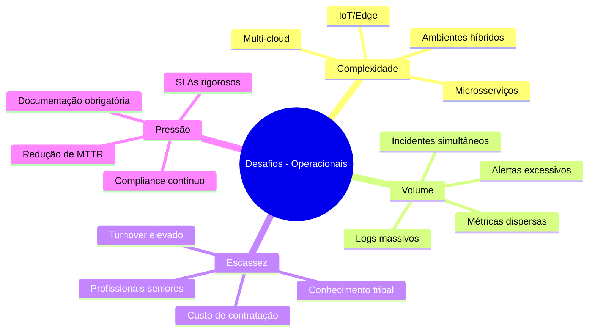
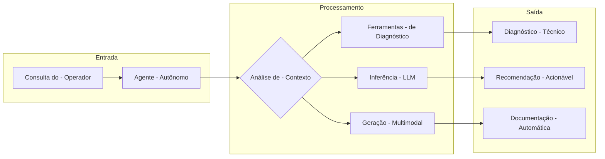
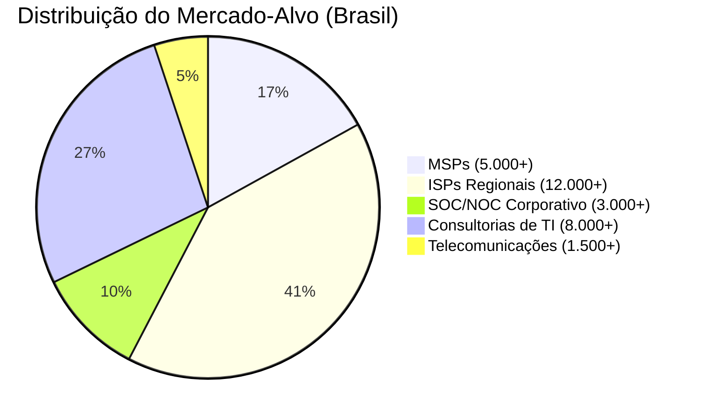
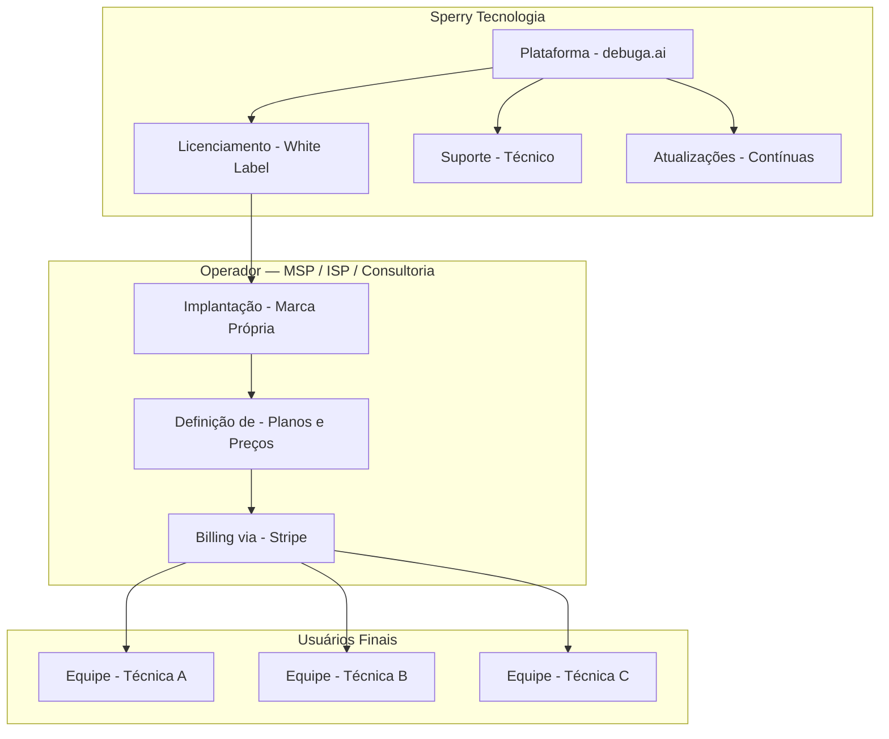
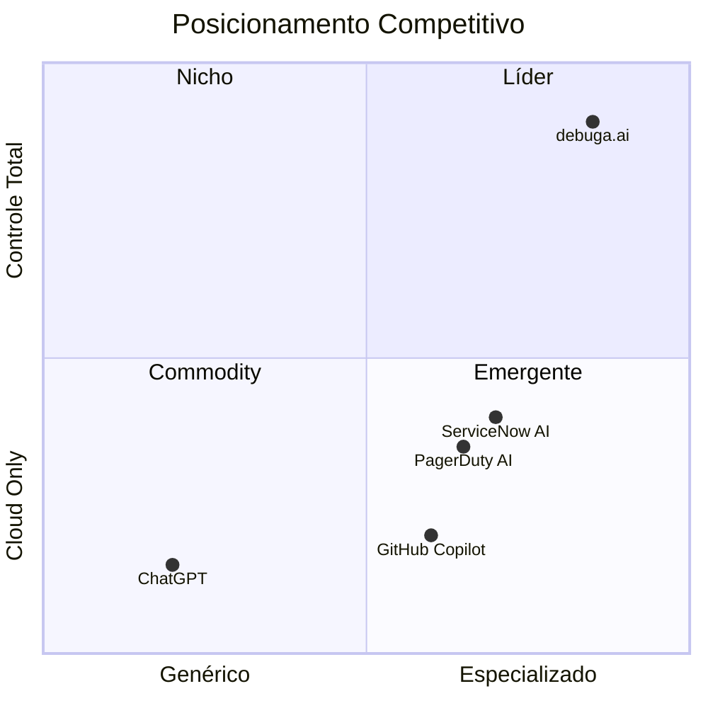
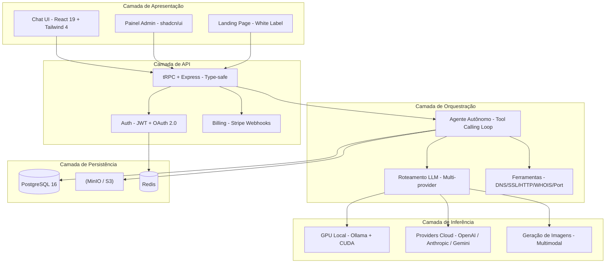
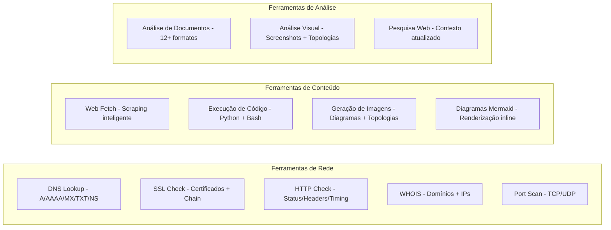
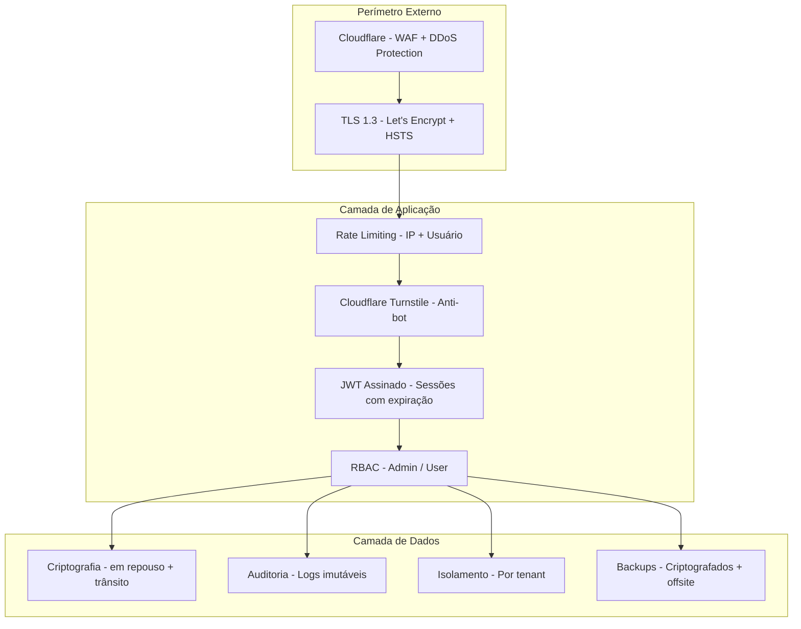
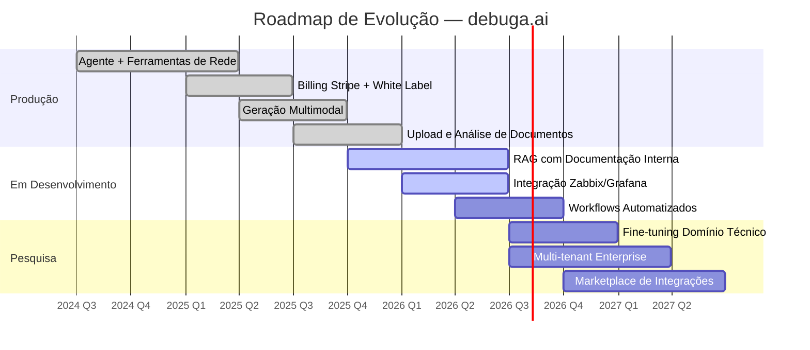

# Whitepaper — debuga.ai

**Plataforma de IA Operacional para Infraestrutura, Segurança e Automação Técnica**

Versão 2.0 | Maio 2026 | Sperry Tecnologia

---

## Sumário Executivo

A **debuga.ai** é uma plataforma de inteligência artificial operacional desenvolvida pela Sperry Tecnologia, projetada para equipes que operam infraestrutura de TI, segurança da informação, DevOps, telecomunicações e automação técnica. A plataforma combina inferência local com GPU, fallback inteligente para providers cloud, roteamento por capacidade e geração multimodal em uma solução white label implantável com marca própria em infraestrutura dedicada.

Diferente de assistentes de IA genéricos, a debuga.ai foi construída desde o primeiro dia para o contexto operacional: compreende topologias de rede, executa diagnósticos em tempo real, gera documentação técnica automaticamente e opera com dados sob controle total do operador.

---

## Problema de Mercado

Equipes técnicas de infraestrutura enfrentam uma convergência de desafios que se intensificam com a complexidade crescente dos ambientes modernos:

Assistentes de IA genéricos não atendem ao contexto operacional porque carecem de ferramentas especializadas, não compreendem topologias de rede, não se integram ao workflow técnico existente e não oferecem controle sobre dados sensíveis.

---

## Proposta de Valor

A debuga.ai resolve esses desafios oferecendo um agente de IA que opera como um engenheiro sênior disponível 24/7:

| Capacidade | Descrição | Impacto |
|-----------|-----------|---------|
| **Diagnóstico em tempo real** | DNS, SSL, HTTP, WHOIS, port scan, traceroute | Redução de 70% no tempo de triagem |
| **Contexto técnico nativo** | Compreende topologias, protocolos, logs | Respostas precisas sem re-explicação |
| **Geração multimodal** | Diagramas, documentação, scripts, imagens | Documentação automática de incidentes |
| **Inferência local** | GPU dedicada com modelos otimizados | Dados não saem do ambiente |
| **White label completo** | Marca, domínio, billing, planos | Produto próprio sem desenvolvimento |
| **Controle de custos** | Limites configuráveis com alertas | Previsibilidade financeira total |

---

## Mercado-Alvo

| Segmento | TAM estimado (Brasil) | Dor principal | Solução debuga.ai |
|----------|----------------------|---------------|-------------------|
| **MSPs** | 5.000+ empresas | Escalar suporte sem contratar proporcionalmente | Agente de primeiro nível automatizado |
| **ISPs regionais** | 12.000+ provedores | Automatizar NOC de primeiro nível | Diagnóstico de rede em tempo real |
| **SOC/NOC corporativo** | 3.000+ operações | Reduzir MTTR e documentar incidentes | Triagem automatizada com auditoria |
| **Consultorias de TI** | 8.000+ empresas | Produtividade técnica e padronização | Assistente técnico com knowledge base |
| **Telecomunicações** | 1.500+ operadoras | Configuração e troubleshooting de equipamentos | Ferramentas de diagnóstico integradas |

---

## Modelo de Negócio

A debuga.ai opera em modelo B2B white label, onde o **operador** (MSP, ISP, consultoria) adquire a plataforma e a oferece aos seus próprios clientes com marca e precificação próprias.

| Modalidade | Descrição | Ideal para |
|-----------|-----------|------------|
| **Licença white label** | Implantação dedicada com marca do operador | MSPs e ISPs com infraestrutura própria |
| **SaaS gerenciado** | Operação pela Sperry com domínio do cliente | Consultorias sem equipe de infra |
| **Consultoria de implantação** | Setup, treinamento e suporte à operação | Empresas em transição |
| **Suporte contínuo** | Manutenção, atualizações e suporte técnico | Todos os operadores |

O operador define seus próprios planos e preços para usuários finais, com billing integrado via Stripe. A Sperry não tem acesso aos dados dos usuários finais.

---

## Diferenciais Competitivos

| Diferencial | debuga.ai | Assistentes Genéricos | Ferramentas Legadas |
|-------------|-----------|----------------------|---------------------|
| Contexto técnico nativo | Construído para infra | Adaptado de IA genérica | Regras estáticas |
| Ferramentas integradas | DNS, SSL, HTTP, WHOIS, port scan | Nenhuma | Limitadas ao vendor |
| Inferência local (GPU) | Dados não saem do ambiente | Tudo na nuvem | N/A |
| White label | Marca completa do operador | Impossível | Parcial |
| Fallback inteligente | Multi-provider com routing | Provider único | N/A |
| Geração multimodal | Texto, imagens, diagramas | Texto apenas | N/A |
| Controle de custos | Limites configuráveis | Pay-per-use imprevisível | Licença fixa |
| Auditoria | Logs imutáveis completos | Limitada | Parcial |
| Soberania de dados | 100% sob controle do operador | Dados no provider | Parcial |

---

## Arquitetura de Referência

A plataforma é composta por camadas independentes que se comunicam via APIs internas, permitindo escalabilidade horizontal e substituição de componentes:

Detalhes completos na [documentação de arquitetura](ARCHITECTURE_PTBR.md).

---

## Ferramentas de Diagnóstico

O agente possui acesso a ferramentas especializadas que executa autonomamente durante o raciocínio:

| Ferramenta | Função | Exemplo de uso |
|-----------|--------|----------------|
| **DNS Lookup** | Resolução de registros DNS (A, AAAA, MX, TXT, NS, SOA, CNAME) | Diagnóstico de propagação, verificação de SPF/DKIM |
| **SSL Check** | Validação de certificados, cadeia, expiração, protocolos | Auditoria de segurança, troubleshooting de HTTPS |
| **HTTP Check** | Status, headers, timing, redirects, TLS handshake | Monitoramento de disponibilidade, debug de CDN |
| **WHOIS** | Informações de registro de domínios e IPs | Investigação de propriedade, verificação de ASN |
| **Port Scan** | Varredura de portas TCP/UDP | Auditoria de exposição, verificação de firewall |
| **Web Fetch** | Extração inteligente de conteúdo web | Análise de configurações públicas, documentação |
| **Execução de Código** | Python e Bash em ambiente isolado | Scripts de automação, cálculos, transformações |
| **Geração de Imagens** | Diagramas, topologias, assets visuais | Documentação visual automática |
| **Análise de Documentos** | PDF, DOCX, XLSX, CSV, JSON, YAML, logs | Extração de informações de manuais e relatórios |
| **Análise Visual** | Screenshots, diagramas, topologias | Interpretação de interfaces e dashboards |

---

## Segurança e Compliance

| Aspecto | Implementação | Conformidade |
|---------|--------------|--------------|
| **Transporte** | TLS 1.3 via NGINX + Cloudflare | PCI DSS, LGPD |
| **Autenticação** | JWT + bcrypt (custo 12) + OAuth 2.0 | OWASP Top 10 |
| **Autorização** | RBAC com papéis granulares | Princípio do menor privilégio |
| **Anti-bot** | Cloudflare Turnstile | Proteção contra automação |
| **Rate limiting** | Por IP e por usuário | Proteção contra abuso |
| **Auditoria** | Logs imutáveis com timestamp UTC | SOC 2, LGPD Art. 37 |
| **Isolamento** | Dados separados por tenant | LGPD Art. 46 |
| **Soberania** | Dados no servidor do operador | LGPD Art. 33 |
| **Backups** | Criptografados, sob controle do operador | Business continuity |

---

## Roadmap

| Horizonte | Funcionalidades | Status |
|-----------|----------------|--------|
| **Produção** | Agente conversacional, ferramentas de rede, billing, white label, geração multimodal, upload de documentos | Disponível |
| **Q1-Q2 2026** | RAG com documentação interna, integração Zabbix/Grafana/Prometheus | Em desenvolvimento |
| **Q3-Q4 2026** | Execução de código avançada, workflows automatizados, notificações proativas | Planejado |
| **2027** | Fine-tuning para domínio técnico, multi-tenant enterprise, marketplace de integrações | Pesquisa |

---

## Métricas de Impacto

Baseado em operadores em produção:

| Métrica | Antes | Com debuga.ai | Melhoria |
|---------|-------|---------------|----------|
| Tempo médio de triagem | 15-30 min | 2-5 min | **80-85%** |
| Documentação de incidentes | Manual (30+ min) | Automática (instantânea) | **95%** |
| Resolução de primeiro nível | 40% | 75% | **+35pp** |
| Custo por ticket | R$ 45-80 | R$ 12-25 | **60-70%** |
| Onboarding de novos técnicos | 2-4 semanas | 3-5 dias | **75%** |

---

## Conclusão

A debuga.ai representa uma nova categoria de ferramenta para equipes técnicas: **IA operacional especializada**, com controle total sobre dados e custos, implantável com marca própria. A combinação de inferência local, ferramentas de diagnóstico integradas, geração multimodal e modelo white label posiciona a plataforma como solução única para o mercado de infraestrutura e segurança.

A plataforma está em produção, com operadores ativos e roadmap de evolução contínua. Para mais informações sobre implantação, consulte a [documentação de arquitetura](ARCHITECTURE_PTBR.md) e o [modelo white label](WHITE_LABEL_OVERVIEW.md).

---

## Documentação Relacionada

| Documento | Descrição |
|-----------|-----------|
| [Arquitetura Técnica](ARCHITECTURE_PTBR.md) | Visão detalhada da arquitetura com diagramas |
| [White Label](WHITE_LABEL_OVERVIEW.md) | Modelo de implantação e personalização |
| [Segurança](SECURITY_OVERVIEW.md) | Políticas de segurança e compliance |
| [Providers de IA](PROVIDERS_OVERVIEW.md) | Providers suportados e roteamento |
| [Roadmap](ROADMAP.md) | Evolução planejada da plataforma |

---

*Sperry Tecnologia — [sperrytecnologia.com.br](https://www.sperrytecnologia.com.br)*
