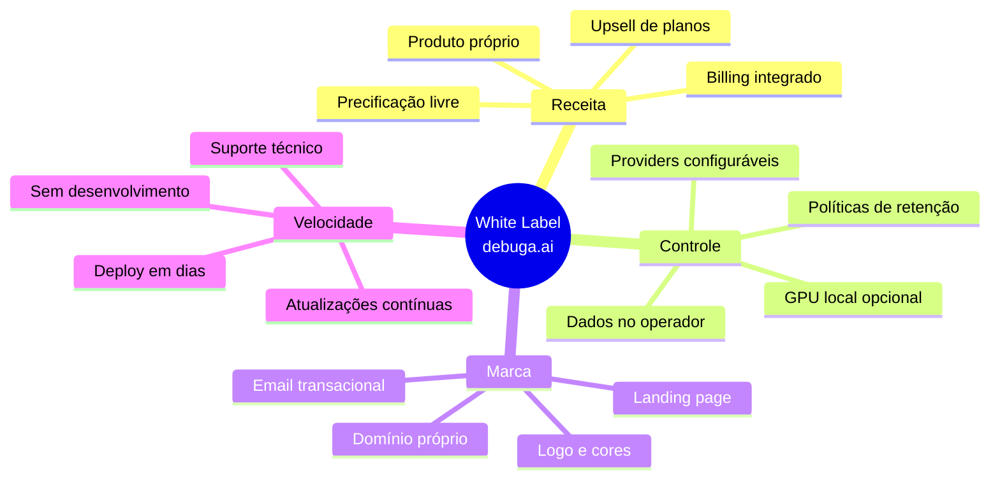
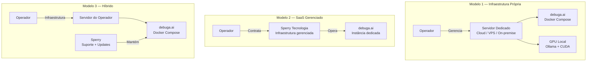
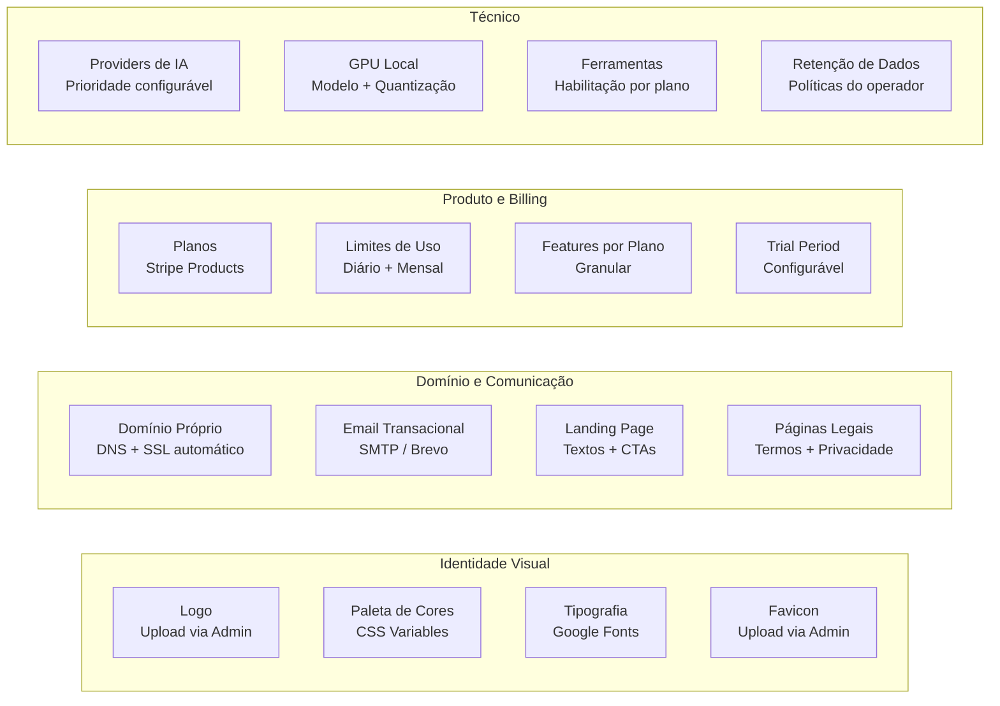
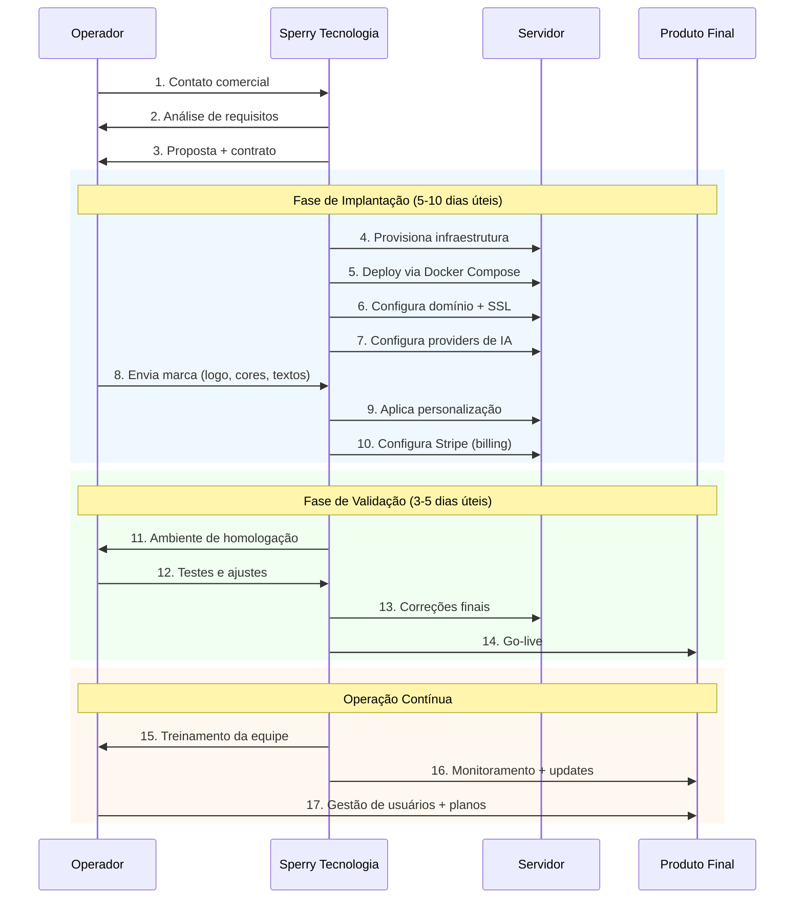
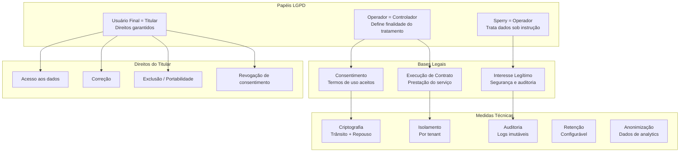
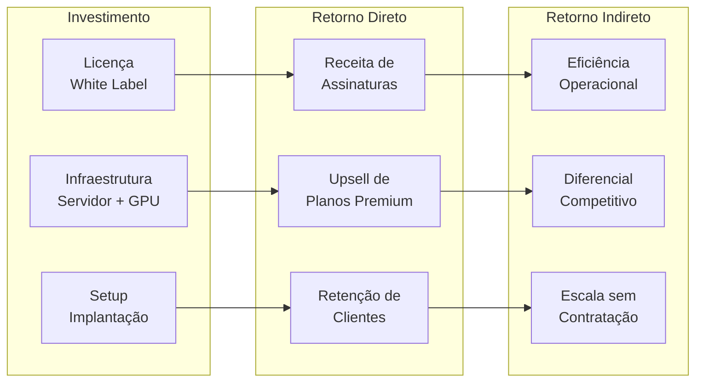
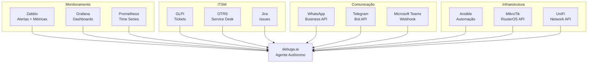

# White Label Enterprise — debuga.ai

**Modelo de Implantação, Personalização e Operação da Plataforma de IA como Produto Próprio**

Versão 2.0 | Maio 2026 | Sperry Tecnologia

---

## Visão Geral

A debuga.ai foi projetada desde a concepção para operar como **produto white label**. O operador — seja um MSP, ISP, consultoria de TI, SOC/NOC ou departamento de tecnologia — implanta a plataforma em sua própria infraestrutura, com marca, domínio, identidade visual e precificação próprios. Os usuários finais interagem exclusivamente com o produto do operador, sem qualquer referência à tecnologia subjacente.

Este documento detalha os modelos de implantação disponíveis, a matriz de personalização, o processo de onboarding, conformidade regulatória e o retorno sobre investimento esperado.

---

## Por que White Label?

O modelo white label resolve um dilema comum: equipes técnicas precisam de IA operacional, mas não podem depender de plataformas externas (dados sensíveis, compliance, custos imprevisíveis) nem têm tempo ou orçamento para desenvolver uma solução própria. A debuga.ai elimina esse dilema oferecendo uma plataforma pronta para operar com marca própria.

---

## Modelos de Implantação

A plataforma suporta três modelos de implantação, cada um adequado a um perfil diferente de operador:

| Modelo | Infraestrutura | Operação | GPU | Ideal para |
|--------|---------------|----------|-----|------------|
| **Infraestrutura Própria** | Operador (cloud, VPS ou on-premise) | Operador | Sim (opcional) | MSPs e ISPs com equipe de infra, requisitos de soberania de dados |
| **SaaS Gerenciado** | Sperry Tecnologia | Sperry | Cloud only | Consultorias sem equipe de infra, time-to-market rápido |
| **Híbrido** | Operador | Sperry + Operador | Sim (opcional) | Empresas em transição, compliance com suporte externo |

### Detalhamento: Infraestrutura Própria

O operador provisiona um servidor (cloud, VPS ou bare-metal) e executa o deploy via Docker Compose. A Sperry fornece o repositório privado, documentação de setup, scripts de automação e suporte técnico durante a implantação.

**Opções de hospedagem compatíveis:**

| Tipo | Exemplos | GPU | Custo mensal estimado |
|------|----------|-----|----------------------|
| VPS Cloud | Hetzner, OVH, Vultr, DigitalOcean | Não | A partir de R$ 150/mês |
| Cloud com GPU | Vast.ai, RunPod, Lambda | Sim | A partir de R$ 500/mês |
| Bare-metal | Servidor próprio, colocation | Sim | Investimento inicial |
| Nuvem pública | AWS, GCP, Azure | Sim (instâncias GPU) | Variável |

### Detalhamento: SaaS Gerenciado

A Sperry opera a instância dedicada do operador, incluindo monitoramento, backups, atualizações e suporte. O operador mantém controle total sobre marca, planos e dados (via painel administrativo).

### Detalhamento: Híbrido

O operador fornece a infraestrutura e a Sperry realiza a operação remota: monitoramento, atualizações, troubleshooting e suporte de segundo nível. Ideal para operadores que precisam de soberania de dados mas não têm equipe de DevOps dedicada.

---

## Matriz de Personalização

| Categoria | Item | Método de Configuração | Nível |
|-----------|------|----------------------|-------|
| **Marca** | Nome do produto | Variável de ambiente | Básico |
| **Marca** | Logo (header + favicon) | Upload via painel admin | Básico |
| **Marca** | Paleta de cores | Variáveis CSS (admin) | Básico |
| **Marca** | Tipografia | Google Fonts (configuração) | Básico |
| **Domínio** | Domínio próprio | DNS A/CNAME + Let's Encrypt | Básico |
| **Domínio** | Certificado SSL | Automático (Let's Encrypt) | Básico |
| **Comunicação** | Email transacional (remetente) | SMTP / Brevo API | Básico |
| **Comunicação** | Templates de email | Configuração de texto | Intermediário |
| **Landing** | Textos e CTAs | Painel admin | Básico |
| **Landing** | Seções e layout | Configuração de componentes | Intermediário |
| **Legal** | Termos de uso | Página editável | Básico |
| **Legal** | Política de privacidade | Página editável | Básico |
| **Legal** | LGPD (DPO, base legal) | Configuração | Intermediário |
| **Billing** | Planos e preços | Stripe Dashboard | Básico |
| **Billing** | Limites por plano | Painel admin | Básico |
| **Billing** | Features por plano | Painel admin | Intermediário |
| **Billing** | Período de trial | Configuração | Básico |
| **IA** | Providers habilitados | Variáveis de ambiente | Intermediário |
| **IA** | Prioridade de providers | Configuração | Intermediário |
| **IA** | Modelo GPU local | Ollama pull | Avançado |
| **IA** | Ferramentas habilitadas | Configuração por plano | Intermediário |
| **Dados** | Política de retenção | Configuração | Intermediário |
| **Dados** | Backup automático | Cron + script | Avançado |
| **Dados** | Export de dados | API admin | Intermediário |

---

## Processo de Onboarding

| Fase | Duração | Responsável | Entregáveis |
|------|---------|-------------|-------------|
| **Análise** | 1-2 dias | Sperry + Operador | Requisitos, modelo de implantação, proposta |
| **Implantação** | 5-10 dias úteis | Sperry | Servidor configurado, domínio ativo, SSL, providers |
| **Personalização** | 2-3 dias | Sperry + Operador | Marca aplicada, landing page, planos no Stripe |
| **Validação** | 3-5 dias | Operador + Sperry | Testes de funcionalidade, ajustes, homologação |
| **Go-live** | 1 dia | Sperry | DNS apontado, produção ativa |
| **Treinamento** | 1-2 dias | Sperry | Equipe do operador treinada (admin + uso) |

**Tempo total estimado: 12-22 dias úteis** do contrato ao go-live.

---

## Conformidade e LGPD

| Requisito LGPD | Implementação na debuga.ai | Artigo |
|----------------|---------------------------|--------|
| **Base legal** | Consentimento (termos) + execução de contrato | Art. 7 |
| **Finalidade** | Definida pelo operador nos termos de uso | Art. 6, I |
| **Minimização** | Coleta apenas dados necessários para o serviço | Art. 6, III |
| **Transparência** | Política de privacidade editável pelo operador | Art. 6, VI |
| **Segurança** | Criptografia, isolamento, auditoria | Art. 46 |
| **Direitos do titular** | API de export/exclusão disponível ao operador | Art. 18 |
| **Transferência internacional** | Dados no servidor do operador (Brasil) | Art. 33 |
| **DPO** | Configurável pelo operador | Art. 41 |
| **Registro de tratamento** | Logs de auditoria imutáveis | Art. 37 |
| **Notificação de incidentes** | Alertas configuráveis para o operador | Art. 48 |

O operador é o **controlador** dos dados de seus usuários finais. A Sperry atua como **operador** (no sentido LGPD) apenas quando contratada para gerenciar a infraestrutura. Em implantações próprias, a Sperry não tem acesso aos dados dos usuários finais.

---

## SLA e Suporte

| Nível | Tempo de Resposta | Tempo de Resolução | Canal |
|-------|------------------|-------------------|-------|
| **Crítico** (plataforma indisponível) | 1 hora | 4 horas | WhatsApp + Telefone |
| **Alto** (funcionalidade degradada) | 4 horas | 24 horas | WhatsApp + Email |
| **Médio** (bug não-crítico) | 24 horas | 72 horas | Email |
| **Baixo** (dúvida, feature request) | 48 horas | Conforme roadmap | Email |

| Garantia | Compromisso |
|----------|-------------|
| **Uptime da plataforma** | 99.5% (infraestrutura gerenciada) |
| **Atualizações de segurança** | Em até 48h após disclosure |
| **Atualizações de funcionalidade** | Mensal (changelog documentado) |
| **Backup** | Diário (retenção configurável) |
| **Suporte técnico** | Horário comercial (extensível para 24/7) |

---

## Retorno sobre Investimento

A adoção da debuga.ai como produto white label gera retorno em múltiplas dimensões:

| Métrica | Cenário Conservador | Cenário Otimista |
|---------|--------------------|--------------------|
| **Payback** | 4-6 meses | 2-3 meses |
| **Margem por usuário** | 60-70% | 75-85% |
| **Redução de tickets L1** | 40-50% | 60-70% |
| **Redução de MTTR** | 50-60% | 70-80% |
| **Retenção de clientes** | +15% | +25% |
| **NPS improvement** | +10 pontos | +20 pontos |

### Cenário de Exemplo: MSP com 50 Clientes

| Item | Valor |
|------|-------|
| Usuários ativos estimados | 150-300 |
| Receita mensal com assinaturas | Definida pelo operador |
| Custo de infraestrutura | VPS + GPU (variável) |
| Economia em suporte L1 | 40-60% do custo atual |
| Tempo de payback | 3-5 meses |

---

## Integrações Planejadas

| Integração | Status | Tipo | Caso de Uso |
|-----------|--------|------|-------------|
| **Zabbix** | Em desenvolvimento | Bidirecional | Consulta de alertas, ack automático, correlação |
| **Grafana** | Em desenvolvimento | Leitura | Visualização de métricas via agente |
| **Prometheus** | Em desenvolvimento | Leitura | Consulta de time series |
| **GLPI** | Planejado | Bidirecional | Abertura/atualização de tickets |
| **WhatsApp Business** | Planejado | Bidirecional | Atendimento via WhatsApp |
| **Telegram** | Planejado | Bidirecional | Notificações e consultas |
| **MikroTik** | Pesquisa | Leitura | Diagnóstico de roteadores |
| **UniFi** | Pesquisa | Leitura | Status de rede wireless |

---

## Requisitos para Implantação

| Requisito | Mínimo (sem GPU) | Recomendado (com GPU) |
|-----------|-----------------|----------------------|
| **CPU** | 4 cores | 8+ cores |
| **RAM** | 8 GB | 32 GB |
| **Storage** | 50 GB SSD | 500 GB NVMe |
| **GPU** | — | NVIDIA 24+ GB VRAM |
| **Rede** | 100 Mbps | 1 Gbps |
| **OS** | Ubuntu 22.04+ | Ubuntu 22.04+ |
| **Docker** | Docker Engine 24+ | Docker Engine 24+ |
| **Domínio** | DNS configurável | DNS com Cloudflare |
| **SSL** | Let's Encrypt (automático) | Cloudflare Full (Strict) |
| **Stripe** | Conta ativa | Conta ativa |
| **Email** | SMTP funcional | Brevo / SendGrid |

---

## Próximos Passos

Para iniciar o processo de implantação white label:

1. **Contato comercial** — Apresente seu cenário e requisitos
2. **Análise técnica** — Avaliamos infraestrutura e modelo ideal
3. **Proposta** — Detalhamento de escopo, cronograma e investimento
4. **Implantação** — Deploy, personalização e validação
5. **Go-live** — Produto ativo com sua marca

**Contato:** contato@sperrytecnologia.com.br

---

## Documentação Relacionada

| Documento | Descrição |
|-----------|-----------|
| [Whitepaper](WHITEPAPER_PTBR.md) | Visão executiva da plataforma |
| [Arquitetura Técnica](ARCHITECTURE_PTBR.md) | Detalhes da arquitetura com diagramas |
| [Segurança](SECURITY_OVERVIEW.md) | Políticas de segurança e compliance |
| [Providers de IA](PROVIDERS_OVERVIEW.md) | Providers suportados e roteamento |
| [Roadmap](ROADMAP.md) | Evolução planejada da plataforma |

---

*Sperry Tecnologia — [sperrytecnologia.com.br](https://www.sperrytecnologia.com.br) — contato@sperrytecnologia.com.br*
